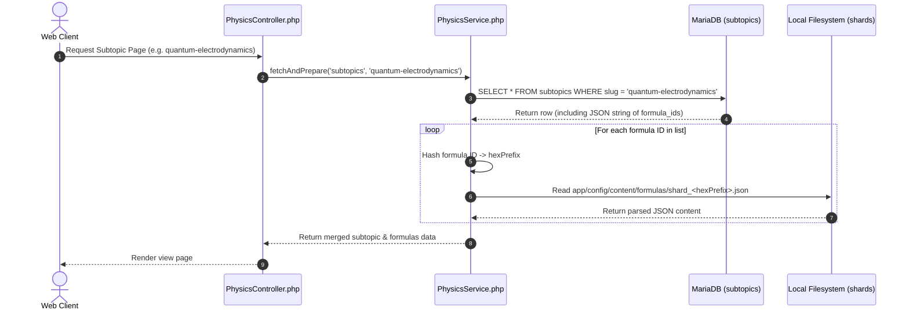

# Production Deployment & Scaling Strategy: Physics Identities Registry

This document examines what happens to the sharded identities database and pre-rendered SVGs when the application is launched on a production server. It details performance bottlenecks, scaling constraints, and outlines strategies to manage and deliver formula identities and mathematical SVGs in production.

---

## 1. How the Current Sharded Registry Behaves in Production

In the local development environment, the database consists of 256 JSON shard files:
* Shards reside under [app/config/content/formulas/shard_*.json](file:///Users/holobetj/code/gemini/terra/app/config/content/formulas/).
* Subtopics are saved as files and dynamically synced to MariaDB via [cli_sync.php](file:///Users/holobetj/code/gemini/terra/cli_sync.php).
* **The formulas themselves are NOT stored in MariaDB**. MariaDB only stores the topics and subtopics data, which contains the list of formula IDs inside the `formula_data` column.

When the application runs in production (i.e. `isPreviewActive() === false`), the execution path for loading a subtopic page is:



### The Production Impact
1. **Concurrent File I/O Bottleneck:** For every subtopic requested, the server performs multiple linear file reads and JSON decodes (one for each formula ID). Under high traffic, this causes disk I/O latency spikes.
2. **File System Serialization Overhead:** PHP is single-threaded and executes synchronously. Fetching 5 formulas from different shards means opening 5 separate files, decoding 5 JSON strings, and scanning their keys in memory during a single request thread.

---

## 2. Constraints of the Current Model Under Production Scaling

Launching the current sharded-file structure on a production server introduces critical scaling and deployment limitations:

### Constraint A: Multi-Server Scaling (Horizontal Scaling)
If the application is deployed behind a load balancer with multiple web server instances:
* **Inconsistent State:** Any automated or manual updates to the local JSON shards on Web Server A will not replicate to Web Server B.
* **Synchronization Drift:** Different users hitting different web nodes will see different versions of the formulas and search indexes.

### Constraint B: Containerization & Cloud Deployments (Docker, Kubernetes, AWS ECS)
In modern containerized setups, filesystems are **ephemeral** and **read-only**:
* **Data Loss:** Any local file modifications (e.g. pre-rendering SVGs, running sync scripts) will be lost when a container restarts or scales.
* **Write Failures:** Attempting to write back to files inside a read-only container root will throw runtime PHP exceptions.

---

## 3. Options for Formula Identities in Production

To manage the metadata and JSON payloads of formula identities in production, we have three primary architectures:

### Option A: Production-Grade Relational Database (Recommended)
Migrate the formulas from JSON shards into a dedicated `formulas` relational table in MariaDB.
* **The Process:** Add a `formulas` table. The PHP runtime queries the formulas in a single SQL batch query:
  ```php
  // Fetch all formulas for a subtopic in 1 query
  $rows = $this->app->db()->fetchAll("SELECT * FROM formulas WHERE id IN ($placeholders)", $fIds);
  ```
* **Pros:**
  * **Database-Driven Performance:** Resolving all formulas for a subtopic takes **exactly 1 SQL query** instead of $N$ disk accesses.
  * **Scalable State:** Standard MariaDB/MySQL replication scales horizontally.
  * **Admin Panel Support:** Allows a standard CRUD interface to add, delete, or modify formulas dynamically without codebase redeploys.
  * **Container-Safe:** Web nodes can run on read-only containers; only connection strings are needed.
* **Cons:**
  * Adds database read load (mitigated by SQL indexing and Redis query cache).

### Option B: Key-Value / In-Memory Cache (Redis / Memcached)
Retain JSON shards as the git-versioned source of truth (making deployments easy and retaining version history), but load/cache the formula definitions into Redis or Memcached during the deployment build process or lazy-load them at runtime.
* **The Process:** At deployment, a script reads the shards and populates Redis keys: `SET formula:id "JSON_DATA"`. `loadFormula()` checks Redis first.
* **Pros:**
  * Sub-millisecond read speed.
  * Offloads disk I/O and DB queries completely.
  * Retains simple Git version control for all math files.
* **Cons:**
  * Requires setting up and managing a Redis server/cluster.
  * Requires a cache invalidation strategy when JSON files are modified.

### Option C: Build-Time Static Compilation (Immutable Build)
If content is updated infrequently and managed primarily by developers:
* **The Process:** We run the compilation tools inside a **CI/CD build pipeline** (e.g., GitHub Actions). The pre-compiled static assets and JSON shards are built and copied directly into the Docker image or served from a static web server.
* **Pros:**
  * Zero database/cache dependency at runtime.
  * Infinite caching capability via CDN.
* **Cons:**
  * Simple typos require a code commit, build cycle, and deployment.

---

## 4. Options for serving Math SVGs in Production

Currently, equations are pre-rendered into SVGs and embedded directly inside the formula shards (in the `equation` field) or retrieved from the 180MB `global_svg_cache.json`. When deploying to a production server, we have four options for serving these SVGs:

### Option 1: Inline SVG Embedding in Database/Payloads (Current Strategy Scaled)
Continue embedding the SVG XML strings directly inside the formula database table or JSON shards, serving them inline in the generated HTML.
* **Pros:**
  * **Instant Rendering:** No extra HTTP requests. Equations display immediately on page load, eliminating layout shifts (CLS) and "flash of unstyled content" (FOUC).
  * **SEO Friendly:** Search engines index the equations instantly because they are fully server-side rendered (SSR).
* **Cons:**
  * **Payload Bloat:** Inline SVG markup is verbose. A page containing 20 formulas will have a significantly larger HTML document size, consuming more bandwidth.
  * **No Browser Caching:** Because the SVGs are inline, the browser cannot cache individual SVGs independently of the page HTML.

### Option 2: Decoupled Asset Storage & CDN (Recommended)
Extract all SVGs from the formula payloads. Each SVG is saved as a static file (e.g., `public/assets/formulas/<formula_id>.svg`) or uploaded to an object store (like AWS S3) and served via a CDN. The formula database only stores the metadata and the URL of the SVG.
* **Pros:**
  * **Minimal Document Payload:** The HTML size stays extremely small.
  * **CDN Caching:** Individual SVGs are cached aggressively at the edge and in the user's browser.
  * **Stateless App Containers:** App servers do not need to host the SVGs; they are loaded directly from cloud storage.
* **Cons:**
  * **Multiple HTTP Requests:** The browser must make external requests to load the SVGs (can be optimized using HTTP/2 multiplexing or SVG sprites).
  * **Layout Shifts:** If image dimensions are not specified, the page layout will shift as the SVGs load.

### Option 3: Client-Side KaTeX or MathJax Rendering (No Pre-rendered SVGs)
Remove all SVGs from the database entirely. The database only stores clean, lightweight LaTeX strings (e.g., `\nabla \cdot \mathbf{E} = \frac{\rho}{\varepsilon_0}`). The frontend compiles the LaTeX strings to HTML/MathML dynamically in the user's browser using KaTeX or MathJax.
* **Pros:**
  * **Tiny Database Storage:** Extremely small database footprints (simple text strings instead of large SVG XML trees).
  * **Accessibility & Selection:** Browser-rendered equations are natively copy-pasteable and highly accessible for screen readers.
  * **Zero Server Overhead:** Offloads all rendering computation to the client's CPU.
* **Cons:**
  * **Render Delay:** A slight lag before the equation compiles, resulting in a visible "flash of raw LaTeX code" on slow devices.
  * **SEO Risk:** Search engines might index the raw LaTeX code before the browser executes KaTeX to render the beautiful math.

### Option 4: On-the-Fly SVG Rendering Microservice (Hybrid)
Store raw LaTeX in the database, and set up a lightweight NodeJS microservice (using MathJax-node or KaTeX server-side wrapper). When the app requests an equation, it queries the microservice to generate the SVG, caching the result in Redis.
* **Pros:**
  * Eliminates the need to pre-build a massive 180MB cache or ship it with the build.
  * Adapts cleanly to dynamically created formulas without rebuilds.
* **Cons:**
  * Adds architectural complexity (extra server/container to deploy and maintain).
  * High latency on first-time cache misses.

---

## 5. Architectural Comparison Matrix

| Strategy Choice | Developer Workflow | Server Disk I/O | DB Performance | HTML Document Size | Browser Caching | SEO Impact |
| :--- | :--- | :--- | :--- | :--- | :--- | :--- |
| **A1. Inline SVGs + MariaDB** | High (Direct edit) | Zero (DB reads) | Medium (Single SQL batch) | Large | None (Rerendered) | Excellent |
| **B2. CDN/S3 SVGs + MariaDB + Redis** | High (Direct edit) | Zero (Cache reads) | Excellent (Redis lookup) | Small | Excellent (Edge + Browser) | Good |
| **C3. Client-Side KaTeX + Git Shards** | Low (PR-based) | High (Local reads) | Zero (No DB) | Tiny | N/A (Client generated) | Moderate (SEO latency) |
| **D4. On-the-Fly SVGs + Redis Cache** | High (Direct edit) | Zero (Cache reads) | Excellent | Small | Excellent | Good |

---

## 6. Recommended Transition Plan

For launching the site on a production server, we suggest a phased implementation:

1. **Short-Term Production Target (Path A + Option 1):**
   * Keep the current pre-rendered inline SVGs, but move both the subtopics and formulas from local files to **MariaDB relational tables** (`subtopics` and `formulas`).
   * Update `PhysicsService.php` to batch load formula records from the database in a single database request.
   * This removes the filesystem read bottlenecks and makes the application cloud-native (stateless containers).

2. **Long-Term Scaling Target (Path B + Option 2):**
   * Extract SVGs out of the database into **AWS S3 / CDN CloudFront**.
   * Add a Redis layer in front of the MariaDB database to cache the formula metadata payloads.
   * The database payload stays lightweight, and browser caching handles all math rendering assets.
