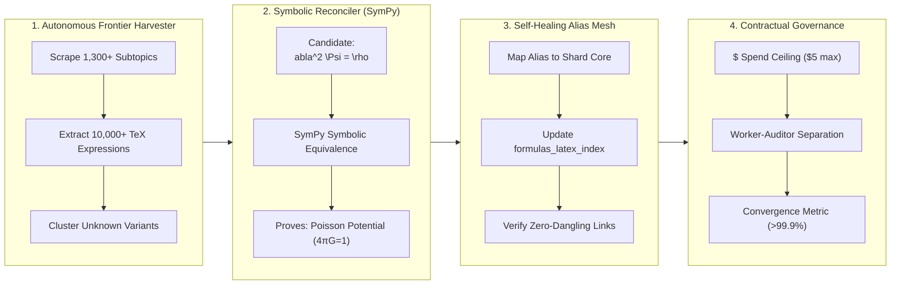

# 🌌 Merging Long Task Horizons (LTH) and the Semantic Expansion Horizon (SEH)

**Document Reference:** `docs/Long_Task_Horizons_(LTH)_and_the_Semantic_Expansion_Horizon_(SEH).md`  
**System Scope:** Physics Lab Manifold Engine & Autonomous Agent Architecture  
**Status:** Strategic Architecture Specification  

---

## 1. Executive Summary & Foundational Synthesis

In the development of large-scale scientific knowledge engines, two foundational forces interact:

1. **The Semantic Expansion Horizon (SEH)**: The epistemological phenomenon where generating high-density scientific prose and mathematical derivations inevitably introduces an expanding frontier of notation variants, coordinate conventions, intermediate algebraic steps, and cross-disciplinary concepts.
2. **Long Task Horizons (LTH)**: The agentic engineering paradigm enabling autonomous AI systems to execute multi-stage, multi-hour missions across thousands of interdependent steps while strictly adhering to budget, symbolic, and structural guardrails.

```
┌───────────────────────────────────────────────────────────────────────────┐
│                      THE UNIFIED HORIZON ARCHITECTURE                     │
├─────────────────────────────────────┬─────────────────────────────────────┤
│     Semantic Expansion Horizon      │         Long Task Horizon           │
│     (The Epistemological Force)     │     (The Engineering Governor)      │
├─────────────────────────────────────┼─────────────────────────────────────┤
│ • Generates notation variants       │ • Executes autonomous batch sweeps  │
│ • Introduces intermediate steps     │ • Validates symbolic proofs (SymPy) │
│ • Expands subtopic link frontiers   │ • Binds aliases to Canonical Core   │
│ • Potential for infinite drift      │ • Enforces hard budget & stop bounds│
└─────────────────────────────────────┴─────────────────────────────────────┘
```

By unifying these two models, **Physics Lab (`terra`)** transitions from reactive micro-remediation (repairing isolated equations one at a time) to **self-governing, autonomous manifold curation** that continuously discovers, reconciles, and proves mathematical notation bridges across the entire 13,764+ formula encyclopedia.

---

## 2. The Strategic Imperative: From Reactive Micro-Fixes to Autonomous Sweeps

### The Traditional Bottleneck (Reactive Micro-Editing)
When an encyclopedia grows, users or automated QA tools periodically encounter "undefined equation" states (e.g. `\nabla^2 \Psi = \rho` or $E = hf$) caused by ad-hoc notation written in subtopic paragraphs. Manually identifying and repairing these instances one-by-one requires continuous developer attention and creates an unending queue of micro-tasks.

### The Long-Horizon Solution (Autonomous Manifold Sweeps)
Under the LTH framework, the developer defines a high-level **Goal & Governance Contract**:
> *"Execute an autonomous 4-hour background sweep across all 1,300 subtopics to harvest all unmapped mathematical expressions, verify their algebraic equivalence against canonical formulas using symbolic proof engines, and update the LaTeX alias mesh under a hard $5.00 spend ceiling."*

The system executes this mission autonomously through fault-tolerant batch pipelines, logging atomic checkpoints and producing a verified, fully closed graph.

---

## 3. The Four Pillars of the Unified Architecture



### Pillar 1: Autonomous Frontier Harvester
- Systematically crawls the entire corpus of subtopic HTML files and JSON shards.
- Extracts all mathematical strings (`<svg data-tex="...">`, `\[ ... \]`, `$$ ... $$`, and explainer query parameters).
- Compares harvested strings against `formulas_latex_index.json` to isolate the unmapped frontier queue.

### Pillar 2: Symbolic & Algebraic Reconciler (SymPy Engine)
- Submits candidate variants to a deterministic symbolic computer algebra system (CAS).
- Automatically proves whether a notation variant is algebraically identical to a canonical formula:
  $$\text{Simplify}\left( \text{Expr}_{\text{candidate}} - \text{Expr}_{\text{canonical}} \right) \equiv 0$$
- Verifies physical dimensional consistency across mass, length, time, and charge dimensions ($[M L^2 T^{-2}]$).

### Pillar 3: Self-Healing Alias Mesh
- Upon symbolic verification, automatically writes the normalized alias mapping into `formulas_latex_index.json`.
- Binds intermediate equations directly to their parent canonical Platinum formula without duplicating database rows.
- Re-indexes the global derivation and genealogy graph.

### Pillar 4: Hard Governance & Safety Contracts
- Enforces strict execution bounds: `--max-cost-dollars <N>`, request rate limits, and token budgets.
- Separates creative generation from deterministic auditing.
- Guarantees complete fault tolerance and atomic checkpoint recovery.

---

## 4. Key Operational Mechanisms

### 4.1 The Manifold Closure Coefficient ($\mathcal{C}_{\text{manifold}}$)
In long-horizon autonomous tasks, a clear mathematical stopping condition is essential to prevent infinite loops. The system tracks convergence using the **Manifold Closure Coefficient**:

$$\mathcal{C}_{\text{manifold}} = \frac{N_{\text{resolved prose equations}} + N_{\text{resolved subtopic links}}}{N_{\text{total harvested references}}}$$

- **Target Threshold**: $\mathcal{C}_{\text{manifold}} \ge 0.999$ (99.9% closure).
- When the sweep satisfies this criterion or reaches its designated budget ceiling, the task commits all atomic shard updates, generates a summary audit report, and terminates gracefully.

### 4.2 The Worker-Auditor Separation Pattern
To prevent LLM hallucination and maintain strict publication-grade rigor during long autonomous runs:

```
┌─────────────────────────────────────────────────────────┐
│              WORKER-AUDITOR SEPARATION                  │
├────────────────────────────┬────────────────────────────┤
│   WORKER (Vertex AI LLM)   │   AUDITOR (Deterministic)  │
├────────────────────────────┼────────────────────────────┤
│ • Pattern clustering       │ • SymPy CAS symbolic proof │
│ • Pedagogical inference    │ • Dimensional analysis     │
│ • Candidate alias mapping  │ • JSON schema validator    │
│ • Drafts prose remediation │ • Pre-push IntegrityShield │
└────────────────────────────┴────────────────────────────┘
```

The Worker proposes candidate alias relationships; the deterministic Auditor independently verifies algebraic equivalence and schema integrity before any file is updated.

### 4.3 Atomic Checkpoints & Fault-Tolerant State
Long-running sweeps maintain an external checkpoint ledger (`batch_sweep_checkpoint.json`). Each processed shard and subtopic is recorded atomically. If the process is paused, interrupted by OS power management, or rate-limited, it resumes from the exact last-verified formula with zero data loss or duplicate API spend.

---

## 5. The End-to-End Long-Horizon Sweep Lifecycle

```
[ Developer Initiates Mission ]
   │
   ▼
[ Load Checkpoint & Validate Budget Ceiling ($5.00 max) ]
   │
   ▼
[ Step 1: Harvest All Mathematical Expressions from Subtopic Corpus ]
   │
   ▼
[ Step 2: Filter Known Canonical Formulas & Existing Aliases ]
   │
   ▼
[ Step 3: Worker Clusters Unresolved Expressions & Proposes Canonical Links ]
   │
   ▼
[ Step 4: Auditor Runs SymPy Algebraic & Dimensional Invariance Tests ]
   │
   ▼
[ Step 5: Update formulas_latex_index.json & Sync MariaDB ]
   │
   ▼
[ Step 6: Verify Manifold Closure Coefficient (C_manifold >= 0.999) ]
   │
   ▼
[ Write Audit Report & Final Commit Checkpoint ]
```

---

## 6. Strategic Value for Physics Lab

Unifying Long Task Horizons with the Semantic Expansion Horizon transforms the Physics Lab repository into a **self-healing, self-bounding mathematical manifold**:

1. **Unconstrained Pedagogical Freedom**: Authors and AI generators can write rich, nuanced physics explanations with diverse notation conventions without risking broken links or unmapped equations.
2. **Mathematical Precision Guaranteed**: Every notation bridge is backed by formal symbolic CAS verification rather than approximate heuristic guesses.
3. **Architectural Scalability**: The core repository remains compact and bounded around its 13,764 canonical Platinum anchors, while the alias mesh seamlessly accommodates infinite notation breadth.
