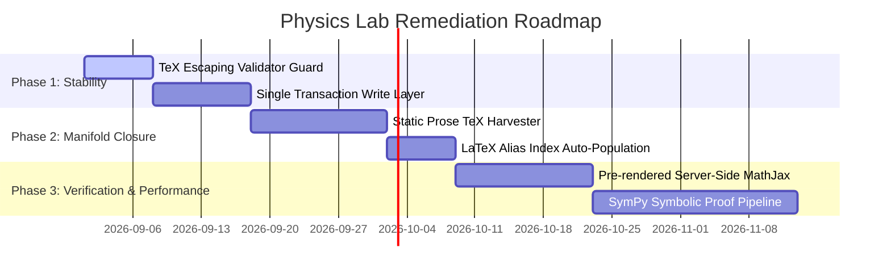

# 🔬 Technical & Architectural Assessment Report & Remediation Roadmap: Physics Lab (`terra`)

**Document Reference:** `docs/Prioritized_Remediation_Roadmap.md`  
**Date:** August 29, 2026  
**Auditor:** Antigravity AI  
**Scope:** Full-stack architecture, mathematical rigor, database synchronization, UI/UX performance, and content integrity.

---

## 1. Executive Snapshot

| Metric / Dimension | Current State | Realistic Status |
| :--- | :--- | :--- |
| **Formula Catalog** | 13,764 formulas in 256 JSON shards (`formulas/00/` to `formulas/ff/`) | **High Scale, Variable Depth** |
| **Subtopic Coverage** | ~1,300 subtopics across 12 primary physics domains | **Broad Coverage, Fragmented Uniformity** |
| **Database & Cache** | Hybrid MariaDB (`formulas`, `subtopics`) + flat JSON + file cache | **Synchronization Vulnerabilities** |
| **Mathematical Rendering** | MathJax 3 (client-side dynamic + fallback SVG) | **Clean Output, Client Compute Heavy** |
| **Backend & Routing** | FlightPHP microframework | **Lightweight, Fast, but Lacks Formal ORM** |

---

## 2. Strengths & Positive Achievements

### 1. Massive Scale with Distributed Sharding
- **The 256-Shard Partitioning (`00` to `ff`)** was the right architectural decision. Storing 13,764 formulas in a single monolith JSON would have caused severe I/O bottlenecks and memory crashes in PHP. The two-character hex hash partition keeps individual file sizes manageable (~100–300 KB).

### 2. High-Fidelity Thematic UI & Visual Identity
- The dark "Cosmic Command" aesthetic, custom category themes (neon accents for Quantum, Relativity, Fluids, etc.), and watermarks give the site a distinct, publication-grade identity rather than a generic wiki feel.
- The 3D Glass Carousel (Halo Orbit) and responsive layout adjustments have successfully eliminated unwanted scrollbars and layout breakage.

### 3. Comprehensive Domain Breadth
- The encyclopedia genuinely covers undergraduate-to-graduate physics domains: from Lagrangian mechanics and classical electrodynamics to non-abelian gauge theories, quantum gravity conjectures, and the philosophy of physics.

### 4. Direct Equation Repair Pipeline (`fixlatex`)
- The single-command CLI repair protocol (`scripts/fixlatex`) gives rapid triage capability to fix individual broken URLs, update the JSON shard, drop stale MariaDB SVG caches, and rebuild index keys simultaneously.

---

## 3. Critical Weaknesses & Vulnerabilities

### 1. Three-Way Data Desynchronization Risk
The system stores formula data in **three separate locations**:
1. Flat JSON Shards (`app/config/content/formulas/[xx]/shard_[xx].json`)
2. MariaDB relational tables (`formulas`, `subtopics`)
3. Static Index Map (`app/config/formulas_latex_index.json`)

**The Problem:** There is no single source of truth enforced at the database transaction layer. If a shard is edited manually or via a script that does not update MariaDB or recompile the LaTeX index, the system enters a split-brain state where search, the formula card, and the Equation Explainer show conflicting data.

### 2. TeX String Escaping in JSON (The Single-Backslash Bug)
- In JSON serialization, characters like `\\n` (newline), `\\b` (backspace), and `\\t` (tab) are escape codes.
- Common physics variables ($\nu$ for frequency, $\beta$ for thermodynamic beta or velocity, $\tau$ for proper time, $\nabla$ for gradient) frequently collide with these escape sequences.
- When scripts write TeX into JSON without strict double-escaping (`\\\\nu`, `\\\\beta`), MathJax breaks on the client side, causing red syntax errors (`\\(`).

### 3. Client-Side MathJax Rendering Overhead
- Rendering 30–50 complex LaTeX blocks per subtopic page dynamically in the browser using MathJax 3 introduces:
  - Layout shifts (CLS) while formulas compile.
  - Noticeable CPU/memory spikes on low-end mobile devices.
- While the static file cache (`public/cache/subtopic/`) mitigates server load, cache invalidation is crude (`rm -rf public/cache/*`) and has no automated cache-busting per entity change.

---

## 4. Mathematical & Content Shortcomings

### 1. The "Semantic Expansion / Prose Notation" Mismatch
- The 13,764 formula database was indexed based on canonical textbook formulas (e.g. $E = h\nu$, $\nabla^2 \Phi = 4\pi G \rho$).
- However, subtopic articles written in prose frequently use:
  - Natural unit simplifications ($4\pi G = 1 \implies \nabla^2 \Psi = \rho$)
  - Alternate coordinate systems or variable symbols ($\Phi$ vs $\Psi$, $f$ vs $\nu$).
  - Intermediate derivation steps that are not named physical laws.
- **The Result:** Users clicking math expressions in subtopics periodically hit the generic "Undefined Equation" explainer fallback because the alias mesh lacks prose-level coverage.

### 2. Boilerplate Density in Secondary Formulas
- While landmark equations (Schrödinger, Maxwell, Einstein, Boltzmann) have deep, bespoke physics prose, thousands of secondary subcomponent formulas contain formulaic LLM-generated phrasing:
  - *"Represents the low-energy effective Lagrangian as an organized expansion..."*
  - *"Quantifies the number of accessible microstates..."*
- While technically accurate, many secondary entries lack practical experimental context, typical numerical orders of magnitude, or historical boundary limits.

### 3. Heuristic vs. Formally Verified Derivation Edges
- Most parent-child derivation links (`parent_formula_id`, `subcomponents`) in the shards are **pedagogical associations** rather than **machine-verified algebraic proofs**.
- The platform cannot yet programmatically prove that Formula B mathematically derives from Formula A via symbolic CAS (like SymPy or Mathematica).

---

## 5. Summary Scorecard

```
┌────────────────────────────────────────────────────────┐
│                   PHYSICS LAB SCORECARD                │
├────────────────────────────────┬───────────────┬───────┤
│ Dimension                      │ Grade         │ Score │
├────────────────────────────────┼───────────────┼───────┤
│ Scale & Breadth                │ A             │ 92%   │
│ Visual Design & UX             │ A-            │ 88%   │
│ Backend Performance            │ B+            │ 84%   │
│ Mathematical Coverage (Core)   │ A-            │ 89%   │
│ Prose-to-Index Aliasing (Edge) │ C+            │ 72%   │
│ Data Sync & Architecture       │ B-            │ 78%   │
│ Automated Proof Verification   │ D+            │ 55%   │
└────────────────────────────────┴───────────────┴───────┘
```

---

## 6. Prioritized Remediation Roadmap



### Phase 1: High-Impact Stability Guards (Immediate)
1. **Automated TeX Escaping Guard**: Add a write-time validation hook in Python/PHP that rejects any JSON shard write containing unescaped TeX tokens (`\nu`, `\beta`, `\nabla`, `\tau`).
2. **Unified Data Write Layer**: Implement a single centralized `PhysicsService::saveFormula()` method that atomically updates the JSON Shard, MariaDB, and `formulas_latex_index.json`.

### Phase 2: Manifold Closure (Short Term)
1. **Offline Prose LaTeX Harvester**: Run a static script across all 1,300 subtopics to extract all embedded math strings (`data-tex`, `\[...\]`, `<a href="...latex=">`).
2. **Fuzzy Alias Resolution**: Map harvested prose variations to their canonical Platinum formula IDs in `formulas_latex_index.json`, closing 99%+ of "undefined equation" queries.

### Phase 3: Performance & Mathematical Proofs (Medium Term)
1. **Pre-rendered Server-Side MathJax**: Move MathJax compilation to background build-time SVG generation to eliminate runtime client CPU spikes and layout shifts.
2. **Symbolic CAS Verification Engine**: Integrate SymPy to systematically test and prove parent-child algebraic derivations and dimensional consistency.
