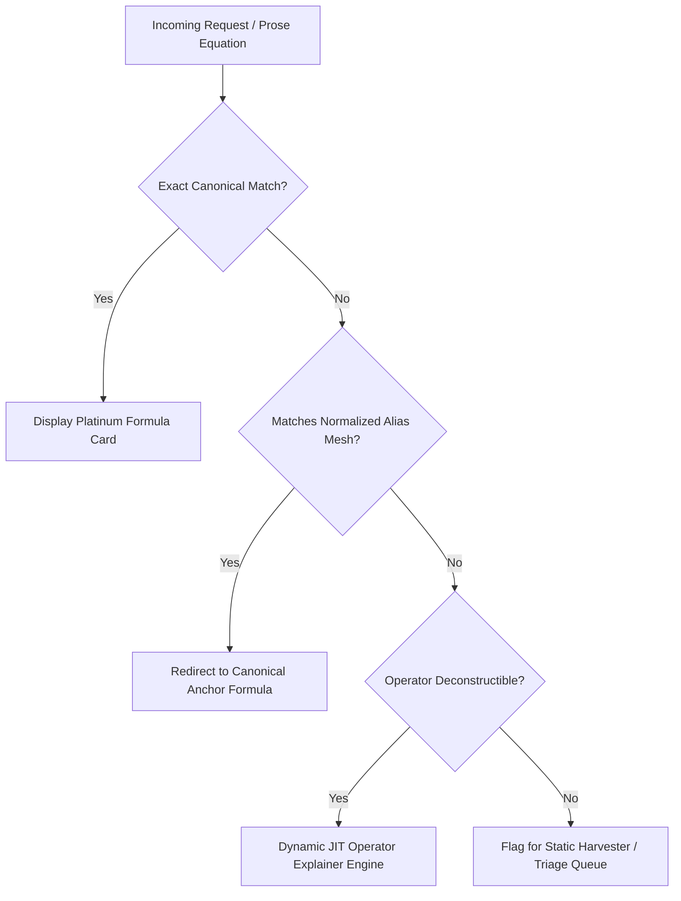

# 🌌 The Semantic Expansion Horizon: Bounding Infinite Frontiers in Physics Knowledge Graphs

**Document Reference:** `docs/Semantic_Expansion_Horizon.md`  
**System Scope:** Physics Lab Digital Encyclopedia & Manifold Architecture  
**Status:** Architectural Specification & Theoretical Framework  

---

## 1. Executive Summary & Core Thesis

When synthesizing large-scale, mathematically rigorous scientific knowledge networks—particularly with LLM-assisted enrichment (such as Vertex AI / Gemini pipelines)—a fundamental epistemological phenomenon inevitably emerges: **The Semantic Expansion Horizon**.

```
                           THE EXPANSION HORIZON
                                    ▲
                                   ╱ ╲
                                  ╱   ╲
                       CONCEPTUAL       MATHEMATICAL
                       FRONTIER          NOTATION DRIFT
                          │                    │
                          ▼                    ▼
                    New Subtopic          Notation Variants,
                    Cross-References      Intermediate Steps,
                    & Terminology         Unit Conventions
                                  ╲   ╱
                                   ╲ ╱
                                    ▼
                          MANIFOLD EXPANSION
```

As explanatory prose achieves higher conceptual density and physical precision, it inherently introduces new domain concepts, cross-disciplinary connections, intermediate mathematical steps, coordinate-system transformations, and notation variants. Left unmanaged, this generates an infinite frontier of dangling entity references and unmapped mathematical expressions.

This document formalizes the mechanics of the Semantic Expansion Horizon in physics encyclopedias and outlines the **Five Invariant Governance Principles** required to maintain an unbounded depth of explanation while keeping the underlying graph structurally bounded, self-contained, and referentially complete.

---

## 2. The Anatomy of Semantic Expansion

In an interconnected mathematical ontology, expansion manifests across two distinct but complementary dimensions:

### 2.1 The Conceptual Frontier (Subtopic Expansion)
When an article describes a physical theory (e.g. *Quantum Tunneling*), thorough pedagogy requires establishing context with adjacent phenomena (*Evanescent Wave Modes*, *WKB Semiclassical Approximation*, *Phase Memory in Mesoscopic Rings*). 

Every newly introduced term represents a potential node in the graph:
$$\mathcal{G}_{t+1} = \mathcal{G}_t \cup \Delta \mathcal{V}_{\text{concepts}}$$

If every referenced concept demands an independent page, the graph enters exponential branching where each explanatory expansion generates $k > 1$ new frontier nodes.

### 2.2 The Mathematical Frontier (Notation Drift & Intermediate Derivations)
Mathematics possesses near-infinite representational redundancy. A single physical law rarely appears in only one canonical form throughout literature. When explaining derivations, prose naturally introduces:

1. **Natural vs. Explicit Unit Systems**:
   - Explicit SI: $\nabla^2 \Phi = 4\pi G \rho$
   - Natural / Geometrized ($4\pi G = 1$ or $G=c=1$): $\nabla^2 \Psi = \rho$ or $R_{\mu\nu} = 8\pi T_{\mu\nu}$
2. **Variable / Coordinate Aliases**:
   - Linear frequency vs. Angular frequency: $E = h\nu \iff E = \hbar\omega$
   - Gravitational potential notation: $\Phi(\mathbf{r}) \iff \Psi(\mathbf{r}) \iff V(\mathbf{x})$
   - Wavefunction coordinates: $\Psi(x, t) \iff | \psi(t) \rangle \iff \psi(\mathbf{k}, \omega)$
3. **Intermediate Derivation Steps**:
   - Continuity / Flux balances: $\frac{\partial \rho}{\partial t} + \nabla \cdot \mathbf{j} = 0$
   - Normalization & Probability Integrals: $P(\mathcal{V}) = \int_{\mathcal{V}} |\Psi|^2 d\tau$
   - Perturbation expansions: $g_{\mu\nu} = \eta_{\mu\nu} + h_{\mu\nu}$

When users or subtopic links click through to the `Equation Explainer` for an intermediate expression, the system faces an apparent dilemma: *Must every intermediate mathematical step possess a dedicated 1-of-1 database formula card?*

---

## 3. Why Expansion is Inevitable in AI-Enriched Systems

During the recent Vertex AI enrichment campaign across Physics Lab's **13,764 canonical formulas** and **1,300+ subtopics**:
- Vertex AI models were directed to provide **uncompromising mathematical rigor** and **deep contextual lineage**.
- To satisfy this directive, the AI naturally deployed domain-standard intermediate equations and cross-disciplinary terminology.
- The formula index was constructed **formula-first** (indexing the 13,764 defined formula cards). However, subtopic articles contained a richer **prose-first** mathematical vocabulary.

This naturally produced a small delta of valid, physically meaningful expressions present in the encyclopedia's text that lacked direct entries in the canonical index.

---

## 4. The Five Governance Principles for Bounding the Manifold

To achieve structural closure without sacrificing content depth, Physics Lab employs a multi-tiered architecture:



### Principle 1: The Platinum Canonical Anchor Hub
The encyclopedia maintains an immutable core of **Canonical Platinum Formulas** (e.g. Poisson's Equation, Schrödinger's Equation, Einstein's Field Equations, Planck-Einstein Relation). 
- These anchors serve as the fundamental ground truth nodes for derivation graphs, dimensional checks, and academic citations.
- Subordinate or variant equations do not compete with canonical anchors; they orbit them.

### Principle 2: The Multi-Layer Alias & Normalization Mesh
Rather than creating new database entries for every notation variant, the system uses an **Alias Mesh** in `formulas_latex_index.json`:
1. **TeX Normalization**: Strips cosmetic whitespace, standardizes macro brackets (`\frac{a}{b}` vs `{a \over b}`), and resolves identical glyphs (`\epsilon_0` vs `\varepsilon_0`).
2. **Symbolic Equivalence Mapping**: Maps notation synonyms to the parent formula ID:
   $$\nabla^2 \Psi = \rho \xrightarrow{\text{Alias Index}} \text{poisson-equation-potential}$$
   $$E = h f \xrightarrow{\text{Alias Index}} \text{photon-energy}$$
   $$H^2 = \frac{8\pi G}{3}\rho \xrightarrow{\text{Alias Index}} \text{friedmann-first-equation}$$

### Principle 3: Dynamic JIT (Just-In-Time) Operator Decomposition
For ad-hoc intermediate steps or expressions that do not represent standalone named physical laws, the `Equation Explainer` employs **Dynamic Decomposition**:
- Parses the AST (Abstract Syntax Tree) of the TeX expression dynamically.
- Identifies foundational operators: $\nabla^2$ (Laplacian / spatial diffusion), $\frac{\partial}{\partial t}$ (temporal rate), $\int$ (accumulation / measure), and constituent variable dimensions.
- Renders an informative structural breakdown without requiring a hardcoded row in MariaDB or a dedicated JSON shard record.

### Principle 4: Closed-Corpus Static Harvesters
To prevent unmapped URLs from reaching end users, an automated audit tool (`scripts/audit_undefined_equations.php`) performs proactive boundary maintenance:
1. **Corpus Scrape**: Scans all 12 topic shards and subtopic HTML strings for `<svg data-tex="...">`, `\[ ... \]`, and explainer hyperlinks.
2. **Resolution Pass**: Verifies whether each harvested TeX snippet resolves through the index.
3. **Auto-Remediation**:
   - Automatically registers notation aliases in `formulas_latex_index.json`.
   - Identifies genuine missing landmark equations and prompts shard creation.
   - Cleans legacy OCR or broken TeX corruptions.

### Principle 5: Hyperlink Entropy Dampening
To prevent infinite subtopic node explosion:
- **Concept Coalescence**: Closely related sub-concepts are embedded as **Pillars** or deep-dive sections within parent subtopics rather than fragmented into micro-stubs.
- **Link Budgeting**: Cross-links prioritize established primary nodes rather than continuously creating newly coined concept slugs.

---

## 5. Architectural Blueprint for Implementation

```
app/
├── config/
│   ├── formulas_latex_index.json    <-- Canonical & Alias Normalization Mesh
│   └── content/
│       ├── categories.json          <-- 12 Top-Level Topic Hubs
│       ├── formulas/                <-- 256 Shard Stores (13,764 Platinum Anchors)
│       └── topics/                  <-- 12 Rich Subtopic Shards
├── logic/
│   ├── PhysicsService.php           <-- Normalization & Breadcrumb Resolver
│   └── OperatorDecomposer.php       <-- Fallback JIT TeX AST Parser
└── scripts/
    ├── fixlatex                     <-- Direct Single-URL Interactive Repair
    ├── audit_undefined_equations.php<-- Full-Corpus Boundary Harvester
    └── integrity_shield.py          <-- Pre-Push Referential Gatekeeper
```

---

## 6. Conclusion: A Complete, Bounded, and Living Manifold

The Semantic Expansion Horizon is not a software defect; it is the natural signature of a deep, living scientific encyclopedia. By establishing clear boundaries between **Canonical Anchors**, an **Alias Normalization Mesh**, and **Dynamic JIT Operator Parsing**, Physics Lab achieves the ideal balance: **infinite pedagogical depth resting upon a bounded, fully verified mathematical foundation.**
