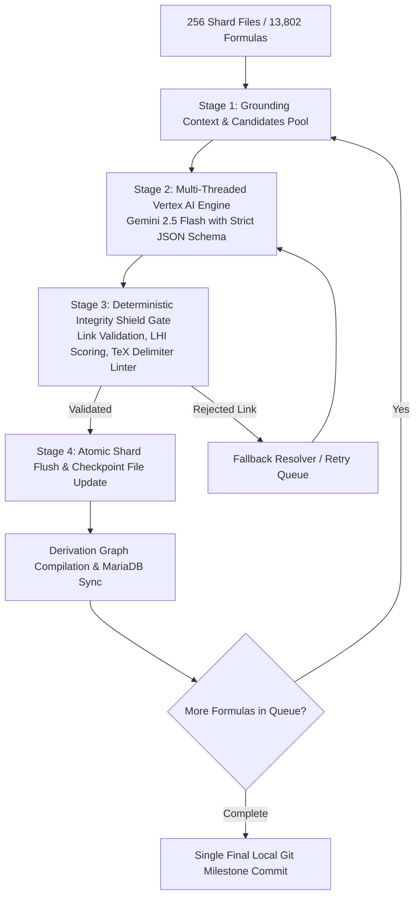

# Vertex AI Equation & Lineage Derivation Map Updater
**Date:** 2026-08-23  
**Status:** Architecture Specification & Operational Blueprint  
**Target Scope:** Terra Physics Lab (13,802 Formulas across 256 Shards)

---

## 1. Executive Summary & Objective

The Terra Physics Lab encyclopedia contains **13,802 physics formulas** partitioned across 256 JSON shard files (`app/config/content/formulas/[xx]/shard_[xx].json`). 

An audit using the **Lineage Health Index (LHI)** established the baseline health of the formula derivation graph:
* 🟢 **Rich & Complete (LHI 75–100):** 1,194 (8.7%)
* 🟡 **Moderate (LHI 40–74):** 9,792 (70.9%)
* 🔴 **Thin (LHI 1–39):** 786 (5.7%)
* ⚫ **Isolated (LHI 0):** 2,030 (14.7%)

**Primary Goal:** Leverage **Google Cloud Vertex AI (Gemini 2.5 Flash / Pro)** to systematically enrich, sanitize, and link all formula nodes into a connected mathematical derivation DAG, elevating >90% of the encyclopedia to an LHI score $\ge 80 / 100$.

---

## 2. End-to-End System Architecture



---

## 3. Core Engine Components

### 3.1 Grounded Candidate Vector & Token Index (Zero-Hallucination Gate)
* **Challenge:** Unconstrained LLMs frequently hallucinate nonexistent parent formula IDs (e.g., `coulomb-law-v1`), causing graph corruption and `IntegrityShield` test failures.
* **Solution:** 
  * On startup, the engine loads all 13,802 canonical IDs, LaTeX strings, titles, and subtopic tags into memory.
  * For each target formula $F$, a multi-signal similarity search extracts the **top 25–30 most mathematically and topologically related candidate formulas**.
  * The prompt constrains Gemini to select `parent_formula_id` and `subcomponents` exclusively from this candidate pool (or mark `derivation_type: "AXIOMATIC_FOUNDATION"` with `null` parent).

### 3.2 Robust TeX JSON Parser (`robust_json_decode`)
* Physics JSON payloads contain complex LaTeX escape sequences (`\nabla`, `\partial`, `\hbar`, `\uparrow`, `\frac`) that often violate strict standard JSON parsing rules.
* The parser incorporates multi-stage regex pre-processing:
  1. Fixes `\u` characters that are not 4-hex Unicode escapes (e.g., `\unit`, `\uparrow`).
  2. Preserves valid standard JSON escape sequences (`\n`, `\t`, `\r`, `\"`, `\\`).
  3. Escapes all unescaped TeX backslashes in property values before passing to `json.loads(..., strict=False)`.

### 3.3 Deterministic Verification & Cycle Detection
Before any shard is updated on disk:
1. **Link Verification:** Confirms that `parent_formula_id` and all `subcomponents` exist in the shard index.
2. **Cycle Prevention:** Prohibits self-links (`fid == parent_id`) and mutual parent loops ($A \to B \to A$).
3. **TeX Delimiter Balance:** Verifies that all inline math expressions in prose fields (`conceptual_definition`, `interpretation`, `limits_and_boundary`) have matching, closed delimiters (`$ ... $` or `\( ... \)`).
4. **LHI Score Gate:** Calculates pre- and post-enrichment LHI scores.

---

## 4. Batch Sizing, Throughput & Telemetry Strategy

### 4.1 Starting Batch Size & Concurrency
* **Initial Batch Size:** **8 formulas per chunk**.
* **Worker Concurrency:** **4 to 8 parallel worker threads**.
* **Rationale:** Fast initial feedback loop ($\approx 30–45\text{ seconds per batch}$), allowing rapid verification of API latency, memory footprint, and disk lock stability.

### 4.2 Dynamic Batch Sizing Criteria (+ / -)
* **Scale UP (8 $\to$ 16 $\to$ 32 $\to$ 50):**
  * Trigger: 5 consecutive batches with 100% success rate, average API latency $<6\text{s}$, zero rate limits.
  * Benefit: Reduces graph recompilation frequency, saving $\approx 30\text{ seconds}$ per 100 formulas.
* **Scale DOWN (8 $\to$ 4):**
  * Trigger: Encountering HTTP 429 (`ResourceExhausted`) or API timeouts $>20\text{s}$.

### 4.3 Minimal 30-Second Telemetry Heartbeat
To keep terminal output clean and readable during multi-hour runs, a heartbeat timer emits single-line updates every 30 seconds:
```text
[12:45:30] ⏱️ Progress: 48/2030 (2.4%) | Speed: 1.6 f/s | Avg LHI: +92.1 pts | Errors: 0 | ETC: 20.6 mins
[12:46:00] ⏱️ Progress: 96/2030 (4.7%) | Speed: 1.6 f/s | Avg LHI: +92.8 pts | Errors: 0 | ETC: 19.8 mins
```

---

## 5. Git Commit Strategy: Deferred Single Milestone Commit

### 5.1 The Decision to Defer Git Commits
Instead of committing after every batch (which creates 40+ noisy micro-commits), all Git operations are deferred until the entire target phase completes.

### 5.2 Benefits:
1. **Clean Git History:** One clear milestone commit per enrichment sprint (e.g. `feat(physics): enrich 2,030 isolated formulas via Vertex AI`).
2. **Zero Lock Contention:** Eliminates `.git/index.lock` contention and disk re-indexing overhead during execution.
3. **Graph & DB Independence:** The Derivation Graph compiler and MariaDB synchronizer read directly from shard files on disk; they operate independently of Git state.

### 5.3 Crash Resilience via External JSON Checkpoint:
* State is persisted in real time to `app/config/vertex_enricher_checkpoint.json`.
* If the run is interrupted, restarting the script immediately skips already-enriched formula IDs and resumes at the exact stopping point.

---

## 6. Estimated Time of Completion (ETC) & Cost Model

### 6.1 Cost Model (Gemini 2.5 Flash on Vertex AI)
* **Input Tokens:** $\approx 600\text{ tokens/formula} \times \$0.15 / \text{1M tokens}$
* **Output Tokens:** $\approx 450\text{ tokens/formula} \times \$0.60 / \text{1M tokens}$
* **Unit Cost:** $\approx \$0.00036\text{ per formula}$ ($\approx \$0.36\text{ per 1,000 formulas}$)
* **Total Corpus Cost (13,802 Formulas):** **$\approx \$5.00 – \$8.00 total** (fully covered by GCP Free Trial Credits / Promotional Grants).

### 6.2 Phased Rollout Timeline

| Phase | Formula Target | Formula Count | Expected Runtime (8 Threads) | Target LHI |
| :--- | :--- | :---: | :---: | :---: |
| **Phase 1** | Isolated Formulas | 2,030 | $\approx 1.3\text{ hours}$ | $0 \longrightarrow \ge 90$ |
| **Phase 2** | Thin Formulas | 786 | $\approx 30\text{ minutes}$ | $1–39 \longrightarrow \ge 90$ |
| **Phase 3** | Moderate Formulas | 9,792 | $\approx 4.5\text{ hours}$ | $40–74 \longrightarrow \ge 90$ |
| **Total** | **Full Encyclopedia** | **12,608** | **$\approx 6.0 – 6.5\text{ hours}$** | **$>90 / 100$ Corpus Average** |

---

## 7. CLI Reference Implementation

The engine is implemented in [`scripts/maintenance/run_vertex_lineage_enricher.py`](file:///Users/holobetj/code/gemini/terra/scripts/maintenance/run_vertex_lineage_enricher.py).

```bash
# Dry run test on 8 isolated formulas
.venv/bin/python3 scripts/maintenance/run_vertex_lineage_enricher.py --filter isolated --limit 8 --dry-run

# Run initial batch of 8 formulas with live atomic shard updates
.venv/bin/python3 scripts/maintenance/run_vertex_lineage_enricher.py --filter isolated --limit 8 --concurrency 8 --rebuild-graph

# Run complete Phase 1 (all isolated formulas) in chunks of 8
.venv/bin/python3 scripts/maintenance/run_vertex_lineage_enricher.py --filter isolated --batch-size 8 --concurrency 8 --rebuild-graph
```
