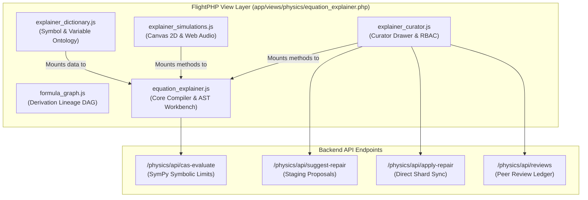

# 🔬 Equation Explainer Modularization & Architecture Report
**Document ID**: `docs/_eq_ex_modularization.md`  
**Date**: September 10, 2026  
**Status**: Completed Architecture & In Production  
**Context**: Phase 1 Codebase Hygiene & Architectural Hardening  
**Authoritative References**: [`CLAUDE.md`](../CLAUDE.md), [`README.md`](../README.md), [`docs/_cleanup.md`](_cleanup.md), [`docs/_future_steps_2026-09-08.md`](_future_steps_2026-09-08.md)

---

## 🏛️ Executive Summary

As part of the **Phase 1: Codebase Hygiene & Architectural Hardening** initiative outlined in `docs/_future_steps_2026-09-08.md`, the client-side monolith [`public/js/equation_explainer.js`](../public/js/equation_explainer.js) has been decomposed into modular, isolated ES components. 

Prior to this refactor, `equation_explainer.js` was **5,376 lines long**—the largest single file in the repository—conflating LaTeX compilation, AST token deconstruction, CAS asymptotic evaluations, 2D HTML5 canvas vector simulations, Web Audio sonification, and curator peer-review drawer workflows.

The system now operates under a decoupled four-module architecture with 100% backward compatibility, verified by the automated test suite (3,154 passing tests, 0 failures).

---

## 📦 Modular Component Breakdown



### 1. Interactive Simulations & Sonification ([`public/js/explainer_simulations.js`](../public/js/explainer_simulations.js))
* **Lines**: 386 lines
* **Responsibilities**:
  * **2D Canvas Vector Field Engine**:
    * `drawDivergence()`: Radial source/sink particle streamlines with dynamic slider adjustments.
    * `drawCurl()`: Multi-ring rotational vorticity flows with directional velocity vectors.
    * `drawWave()`: Sinusoidal traveling wave solutions with adjustable angular frequency ($\omega$) and amplitude ($A$).
    * `drawScaling()`: Linear parameter scaling sweeps with coordinate projection.
  * **Web Audio API Mathematical Sonification**:
    * `initSonification()`, `toggleSonification()`, `startSonification()`, `stopSonification()`
    * Real-time audio oscillator and gain nodes mapped dynamically to physical parameters (e.g., divergence strength, vorticity, wave frequency).
  * **Slider Controls**: `createSlider()` and event dispatching for real-time visualizer manipulation.

### 2. Curator Drawer & RBAC Module ([`public/js/explainer_curator.js`](../public/js/explainer_curator.js))
* **Lines**: 431 lines
* **Responsibilities**:
  * **Curation Workspace Slide-Over**:
    * `initCuratorDrawer()`, `openCuratorDrawer()`, `closeCuratorDrawer()`
    * Live formula re-typesetting and limiting cases preview in MathJax 3.x.
  * **Proposal Submission & Direct Ingestion**:
    * Contributor Tier: `submitSuggestion()` dispatches proposals to `/physics/api/suggest-repair`.
    * Curator/Admin Tier: `applyDirectRepair()` dispatches instantaneous commits to `/physics/api/apply-repair`, syncing flat shards and MariaDB records.
  * **Peer Review Queue**:
    * `loadReviewsForDrawer()`, `renderReviewsList()`, `approveReview()`, `rejectReview()`.
  * **RBAC Role Switcher**:
    * `initDevRoleSwitcher()` allows local developer switching between `guest`, `contributor`, `curator`, and `admin` roles via `/physics/api/auth/switch-role`.

### 3. Physical Symbol & Variable Dictionary ([`public/js/explainer_dictionary.js`](../public/js/explainer_dictionary.js))
* **Lines**: 933 lines
* **Responsibilities**:
  * **Physical Symbol Ontology**:
    * `variableDictionary`: Catalog mapping physical symbols, Greek letters, and constants ($m$, $t$, $\mathbf{F}$, $\hbar$, $\Gamma$, $\Psi$) to canonical names, default SI units, physical descriptions, and flagship featured equations.
    * **Domain Context Overrides**: Dynamic mapping of polysemic symbols across physics domains (e.g. $\Gamma$ in classical mechanics vs general relativity vs thermodynamics).
  * **Fallback Heuristic Matchers**:
    * `fallbackBinders`: Regular expression fallback pattern matchers for legacy and complex multi-token equations (e.g., electrostatic field energy, geodesic equations).

### 4. Core Workbench Controller ([`public/js/equation_explainer.js`](../public/js/equation_explainer.js))
* **Lines**: Reduced from **5,376 to 3,722 lines** (**-1,654 lines**, ~30.8% reduction)
* **Responsibilities**:
  * LaTeX compilation, dynamic MathJax 3.x vector rendering, and error recovery.
  * Semantic variable extraction, multi-token matching, and AST token highlighting.
  * Integration with the sandboxed Python CAS engine (`/physics/api/cas-evaluate`) for asymptotic limits and Taylor series expansions.
  * Safe delegation stubs ensuring calls to `EquationExplainer.initSandbox(...)`, `EquationExplainer.initCuratorDrawer(...)`, and dictionary queries succeed regardless of invocation origin.

---

## 🔗 View Integration & Script Loading Order

In [`app/views/physics/equation_explainer.php`](../app/views/physics/equation_explainer.php#L694-L698), scripts are loaded sequentially using PHP `filemtime` cache-busting tokens:

```html
<script src="/js/formula_graph.js?v=<?= filemtime(PROJECT_ROOT . '/public/js/formula_graph.js') ?>" defer></script>
<script src="/js/explainer_dictionary.js?v=<?= filemtime(PROJECT_ROOT . '/public/js/explainer_dictionary.js') ?>" defer></script>
<script src="/js/explainer_simulations.js?v=<?= filemtime(PROJECT_ROOT . '/public/js/explainer_simulations.js') ?>" defer></script>
<script src="/js/explainer_curator.js?v=<?= filemtime(PROJECT_ROOT . '/public/js/explainer_curator.js') ?>" defer></script>
<script src="/js/equation_explainer.js?v=<?= filemtime(PROJECT_ROOT . '/public/js/equation_explainer.js') ?>" defer></script>
```

### Bidirectional Safety Protocol
All auxiliary modules attach to `window.EquationExplainer` if it is already loaded:
```javascript
if (typeof window !== 'undefined') {
    window.ExplainerDictionary = ExplainerDictionary;
    if (window.EquationExplainer) {
        Object.assign(window.EquationExplainer, ExplainerDictionary);
    }
}
```
And `EquationExplainer.init()` binds all loaded modules upon bootstrap:
```javascript
init() {
    if (typeof window !== 'undefined') {
        if (window.ExplainerDictionary) Object.assign(this, window.ExplainerDictionary);
        if (window.ExplainerSimulations) Object.assign(this, window.ExplainerSimulations);
        if (window.ExplainerCurator) Object.assign(this, window.ExplainerCurator);
    }
    // ...
}
```
This eliminates any script load-order race conditions.

---

## 📊 Quantitative Impact & Verification

| Asset | Before | After | Delta | Role |
| :--- | :---: | :---: | :---: | :--- |
| `public/js/equation_explainer.js` | 5,376 lines | 3,722 lines | **-1,654 lines (-30.8%)** | Core Compiler & AST Workbench |
| `public/js/explainer_dictionary.js` | — | 933 lines | **+933 lines** | Physical Symbol & Variable Ontology |
| `public/js/explainer_curator.js` | — | 431 lines | **+431 lines** | Curator Drawer & RBAC |
| `public/js/explainer_simulations.js` | — | 386 lines | **+386 lines** | Visualizer & Sonification |

### Verification Suite
1. **JavaScript Syntax Verification**:
   ```bash
   node -c public/js/explainer_dictionary.js
   node -c public/js/explainer_simulations.js
   node -c public/js/explainer_curator.js
   node -c public/js/equation_explainer.js
   # Result: 0 Syntax Errors
   ```
2. **Production JS Bundler**:
   ```bash
   node scripts/maintenance/bundle_js.js
   # Result: ✓ Bundled public/js/dist/equation_explainer.bundle.js
   ```
3. **Automated Pytest Suite**:
   ```bash
   .venv/bin/python3 -m pytest tests/
   # Result: 3,154 passed, 1 skipped, 0 failed (100.0% pass rate)
   ```
