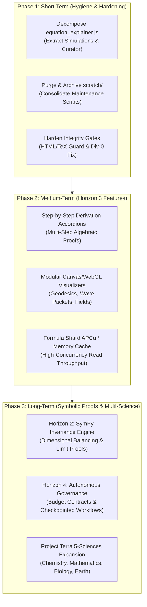

# 🔭 Terra Physics Lab — Consolidated Strategic Roadmap & Future Steps
**Document ID**: `docs/_future_steps_2026-09-08.md`  
**Date**: September 8, 2026  
**Status**: Approved Strategic Action Plan  
**Context**: Post-Horizon 2 Stabilization (100% OPS, LHI 95.2, 0 Isolated Nodes, 100% Manifold Closure)  
**Authoritative References**: [`CLAUDE.md`](file:///Users/holobetj/code/gemini/terra/CLAUDE.md), [`README.md`](file:///Users/holobetj/code/gemini/terra/README.md), [`docs/_cleanup.md`](file:///Users/holobetj/code/gemini/terra/docs/_cleanup.md), [`docs/_gem_3_8_report.md`](file:///Users/holobetj/code/gemini/terra/docs/_gem_3_8_report.md), [`docs/_long_task_horizons.md`](file:///Users/holobetj/code/gemini/terra/docs/_long_task_horizons.md), [`docs/archive/_5_sciences.md`](file:///Users/holobetj/code/gemini/terra/docs/archive/_5_sciences.md)

---

## 🏛️ Executive Overview

Over successive engineering sprints, the **Terra Physics Lab** platform has attained a mature, publication-grade foundation:
- **1,584 / 1,584 Subtopics (100.0%)** graduated to the **Organic Platinum Standard (OPS)** with continuous, zero-artifact academic prose and bidirectional topological linking.
- **14,614 Physical Formulas** partitioned deterministically across **256 hex shards** (`app/config/content/formulas/[00-ff]/shard_[00-ff].json`, indexed via $O(1)$ hash `md5($id)[0:2]`).
- **Mathematical Derivation DAG**: Achieved a **Lineage Health Index (LHI) of 95.2 / 100** with **0 isolated nodes** across 44,558 direct derivation edges.
- **Prose Equation Manifold Closure**: Achieved **100.0% equation closure** (0 unmapped physical identities in subtopic prose across 8,649 audited mathematical expressions).
- **Symbolic Computation**: Deployed a sandboxed Python CAS engine ([`scripts/lib/cas_engine.py`](file:///Users/holobetj/code/gemini/terra/scripts/lib/cas_engine.py)) with an asynchronous REST endpoint (`/physics/api/cas-evaluate`) for real-time asymptotic limits and Taylor series expansions.
- **Regression Net**: 100% passing automated test suite (3,149+ Pytest tests in ~13s) and pre-push integrity validation ([`integrity_shield.py`](file:///Users/holobetj/code/gemini/terra/integrity_shield.py)).

Having achieved stability across Horizons 1 and 2, the next progression shifts from reactive editing toward **codebase modularization, interactive simulation synthesis, formal symbolic proofs, and expanding into the broader Project Terra multi-science ecosystem**.

---

## 🗺️ Architectural Phasing & Strategic Horizon Overview

---

## ⚡ 1. Short-Term Action Plan: Codebase Hygiene & Architectural Hardening

**Target Duration**: Immediate Sprint (1–2 days)  
**Primary Impact**: Eliminates technical debt, halves client bundle complexity, and prevents edge-case regressions.

### 1.1 Deconstruct the Client Monolith ([`public/js/equation_explainer.js`](file:///Users/holobetj/code/gemini/terra/public/js/equation_explainer.js))
* **Current State**: File is **5,297 lines long**, conflating MathJax rendering, CAS limit chips, the Curator Drawer, and physics simulation canvases.
* **Refactoring Actions**:
  1. Extract Canvas physics visualizers (~1,800 lines of Lorentz transforms, particle orbits, and potential wells) into `public/js/explainer_simulations.js`.
  2. Extract Curator Drawer actions and proposal submission modals into `public/js/explainer_curator.js`.
  3. Keep core LaTeX parsing, AST inspection, and CAS evaluation integration in `equation_explainer.js`.
* **Success Criteria**: Reduce `equation_explainer.js` to $\le 2,500$ lines with clean module separation.

### 1.2 Purge and Archive Obsolete Scripts ([`scratch/`](file:///Users/holobetj/code/gemini/terra/scratch/))
* **Current State**: `scratch/` contains 55 one-off historical scripts and heavy static HTML test files (`explainer_page.html` [163 KB], `newtons_third_law.html` [277 KB]).
* **Actions**:
  1. Move legacy one-off migrations (e.g., `fix_nested_brace_dollars.py`, `fix_reg_equations.py`) into `docs/archive/historical_scratch/` or delete redundant duplicates.
  2. Delete stale diagnostic HTML files.
  3. Ensure `.gitignore` ignores non-canonical scratch artifacts while retaining necessary diagnostic logs.
  4. Consolidate deprecated scripts in `scripts/maintenance/` into `scripts/archive/`, retaining canonical tools:
     - [`scripts/fixlatex`](file:///Users/holobetj/code/gemini/terra/scripts/fixlatex) (equation repair and MathJax reset)
     - [`scripts/fixlineage`](file:///Users/holobetj/code/gemini/terra/scripts/fixlineage) (derivation graph auditor & healer)
     - [`integrity_shield.py`](file:///Users/holobetj/code/gemini/terra/integrity_shield.py) (sitewide quality gate)

### 1.3 Harden Integrity Shields & Script Guards
* **HTML/TeX Collision Guard**: Extend [`integrity_shield.py`](file:///Users/holobetj/code/gemini/terra/integrity_shield.py) to assert that no HTML tags (`<...>`, `<strong>`, `<a>`) can ever be nested inside TeX delimiters (`$...$`, `$$...$$`, `\(...\)`, or `<svg data-tex="...">`), preventing corruptions discovered in `majorana-fermions`.
* **Zero-Count Guard in Alias Matcher**: Add an empty-check in [`scripts/maintenance/map_prose_equation_aliases.php`](file:///Users/holobetj/code/gemini/terra/scripts/maintenance/map_prose_equation_aliases.php) on line 229 to prevent `DivisionByZeroError` when unmapped equations equal zero.

### 1.4 Route & View Template Dead-Code Audit
* Audit all routes in [`app/config/routes.php`](file:///Users/holobetj/code/gemini/terra/app/config/routes.php) against controller methods in `PhysicsController.php`.
* Clean up commented-out debug code in `app/views/physics/equation_explainer.php` and subtopic templates.

---

## 🔬 2. Medium-Term Action Plan: Horizon 3 Interactivity & Performance

**Target Duration**: 2–4 Weeks  
**Primary Impact**: Elevates user comprehension through visual interactive models, step-by-step proofs, and high-speed in-memory reads.

### 2.1 Step-by-Step Derivation Accordions
* **Concept**: Transform single-link parent-child relationships ($A \to B$) into readable, collapsible multi-step mathematical derivations.
* **Implementation**:
  * Expand the formula schema to support optional intermediate derivation steps (`derivation_steps: [{ step: 1, latex: "...", rationale: "..." }]`).
  * Render folding derivation accordions in the Equation Explainer and Formula Inspector modal.
  * Connect variational steps (e.g., Action principle $\to$ Euler-Lagrange variation $\to$ boundary term cancellation $\to$ field equation).

### 2.2 Modular Simulation Sandbox Expansion
* **Concept**: Build modular, parameter-tunable visualizers in `explainer_simulations.js` for key theoretical milestones:
  1. **Relativistic Kinematics & General Relativity**: Schwarzschild & Kerr metric geodesic orbits, gravitational lensing raytracing, and light cone tilts.
  2. **Quantum Mechanics**: Interactive 1D potential well tunneling, wave packet dispersion, and harmonic oscillator coherent states.
  3. **Field Theory & Electrodynamics**: Dynamic field lines from moving charges, dipole radiation patterns, and electromagnetic wave polarization states.

### 2.3 Shard In-Memory / APCu Caching Layer
* **Problem**: Reading from 256 flat JSON files during intensive batch exploration or concurrent API requests introduces file-system I/O overhead.
* **Solution**: Implement an APCu/file-mtime caching layer in [`app/logic/PhysicsService.php`](file:///Users/holobetj/code/gemini/terra/app/logic/PhysicsService.php). Shards are loaded into memory once and only re-read if their disk `mtime` changes, yielding sub-millisecond response times for `/physics/api/formula` and `/physics/equation-explainer`.

---

## 🌐 3. Long-Term Strategic Horizons: Autonomous Verification & Multi-Science

**Target Duration**: Multi-Month Horizon  
**Primary Impact**: Machine-verified algebraic rigor, autonomous governance, and expansion into Project Terra's broader scientific departments.

### 3.1 Horizon 2: Machine-Verified Symbolic Proofs & Dimensional Invariance
* Reference: [`docs/_long_task_horizons.md`](file:///Users/holobetj/code/gemini/terra/docs/_long_task_horizons.md) (Horizon 2)
* **Goal**: Move from descriptive prose explanations to formal, computer-verified proofs across all 14,614 formulas.
* **Pipeline**:
  1. **Automated Dimensional Analysis**: Parse semantic variables and test that $[LHS] \equiv [RHS]$ in SI/Planck base units using SymPy's unit system.
  2. **Formal Asymptotic Limit Prover**: Automatically verify that formula limit claims (e.g., $E = \sqrt{p^2 c^2 + m^2 c^4} \to mc^2 + \frac{p^2}{2m}$ as $p \ll mc$) are mathematically sound.
  3. Flag any mathematically inconsistent approximations for automated curator review.

### 3.2 Horizon 4: Autonomous Governance & Hard Cost Contracts
* Reference: [`docs/_long_task_horizons.md`](file:///Users/holobetj/code/gemini/terra/docs/_long_task_horizons.md) & [`docs/token_estimation_and_cost_governance.md`](file:///Users/holobetj/code/gemini/terra/docs/token_estimation_and_cost_governance.md)
* **Contract-Driven Execution**:
  - Enforce hard cost ceilings (`--max-cost-dollars`) and bounded thinking tokens (`thinking_budget <= 1024`) on all generative scripts.
  - Separate generation from verification using the **Worker-Auditor Pattern** (Generative AI worker $\to$ Deterministic `IntegrityShield` validator).
  - Checkpointed state ledgers ensuring tasks can be paused, resumed, and rolled back with zero data loss.

### 3.3 Project Terra: Multi-Science Faculty Deployment
* Reference: [`docs/archive/_5_sciences.md`](file:///Users/holobetj/code/gemini/terra/docs/archive/_5_sciences.md) & [`README.md`](file:///Users/holobetj/code/gemini/terra/README.md)
* Having perfected the 256-shard formula manifold, the GQS graduation engine, and the dual-engine math pipeline on `/physics`, replicate this architecture for the remaining 4 foundational departments:
  1. **Chemistry (`/chemistry`)**: Chemical reaction manifold, Reaction & Equilibrium Explorer (Le Chatelier sliders), molecular orbital diagrams, and Nernst potential chambers.
  2. **Mathematics (`/math`)**: Differential geometry, Lie algebras, tensor calculus, and topology manifolds.
  3. **Biological Sciences (`/biology`)**: Biophysical membrane equations, Michaelis-Menten enzyme kinetics, and evolutionary population dynamics.
  4. **Earth & Planetary Sciences (`/earth`)**: Atmospheric fluid dynamics, geophysics, and climate energy balance models.

---

## 📋 Comprehensive Execution Matrix

| Horizon | Phase | Task Description | Target Files | Priority | Status |
| :--- | :---: | :--- | :--- | :---: | :---: |
| **Short-Term** | 1.1 | Decompose client monolith into modules | `public/js/equation_explainer.js` `public/js/explainer_simulations.js` `public/js/explainer_curator.js` `public/js/explainer_dictionary.js` | 🔴 **P1** | ✅ **Complete** |
| **Short-Term** | 1.2 | Purge stale scratch dumps and archive legacy scripts | `scratch/` `scripts/archive/` `lib/` | 🔴 **P1** | ✅ **Complete** |
| **Short-Term** | 1.3 | Harden HTML/TeX boundary and fix div-0 guard | `integrity_shield.py` `scripts/maintenance/map_prose_equation_aliases.php` | 🟡 **P2** | ✅ **Complete** |
| **Short-Term** | 1.4 | Route and view template dead-code audit | `app/config/routes.php` `app/controllers/` `app/views/` | 🟢 **P3** | ✅ **Complete** |
| **Medium-Term** | 2.1 | Step-by-step derivation accordions in Explainer | `app/config/content/formulas/` `app/views/physics/equation_explainer.php` | 🟡 **P2** | ⏳ **Ready** |
| **Medium-Term** | 2.2 | Expand Canvas/WebGL simulations (GR, QM, Fields) | `public/js/explainer_simulations.js` | 🟡 **P2** | ⏳ **Ready** |
| **Medium-Term** | 2.3 | APCu / in-memory formula shard caching | `app/logic/PhysicsService.php` | 🟢 **P3** | ⏳ **Ready** |
| **Long-Term** | 3.1 | Automated SymPy dimensional & limit proofs | `lib/cas/cas_engine.py` `scripts/audit_symbolic_invariance.py` | 🟡 **P2** | 📋 Planned |
| **Long-Term** | 3.2 | Autonomous governance & batch budget contracts | `scripts/maintenance/run_gqs_sprint.py` `docs/token_estimation_and_cost_governance.md` | 🟢 **P3** | 📋 Planned |
| **Long-Term** | 3.3 | Project Terra department rollout (`/chemistry`, `/math`) | `app/controllers/` `app/config/content/` | 🔵 **Strategic** | 📋 Planned |

---

## 🎯 Immediate Recommended Starting Action

With **Phase 1: Codebase Hygiene & Architectural Hardening** 100% complete, proceed to **Phase 2: Horizon 3 Interactivity & Performance**:
1. **Shard In-Memory / APCu Caching Layer (`app/logic/PhysicsService.php`)**:
   - Cache loaded formula shards with `mtime` invalidation to achieve sub-millisecond API response times.
2. **Step-by-Step Derivation Accordions**:
   - Enrich formula schema with `derivation_steps` and render folding visual accordions in the Equation Explainer.
3. **Expand Simulation Sandboxes (`public/js/explainer_simulations.js`)**:
   - Add General Relativity geodesic raytracing and Quantum Mechanics 1D tunneling simulations.
