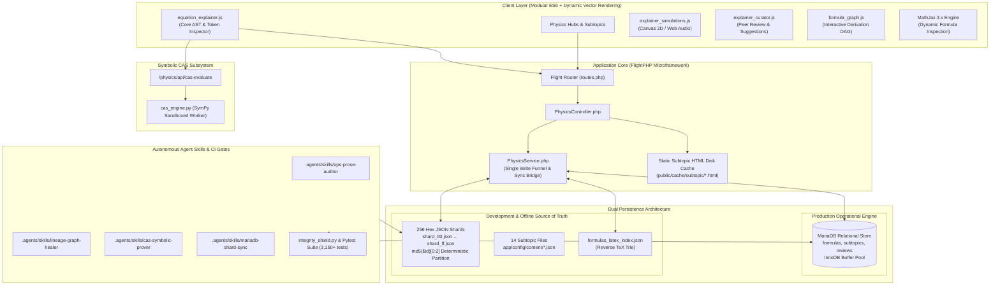
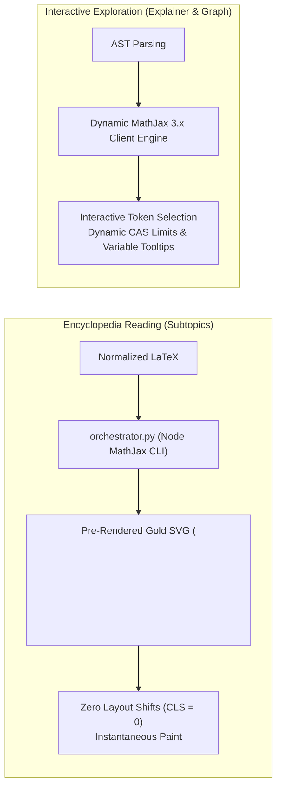

# 🏛️ Terra Physics Lab — System Architecture & Manifold Specification

> **Status**: Active Architecture Standard  
> **Scope**: Core System Architecture, Dual Data Model, Mathematical Rendering, Symbolic Computation & Autonomous Agent Skills  
> **Authoritative References**: [`CLAUDE.md`](../CLAUDE.md), [`README.md`](../README.md), [`docs/delimiters.md`](delimiters.md)

---

## 1. System Overview & Technology Stack

**Terra Physics Lab** is a high-density, mathematically rigorous digital physics encyclopedia, symbolic computation manifold, and derivation lineage network. It indexes, structures, and cross-references **14,614 physical formulas** and **1,584 subtopic encyclopedia articles** across 12 fundamental physics domains.



---

## 2. The Dual-Persistence Data Model

To achieve both high-performance web delivery in production and robust offline version control in Git, the platform operates on a deliberate dual-layer operational architecture:

```
┌────────────────────────────────────────────────────────────────────────────┐
│                  THE DUAL-LAYER OPERATIONAL ARCHITECTURE                   │
├──────────────────────────────────────┬─────────────────────────────────────┤
│   Production Operational Engine      │     Development Source of Truth     │
│             (MariaDB)                │          (Git JSON Shards)          │
├──────────────────────────────────────┼─────────────────────────────────────┤
│ • Serves live API & web requests     │ • Version-controlled in Git repo    │
│ • Full-text search on equations      │ • Human & AI pull-request reviewable│
│ • Parent-child relational joins      │ • Enables offline CLI & CI runs     │
│ • Buffered in InnoDB memory pools    │ • Powers ?preview=1 offline mode    │
│ • Backs static subtopic file cache   │ • Partitioned into 256 hex shards   │
└──────────────────────────────────────┴─────────────────────────────────────┘
```

### A. Production Operational Engine (MariaDB)
* Live user queries run against the **MariaDB** relational store (`formulas`, `subtopics`, `topics`, `reviews`).
* When `PhysicsService::loadFormula()` or `fetchAndPrepare()` is called, it queries indexed MariaDB tables directly, leveraging the InnoDB buffer pool.
* Subtopic encyclopedia views are compiled and served via high-performance disk cache (`public/cache/subtopic/{slug}.html`), bypassing database load on repeat visits.
* Relational tables enforce foreign keys, relational lineage indexes, and full-text keyword indexing.

### B. Development & Offline Source of Truth (Git JSON Shards)
* The **256 hex shards** (`app/config/content/formulas/[00-ff]/shard_[00-ff].json`) and **14 subtopic files** (`app/config/content/*.json`) serve as the **authoritative, version-controlled source of truth in Git**.
* **Deterministic $O(1)$ Partitioning**: Formula IDs map to shards via a deterministic MD5 prefix:
  $$\text{Shard Path} = \text{app/config/content/formulas/} + \text{md5}(\text{formula\_id})[0:2] + \text{/shard\_} + \text{md5}(\text{formula\_id})[0:2] + \text{.json}$$
* With 14,614 formulas evenly distributed across 256 buckets, each shard holds ~57 records (~100 KB per file). This eliminates file-locking bottlenecks, keeps git diffs compact, and prevents memory exhaustion.
* Git shards enable offline development, branch merging, preview mode (`?preview=1`), and automated CI test suites (`pytest`, `integrity_shield.py`, `gqs.py`) without requiring an active database daemon.

### C. The Synchronization Bridge (`PhysicsService.php`)
* `PhysicsService::saveFormula()` serves as the **single write funnel**, ensuring atomic updates:
  1. Serializes clean JSON into the designated hex shard on disk.
  2. Updates or inserts the record into MariaDB `formulas`.
  3. Updates the reverse LaTeX trie (`formulas_latex_index.json`).
* Deployments verify consistency using SHA-256 hash registries (`formulas_hash_registry.json`) to synchronize only modified shards into MariaDB in batch.

---

## 3. Mathematical Rendering: The Dual-Engine Pipeline

Physics Lab rejects single-engine compromises by deploying a hybrid rendering model:



1. **Pre-Rendered Gold Vector SVGs for Static Subtopics**:
   - Subtopic articles in Platinum status contain math pre-compiled into `<svg data-tex="...">` elements.
   - Eliminates Cumulative Layout Shift (CLS), reduces client CPU battery drain, and ensures instantaneous rendering on low-power mobile devices.
2. **Dynamic MathJax 3.x for Equation Explainer & AST Deconstruction**:
   - Located at `/physics/equation-explainer`.
   - Tokenizes raw LaTeX into semantic components: base variables, exponents, indices, differentials, and physical constants.
   - Powers the interactive derivation DAG, variable inspection tooltips, and curator drawer.

---

## 4. Symbolic Computer Algebra System (CAS) Engine

Physics Lab integrates machine verification directly into the pedagogical presentation via an isolated, sandboxed SymPy worker:

* **Worker Daemon**: `scripts/lib/cas_engine.py` provides a sandboxed SymPy execution environment.
* **REST API**: `/physics/api/cas-evaluate` accepts JSON payloads with LaTeX formulas, evaluation variables, and target points.
* **Capabilities**:
  - **Asymptotic Boundary Limits**: Evaluates non-relativistic limits ($v/c \to 0$), infinite distances ($r \to \infty$), event horizons ($r \to r_s$), and zero temperatures ($T \to 0$).
  - **Taylor Series Expansions**: Computes series approximations to arbitrary order around specified expansion points.
  - **Dimensional Invariance**: Verifies physical unit balances across fundamental SI dimensions ($[M]$, $[L]$, $[T]$, $[I]$, $[\Theta]$, $[N]$, $[J]$).

---

## 5. Modular Client Architecture

Following the Phase 1 modularization initiative, the front-end codebase is decoupled into single-responsibility ES modules:

| Module | Location | Responsibilities |
| :--- | :--- | :--- |
| **Equation Explainer Core** | `public/js/equation_explainer.js` | LaTeX AST tokenization, variable highlight matching, MathJax dispatching, CAS query handling. |
| **Simulations & Sonification** | `public/js/explainer_simulations.js` | HTML5 Canvas 2D vector field visualizers (divergence, curl, wave propagation) and Web Audio sonification. |
| **Curator Drawer & Reviews** | `public/js/explainer_curator.js` | Staging proposals, peer-review ledger submissions, and formula parameter edits. |
| **Variable Dictionary** | `public/js/explainer_dictionary.js` | Physics symbol ontology, variable names, dimensions, and standard values. |
| **Derivation Graph Visualizer**| `public/js/formula_graph.js` | Force-directed SVG lineage DAG rendering, breadcrumb navigation, and node inspection. |
| **Math Prose Formatter** | `public/js/math_prose_formatter.js` | Centralized prose delimiter formatting for tooltips, modals, and dynamic cards. |

---

## 6. Antigravity AI Agent Skills Framework

Autonomous maintenance, content graduation, and mathematical audits are managed by specialized agent skills defined in `.agents/skills/`:

```
.agents/skills/
├── ops-prose-auditor/       # Organic Platinum Standard (OPS) audits & In Media Res verification
├── lineage-graph-healer/    # Derivation DAG analysis, LHI scoring & reciprocal shard edge healing
├── cas-symbolic-prover/     # SymPy algebraic equivalence, boundary limits & dimensional checks
└── mariadb-shard-sync/      # Hash registry audits, DB schema validation & shard-to-SQL sync
```

### The Autonomous Self-Healing Loop
When auditing or enriching any entity in the encyclopedia, these skills interact in a closed, verifiable cycle:
1. **Auditor Skill** identifies deficiencies (e.g. thin derivation edges, unmapped prose equations, missing asymptotic limits).
2. **CAS Prover Skill** verifies mathematical properties symbolically before proposing changes.
3. **Write Bridge** updates the Git JSON shard and MariaDB atomically.
4. **Integrity Shield** verifies that all 3,150+ tests pass and manifold closure is preserved.

---

## 7. Project Terra Flagship Context & Production Deployment

Physics Lab serves as the flagship domain module of **Project Terra**, an overarching laboratory and computational manifold designed to scale across five primary sciences (Physics, Chemistry, Mathematics, Biology, Earth Sciences).

* **Development Environment**: Local macOS developer workstation (`http://localhost:8000`), version-controlled with Git.
* **Production Environment**: Independent Linux LAMP stack (Apache/Nginx, PHP 8.2+, MariaDB 10.6+).
* **Automated Quality Gates**:
  - `integrity_shield.py`: Verifies zero broken links, delimiter purity, 100% manifold closure, and schema validity.
  - `pytest tests/`: 3,150+ regression tests executed in ~13 seconds prior to any deployment.
