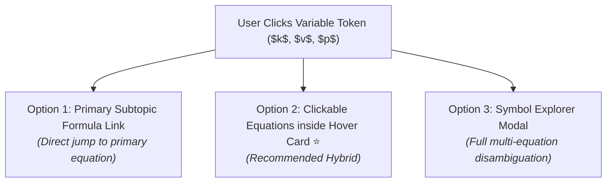

# Architectural Options: Single-Letter Variable Click Behavior & Integration

> **Date**: August 1, 2026  
> **Context**: Analysis of user interaction patterns for single-letter variables ($v, m, F, p, k, E, a, t, r$) across subtopic pages (such as `/physics/subtopic/classical-mechanics-overview`).

---

## 1. Background & Evolution

| Aspect | Original System | Options A & B (Current State) |
| :--- | :--- | :--- |
| **Hover Action** | Default dotted underline / basic tooltip. | **Option A Hover Card**: Instant popover showing symbol, SI unit, definition, and relevant subtopic equations. |
| **Sidebar Overview** | None. | **Option B Sidebar Legend**: "Key Quantities & Symbols" panel with bidirectional hover highlighting. |
| **Click Action** | Hardcoded direct link to a single LaTeX identity in the **Equation Explainer** (e.g., clicking $p$ jumped to `\mathbf{p}`). | Intercepts click via `mathjax_inspector.js` to open Equation Explainer for that exact TeX string. |

---

## 2. Core Tradeoffs with Direct Variable Clicks

1. **Context Ambiguity**:
   - A single letter like **$v$** in kinetic energy ($K = \frac{1}{2}mv^2$) should not blindly jump to the 3D velocity vector ($\mathbf{v}$).
   - Directing a user off the current subtopic page every time they tap a variable breaks their reading flow.

2. **Destination Uncertainty**:
   - When a user clicks **$k$** (Spring Constant), which exact equation should the Equation Explainer open? Hooke's Law ($F = -kx$)? The Harmonic Oscillator ($\ddot{x} + \omega^2 x = 0$)? Or Potential Energy ($U = \frac{1}{2}kx^2$)?

---

## 3. Proposed Click Behavior Strategies

### Option 1: Direct Link to Primary Subtopic Formula *(Restores original intent with domain scoping)*
- **Behavior**: Clicking $k$ in *Classical Mechanics* navigates directly to the Equation Explainer for the **primary defining formula** of $k$ in that subtopic (e.g., Hooke's Law $F = -kx$).
- **Pros**: Restores the direct-click workflow while ensuring the target equation is relevant to Classical Mechanics.
- **Cons**: Still navigates off the page on accidental clicks.

---

### Option 2: Hover Card Links to Equation Explainer ⭐ *(Recommended Hybrid)*
- **Behavior**: 
  - **Hovering** over $k$ displays the Option A Hover Card instantly.
  - Inside the Hover Card, each listed formula (e.g., *Simple Harmonic Oscillator*, *Hooke's Law*) contains a **clickable link button** (`Analyze Equation →`) that opens the Equation Explainer for that specific equation.
- **Pros**: Preserves reading flow while giving users the exact choice of which equation to inspect in the Equation Explainer.

---

### Option 3: Click Opens "Symbol Explorer" Modal
- **Behavior**: Clicking $k$ opens an interactive overlay modal listing all occurrences of $k$ across Terra with direct links to the Equation Explainer for each.
- **Pros**: Complete educational context and zero ambiguity.
- **Cons**: Slightly heavier UI interaction.

---

## 4. Summary & Recommendation

Combining **Option 2 (Clickable Equation Links inside Option A Hover Card)** with **Option 1 (Domain-Scoped Primary Redirects on double-click or fallback)** provides the ideal user experience: reading flow is preserved, and users retain complete freedom to jump directly into the Equation Explainer for any target equation.
