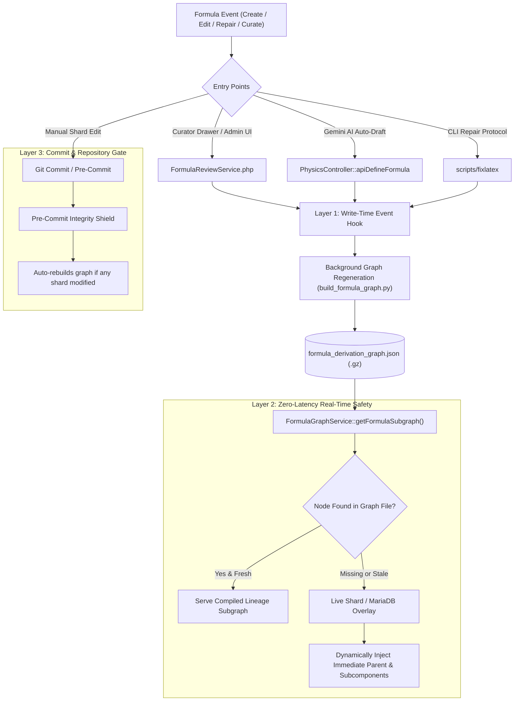

# Continuous Synchronization Architecture for the Mathematical Lineage & Derivation Map

This document outlines the architecture, data flow, and synchronization mechanisms ensuring that the **Mathematical Lineage & Derivation Map** is always updated in real time whenever formulas are created, edited, curated, or repaired across Physics Lab.

---

## 1. Overview & Problem Statement

The **Mathematical Lineage & Derivation Map** renders a directed acyclic graph (DAG) visualizing:
- **Upstream Axioms / Master Laws (Layer -1, -2)**: Foundational equations from which the current formula is derived.
- **Root Focus Equation (Layer 0)**: The current active formula.
- **Downstream Applications & Limit Cases (Layer +1, +2)**: Sub-equations, approximations, and physical specializations.

When formulas are updated through multiple entry points (Curator Drawer, Gemini AI Auto-Drafting, `scripts/fixlatex` CLI, or direct JSON shard editing), the pre-compiled graph (`app/config/formula_derivation_graph.json` and `.gz`) can fall out of sync if not continuously maintained.

---

## 2. The 4-Layer Synchronization Architecture



---

## 3. Detailed Component Breakdown

### Layer 1: Write-Time Event Hooks
Whenever a formula's structure or relationships change at any runtime entry point, an automated write hook executes:

1. **`FormulaReviewService.php` (`directRepair` / `approveReview`)**:
   - When a curator or admin approves a review proposal or applies a direct fix modifying `parent_formula_id`, `derivation_type`, or `subcomponents`, trigger graph regeneration:
     ```php
     exec('python3 ' . escapeshellarg(PROJECT_ROOT . '/scripts/build_formula_graph.py') . ' > /dev/null 2>&1 &');
     ```

2. **`PhysicsController.php` (`apiDefineFormula`)**:
   - When Gemini Vertex AI drafts and persists a new formula definition, immediately invoke the graph compilation hook.

3. **`scripts/maintenance/fixlatex.py` (`scripts/fixlatex`)**:
   - At the conclusion of equation repairs and TeX decorruptions, run `build_formula_graph.py` automatically as step 4 of the repair engine.

---

### Layer 2: Live Dynamic Overlay in `FormulaGraphService.php` (Zero-Latency Fallback)

To eliminate any window where a user creates a formula and navigates immediately to the Lineage Map before background compilation finishes:

1. `FormulaGraphService::getFormulaSubgraph($formulaId, $depth)` loads the compiled graph.
2. If `$formulaId` is absent from `$graph['nodes']` or lacks updated links, the service performs a fast live lookup:
   - Fetches the active formula record from MariaDB / Shard.
   - Extracts `parent_formula_id`, `derivation_type`, and `subcomponents`.
   - Injects the missing nodes and directional links dynamically into the returned subgraph JSON.
3. **Result**: Zero perceived latency for end users, with instantaneous lineage visualization.

---

### Layer 3: Pre-Commit Integrity Shield Gate

In `scripts/precommit_integrity_shield.py`:
- Detects if any file matching `app/config/content/formulas/*/shard_*.json` was staged or modified.
- Automatically compiles `app/config/formula_derivation_graph.json` and `app/config/formula_derivation_graph.json.gz`.
- Stages the regenerated graph files into the commit automatically, guaranteeing that remote git repositories are always 100% in sync.

---

### Layer 4: Semantic Variable & Lineage Integrity Rules

To prevent false-positive link explosions (such as the $n=0$ index collision across 44 unrelated formulas):

1. **Strict Subcomponent Validation**:
   - A formula ID may only be listed in `subcomponents` if it represents a genuine physical or mathematical sub-equation, constraint, or limiting case of the master equation.
   - Index variables (e.g. integer mode counters $n=0, 1, 2, \dots$) must **never** be linked as global subcomponents unless they represent specific domain-scoped laws (such as $Q = ne = 0$ for Charge Neutrality).

2. **Parent Law Verification**:
   - `parent_formula_id` must resolve to a valid canonical formula ID in the encyclopedia.
   - `derivation_type` must be explicitly classified among:
     - `DERIVED_FROM` (Direct mathematical derivation)
     - `SPECIAL_CASE` (Boundary or limiting condition)
     - `GENERALIZATION_OF` (Broader theoretical framework)
     - `APPROXIMATION_OF` (Non-relativistic, weak-field, or classical limit)
     - `AXIOMATIC_FOUNDATION` (Fundamental postulate)

---

## 4. Implementation Checklist

- [ ] Add post-save graph build hook in `FormulaReviewService.php`.
- [ ] Add post-save graph build hook in `PhysicsController::apiDefineFormula`.
- [ ] Update `scripts/maintenance/fixlatex.py` to invoke `build_formula_graph.py` on completion.
- [ ] Implement live database/shard overlay fallback in `FormulaGraphService.php`.
- [ ] Verify `scripts/precommit_integrity_shield.py` ensures graph sync on commit.
