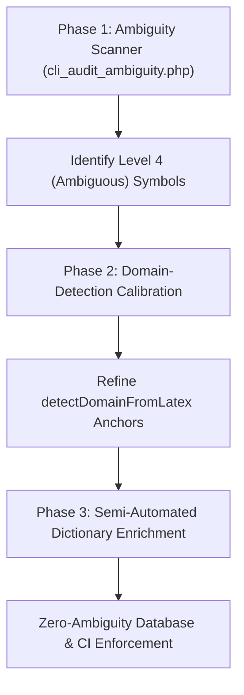

# Automated Ambiguity Auditing & Domain Alignment Pipeline

This document outlines the blueprint for a systematic, automated pipeline to scan, calibrate, and resolve overloaded variable and constant definitions across all sharded physics formulas in the database.

---

## The Goal
Achieve **zero ambiguity** across the entire formula database. Every variable and constant in every equation must resolve to its exact, contextual physical meaning in the frontend breakdown, without requiring manual inspection of thousands of individual equations.

---

## The Proposed Three-Phase Pipeline

### Phase 1: The Automated Ambiguity Scanner (Static Code Audit)
A CLI scanner script (e.g., `php cli_audit_ambiguity.php` or a Node.js equivalent) is run against all formulas mapped in `app/config/formulas_latex_index.json`.

For each formula, the scanner runs the token extraction logic and categorizes the resolution status of each symbol:

| Resolution Level | Definition | Action Taken by Scanner |
| :--- | :--- | :--- |
| **Level 1: Explicitly Resolved** | Symbol has a database override in `semantic_variables`. | Ignored (Safe). |
| **Level 2: Contextually Resolved** | Symbol has a dictionary alternative matching the formula's auto-detected domain. | Ignored (Safe). |
| **Level 3: Default Resolved** | Symbol has a single dictionary definition with no alternatives (e.g., $\pi$). | Ignored (Safe). |
| **Level 4: Ambiguous** | Symbol has multiple dictionary alternatives, but **none match the formula's auto-detected domain** (e.g., $E, F, G, T, \mu, \rho$). | **Flagged for audit.** |

> [!NOTE]
> The scanner outputs a structured report listing all flagged formulas, their auto-detected domains, and the ambiguous symbols.

---

### Phase 2: Domain-Detection Calibration (Anchors Alignment)
Before resolving the flagged variables, the domain classifier must be calibrated to ensure it assigns the correct domain context:

1. **Compare**: The scanner compares the domain returned by `detectDomainFromLatex(latex)` with the actual database topic/subtopic.
2. **Flag Mismatches**: Any formula where the auto-detected domain disagrees with the database topic (e.g., a thermodynamics formula classified as classical mechanics) is flagged.
3. **Refine Anchors**: Adjust structural regex rules and co-occurrence counts in `detectDomainFromLatex` until the index classification agreement rate is $>95\%$.

---

### Phase 3: Semi-Automated Dictionary Enrichment
With calibrated domain detection, the flagged ambiguities from Phase 1 are systematically resolved:

1. **Generate Delta Map**: Compile a list of unique `[Detected Domain, Symbol]` pairs.
   * *Example*: `['quantum_mechanics', '\\phi']`, `['thermodynamics', 'Q']`.
2. **Enrich Dictionary**: For each pair in the delta map, write the corresponding domain-specific entry (name, description, unit) into the `alternatives` array of that symbol in `physicsDictionary` inside `public/js/equation_explainer.js`.
3. **Re-Verify**: Run the scanner again to verify that all flagged ambiguities have been successfully resolved to Level 2 (Contextually Resolved).

---

## Phase 4: Continuous Integration (CI) Enforcement

> [!TIP]
> Integrate the Ambiguity Scanner directly into the database synchronization script (`php cli_sync.php`). 

If a developer adds a new equation with an ambiguous variable that has no database override and no matching domain alternative in the dictionary, the sync script will throw a validation error, preventing the commit until the dictionary or database override is defined.
