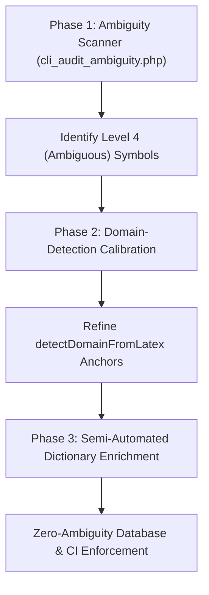

# Automated Ambiguity Auditing & Domain Alignment Pipeline

This document outlines the blueprint for a systematic, automated pipeline to scan, calibrate, and resolve overloaded variable and constant definitions across all sharded physics formulas in the database.

---

## The Goal
Achieve **zero ambiguity** across the entire formula database. Every variable and constant in every equation must resolve to its exact, contextual physical meaning in the frontend breakdown, without requiring manual inspection of thousands of individual equations.

---

## The Proposed Three-Phase Pipeline



### Phase 1: The Automated Ambiguity Scanner (Static Code Audit)
A CLI scanner script (e.g., `php cli_audit_ambiguity.php` or a Node.js equivalent) is run against all formulas mapped in `app/config/formulas_latex_index.json`.

For each formula, the scanner runs the token extraction logic and categorizes the resolution status of each symbol:

| Resolution Level | Definition | Action Taken by Scanner |
| :--- | :--- | :--- |
| **Level 1: Explicitly Resolved** | Symbol has a database override in `semantic_variables`. | Ignored (Safe). |
| **Level 2: Contextually Resolved** | Symbol has a dictionary alternative matching the formula's auto-detected domain. | Ignored (Safe). |
| **Level 3: Default Resolved** | Symbol has a single dictionary definition with no alternatives (e.g., $\pi$). | Ignored (Safe). |
| **Level 4: Ambiguous** | Symbol has multiple dictionary alternatives, but **none match the formula's auto-detected domain** (e.g., $E, F, G, T, \mu, \rho$). | **Flagged for audit.** |

> [!NOTE]
> The scanner outputs a structured report listing all flagged formulas, their auto-detected domains, and the ambiguous symbols.

---

### Phase 2: Domain-Detection Calibration (Anchors Alignment)
Before resolving the flagged variables, the domain classifier must be calibrated to ensure it assigns the correct domain context:

1. **Compare**: The scanner compares the domain returned by `detectDomainFromLatex(latex)` with the actual database topic/subtopic.
2. **Flag Mismatches**: Any formula where the auto-detected domain disagrees with the database topic (e.g., a thermodynamics formula classified as classical mechanics) is flagged.
3. **Refine Anchors**: Adjust structural regex rules and co-occurrence counts in `detectDomainFromLatex` until the index classification agreement rate is $>95\%$.

---

### Phase 3: Semi-Automated Dictionary Enrichment
With calibrated domain detection, the flagged ambiguities from Phase 1 are systematically resolved:

1. **Generate Delta Map**: Compile a list of unique `[Detected Domain, Symbol]` pairs.
   * *Example*: `['quantum_mechanics', '\\phi']`, `['thermodynamics', 'Q']`.
2. **Enrich Dictionary**: For each pair in the delta map, write the corresponding domain-specific entry (name, description, unit) into the `alternatives` array of that symbol in `physicsDictionary` inside `public/js/equation_explainer.js`.
3. **Re-Verify**: Run the scanner again to verify that all flagged ambiguities have been successfully resolved to Level 2 (Contextually Resolved).

---

## Phase 4: Continuous Integration (CI) Enforcement

> [!TIP]
> Integrate the Ambiguity Scanner directly into the database synchronization script (`php cli_sync.php`). 

If a developer adds a new equation with an ambiguous variable that has no database override and no matching domain alternative in the dictionary, the sync script will throw a validation error, preventing the commit until the dictionary or database override is defined.

---

## GQS Integration & Implementation Roadmap

### 1. Estimated Timeline

The entire pipeline can be implemented in **12–15 hours of developer work**:

*   **Phase 1 (CLI Scanner Script)**: 3 hours to create `scripts/maintenance/audit_ambiguity.py` invoking the JS tokenizer via a lightweight Node subprocess.
*   **Phase 2 (Domain Calibration Sweep)**: 3 hours to run the scanner on the index, identify mismatches, and refine the anchors/regexes in `detectDomainFromLatex`.
*   **Phase 3 (Dictionary Enrichment)**: 5 hours to add domain alternatives for overloaded symbols under QFT, thermodynamics, and optics to `physicsDictionary`.
*   **Phase 4 (GQS Integration & CI)**: 3 hours to register the new command in `gqs.py` and hook it into the pre-flight checks in `run_gqs_sprint.py`.

### 2. GQS CLI Suite Integration

The ambiguity auditor can be integrated into the `gqs.py` CLI controller in two primary ways:

#### A. A Dedicated Sub-command: `gqs.py audit-ambiguity`
Add a dedicated CLI entrypoint to manually run the validation sweep:
```bash
.venv/bin/python3 gqs.py audit-ambiguity
```

#### B. A Mandatory Graduation Gate
Enhance the existing `gqs.py audit` and transaction-backed sprint runner (`run_gqs_sprint.py`):
1. During subtopic or formula ingestion (`gqs.py ingest`), the pipeline automatically runs the ambiguity scanner on the newly compiled equation.
2. If any Level 4 ambiguous variables are detected, the compilation throws a validation error and **halts the graduation sprint**, preventing broken/ambiguous entries from reaching production.

---

## Pedagogical & Coding Best Practices

### 1. Pedagogical Best Practices (UX & User Education)
*   **Contextual Accuracy**: Physics symbols are heavily overloaded. Displaying "Tension" in a thermodynamics formula or "Reduced Mass" in a QFT formula actively degrades the educational value of the interactive explanation. Contextual precision is vital to user trust.
*   **Cross-Disciplinary Sidebars**: For highly overloaded variables, the explanation card can display the active context (e.g., **Entropy**), but include an expandable *"Branch Variations"* note highlighting other uses of the symbol in physics (e.g., *"In Classical Mechanics: Action"*, *"In Electromagnetism: Poynting Vector"*). This is highly educational, illustrating the historical overlap of mathematical notation.

### 2. Coding Best Practices
*   **Single Source of Truth**: The Python CLI GQS suite should not duplicate the tokenization or domain detection logic. Instead, the Python controller should invoke the actual frontend Javascript `extractAllMathTokens` and `detectDomainFromLatex` functions (via a Node.js subprocess). This ensures that any regex or syntax improvements made in the UI code are immediately active in the compiler and CI validator.
*   **Stateless Testing**: Add regression test fixtures in `tests/` checking known edge cases (e.g., Stokes' Theorem, Covariant Derivatives, Klein-Gordon) to guarantee that the CLI auditor catches unresolved variables and regression bugs.
