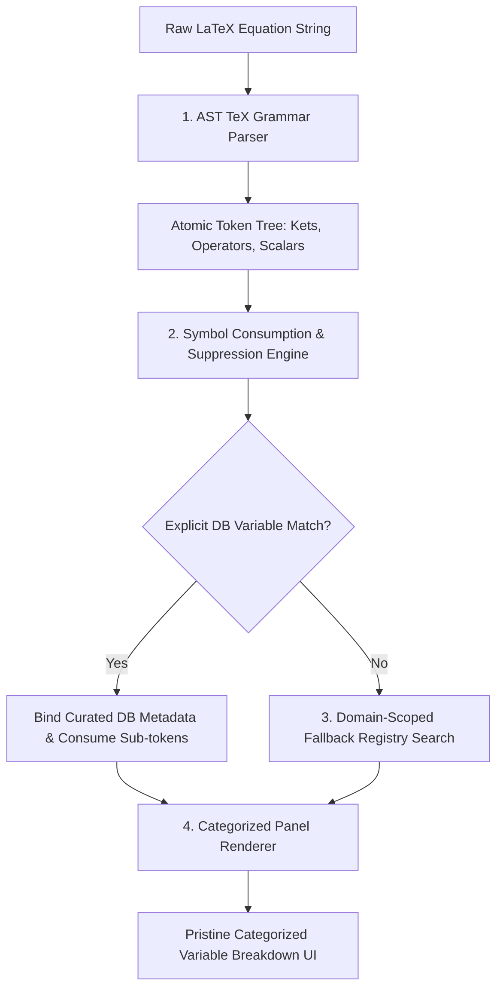

# Architectural Specification: Equation Explainer Symbol Breakdown & Deconstruction Enhancement

**Document ID**: `DOC-2026-EQEX-001`  
**Target Module**: `public/js/equation_explainer.js` & `app/logic/PhysicsService.php`  
**Status**: Proposal / Architectural Blueprint  

---

## 1. Executive Summary & Problem Definition

The **Equation Explainer** (`/physics/equation-explainer`) deconstructs LaTeX equations into term-by-term variable breakdowns. While prose sections such as *Interpretation (Local Identity)* provide context-aware physics explanations, the **Base Variables & Constants** breakdown panel exhibits discrepancies when resolving mathematical symbols.

### Observed Root Causes:
1. **Naive Regex Tokenization**: Deconstruction relies on string splitting or basic regex pattern matching. Decorated symbols (e.g., `\hat{A}`, `\vec{v}`, `\dot{a}`) lose their diacritics, and composite Dirac bra-ket notations (e.g., $|\psi\rangle$) are fragmented into isolated structural characters (`|`, `\psi`, `\rangle`).
2. **Spurious Global Fallback Pollution**: Un-matched sub-tokens (e.g., `A` extracted from `\hat{A}`) query a flat global fallback dictionary. This causes quantum operators like $\hat{A}$ to display incorrect classical definitions (e.g., *"Area ($m^2$)"* or *"Vector Potential"*), while syntax delimiters like `\rangle` render as *"`\rangle` Parameter"*.
3. **Flat Symbol Registries**: The fallback dictionary lacks domain awareness, applying thermodynamic or classical electrodynamic definitions to quantum or general relativistic formulas.

---

## 2. Proposed Architectural Enhancements

To align the breakdown panel with the accuracy of the interpretation narratives, the deconstruction pipeline should be upgraded around four structural pillars:



---

### Pillar 1: AST-Based TeX Grammar Parsing
* **Atomic Dirac Notation**: Parse $|\psi\rangle$ and $\langle\phi|$ as single atomic vector nodes in Hilbert space rather than sequences of bracket characters.
* **Decorated Symbol Preservation**: Treat decorated operators (`\hat{A}`, `\vec{v}`, `\dot{a}`, `\tilde{g}`, `\mathbf{J}`) as single, immutable symbol nodes (`\hat{A}`) rather than stripping accents.

### Pillar 2: Symbol Consumption & Fallback Suppression
* **Sub-token Consumption**: When a curated key (e.g., `\hat{A}` or `|\psi\rangle`) is defined in the database `semantic_variables`, mark all constituent sub-tokens (`A`, `\psi`, `\rangle`, `|`) as **consumed**.
* **Suppression of Generic Overrides**: Prevent consumed sub-tokens from querying global fallback dictionaries, eliminating spurious entries like *"Area ($m^2$)"*.
* **Structural Delimiter Filtering**: Filter out pure structural delimiters (`\rangle`, `\langle`, `(`, `)`, `+`, `=`, `\int`, `\sum`) from rendering as variables unless explicitly defined in the database.

### Pillar 3: Domain-Scoped Fallback Registries
Partition global symbol fallbacks into **Physics Subdomains**:
* **Quantum Mechanics Domain**: $A \to \hat{A}$ (Operator), $T \to \hat{T}$ (Kinetic Energy Operator), $\rho \to \hat{\rho}$ (Density Operator).
* **Thermodynamics Domain**: $T \to \text{Temperature}$, $V \to \text{Volume}$.
* **Electromagnetism Domain**: $A \to \mathbf{A}$ (Vector Potential), $\rho \to \text{Charge Density}$.

### Pillar 4: Categorized UI Panel Rendering
Group breakdown entries into structured semantic categories:

```
┌────────────────────────────────────────────────────────┐
│  OPERATORS                                             │
│  • Â : Linear Quantum Operator                         │
├────────────────────────────────────────────────────────┤
│  QUANTUM STATES (HILBERT SPACE VECTORS)                │
│  • |ψ⟩ : Initial State Vector                          │
│  • |ϕ⟩ : Secondary State Vector                        │
├────────────────────────────────────────────────────────┤
│  SCALARS & COEFFICIENTS                                │
│  • a, b : Complex Amplitudes (a, b ∈ ℂ)                │
└────────────────────────────────────────────────────────┘
```

---

## 3. Comparative Target State

| Symbol in Panel | Legacy Fallback Behavior | Target Enhanced Behavior |
| :--- | :--- | :--- |
| **$\hat{A}$** | Overridden by generic $A$ (*Area / $m^2$*) | **Linear Quantum Operator** ($\mathcal{H} \to \mathcal{H}$) |
| **$A$** | Spurious entry (*Area*) | **Suppressed** (Consumed by $\hat{A}$) |
| **$\rangle$** | Spurious entry (*"`\rangle` Parameter"*) | **Suppressed** (Structural Delimiter) |
| **$a, b$** | Generic scalar | **Complex Amplitudes** ($a, b \in \mathbb{C}$) |
