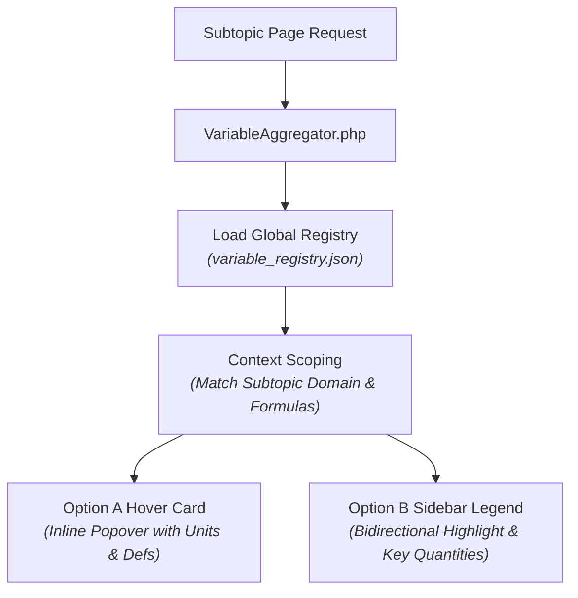

# Comprehensive Analysis: Physics Symbol & Variable Ambiguity Across Domains

> **Date**: August 1, 2026  
> **Context**: Analysis of physics notation ambiguity, multi-domain symbol collisions (Latin, Greek, Case, Subscript), and domain-scoped resolution strategies for the Terra Physics digital encyclopedia.

---

## 1. Executive Summary

Symbol ambiguity is one of the most pervasive challenges in physics education and scientific software design. Beyond basic single letters ($v, m, F, p, k$), symbol collisions occur systematically across **four major categories**:

1. **Multi-Domain Capital Letters** ($T, V, P, H, Q, C$)
2. **Greek Single-Letter Variables & Constants** ($\rho, \mu, \gamma, \tau, \lambda, \omega$)
3. **Notation Font/Style Collisions** (Scalar $v$ vs. Vector $\mathbf{v}$ vs. Unit Vector $\hat{\mathbf{v}}$)
4. **Subtopic Domain Overlaps** ($I$ as Current in Circuits vs. Moment of Inertia in Mechanics vs. Specific Intensity in Astrophysics)

---

## 2. Multi-Domain Capital Letters (High Impact)

Capital letters frequently carry 3 or 4 completely different fundamental physical definitions depending on the subtopic domain:

| Symbol | Meaning in Domain A | Meaning in Domain B | Meaning in Domain C |
| :--- | :--- | :--- | :--- |
| **$T$** | **Temperature** $[\text{K}]$ *(Thermodynamics)* | **Tension** $[\text{N}]$ *(Statics/Mechanics)* | **Period** $[\text{s}]$ *(Oscillations)* / **Kinetic Energy** $T$ *(Lagrangian)* |
| **$V$** | **Potential Energy** $[\text{J}]$ *(Mechanics)* | **Electric Potential / Voltage** $[\text{V}]$ *(EM)* | **Volume** $[\text{m}^3]$ *(Thermodynamics)* |
| **$P$** | **Pressure** $[\text{Pa}]$ *(Thermodynamics)* | **Power** $[\text{W}]$ *(Mechanics)* | **Electric Polarization** $\mathbf{P}$ *(EM)* / **Probability** $P$ *(Quantum)* |
| **$H$** | **Hamiltonian Operator** $\hat{H}$ *(Quantum)* | **Enthalpy** $H$ *(Thermodynamics)* | **Magnetic Field Strength** $\mathbf{H}$ *(EM)* / **Hubble Constant** $H_0$ |
| **$Q$** | **Electric Charge** $[\text{C}]$ *(EM)* | **Heat Transfer** $[\text{J}]$ *(Thermodynamics)* | **Quality Factor** $Q$ *(Resonance/Oscillations)* |
| **$C$** | **Capacitance** $[\text{F}]$ *(Electromagnetism)* | **Heat Capacity** $[\text{J/K}]$ *(Thermodynamics)* | **Casimir Invariant** *(Group Theory)* |

---

## 3. Greek Single-Letter Variables & Constants

Greek letters are used extensively as both variables and fundamental constants, leading to heavy domain overlap:

| Greek Symbol | Primary Physics Meanings |
| :--- | :--- |
| **$\rho$ (Rho)** | **Mass Density** $[\text{kg/m}^3]$ *(Fluids)* vs. **Charge Density** $[\text{C/m}^3]$ *(EM)* vs. **Density Matrix** $\hat{\rho}$ *(Quantum)* vs. **Resistivity** $[\Omega\cdot\text{m}]$ |
| **$\mu$ (Mu)** | **Coefficient of Friction** $\mu_k$ *(Dynamics)* vs. **Magnetic Permeability** $\mu_0$ *(EM)* vs. **Reduced Mass** $\mu$ *(Orbital Mechanics)* vs. **Muon Particle** $\mu^-$ |
| **$\gamma$ (Gamma)** | **Lorentz Factor** $\gamma = \frac{1}{\sqrt{1-v^2/c^2}}$ *(Relativity)* vs. **Adiabatic Index** $C_p/C_v$ *(Thermodynamics)* vs. **Photon** $\gamma$ *(Particle)* |
| **$\tau$ (Tau)** | **Torque** $\boldsymbol{\tau}$ *(Mechanics)* vs. **Proper Time** $\tau$ *(Relativity)* vs. **Optical Depth** $\tau_\nu$ *(Astrophysics)* vs. **Shear Stress** $\tau$ *(Fluids)* |
| **$\lambda$ (Lambda)** | **Wavelength** $\lambda$ *(Optics/Waves)* vs. **Linear Charge Density** $\lambda$ *(EM)* vs. **Eigenvalue** $\lambda$ *(Linear Algebra)* vs. **Cosmological Constant** $\Lambda$ |
| **$\omega$ (Omega)** | **Angular Frequency** $\omega$ *(Oscillations)* vs. **Vorticity Vector** $\boldsymbol{\omega}$ *(Fluid Dynamics)* vs. **Solid Angle** $\Omega$ *(Optics/Astrophysics)* |

---

## 4. Letter Case & Font Notation Ambiguity

In physics textbooks, font style (bold, vector arrow, hat operator, subscript) denotes mathematical nature:

- **Scalar vs. Vector**: $v$ (scalar speed) vs. $\mathbf{v}$ (velocity vector).
- **Operator vs. Classical Value**: $H$ (classical function) vs. $\hat{H}$ (quantum operator).
- **Unit Vector vs. Variable**: $\hat{\mathbf{r}}$ (unit direction) vs. $\mathbf{r}$ (position vector) vs. $r$ (scalar radius).
- **Local vs. Universal Constant**: $g$ (local Earth gravity $9.81\,\text{m/s}^2$) vs. $G$ (Newtonian gravitational constant) vs. $g_{\mu\nu}$ (Metric tensor in General Relativity).

---

## 5. Subtopic Domain Overlaps

When a student moves between different subtopics on Terra:
- On a page about **Electric Circuits**, $I$ means **Current** $[\text{A}]$.
- On a page about **Rotational Mechanics**, $I$ means **Moment of Inertia** $[\text{kg}\cdot\text{m}^2]$.
- On a page about **Astrophysics (Radiative Transfer)**, $I_\nu$ means **Specific Intensity**.

---

## 6. Architectural Resolution Strategies

1. **Domain-Scoped Resolution**: By building `window.SUBTOPIC_VARIABLES` per subtopic, $T$ on a Statics page resolves to *Tension*, while $T$ on a Thermodynamics page resolves to *Temperature*.
2. **Font & Notation Awareness**: $\mathbf{v}$ resolves to *Velocity Vector*, while $v$ resolves to *Scalar Speed*.
3. **Disambiguation Without Page Jumps**: Users reading complex Quantum Mechanics or Relativity text get instant inline definitions for $\psi, \rho, \gamma, \tau$ without being yanked off the page by accidental clicks.
