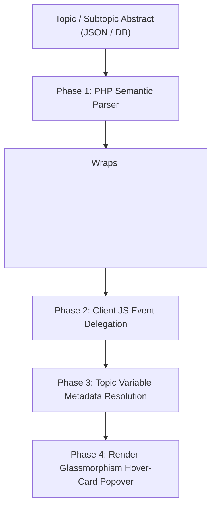

# Architectural Specification: Single-Letter Variable Hover-Cards on Topic Pages

**Document Date**: 2026-08-02  
**Target Feature**: Contextual Variable Hover-Cards for Topic & Subtopic Abstracts  
**Target Scope**: 
- Topic Beginning Abstracts (`#topic-beginning-abstract`)
- Subtopic Card Abstracts (`.subtopic-card-abstract`)
*(Explicitly excluded: Equation Explainer pages and display math blocks)*

---

## 1. Executive Summary & Problem Statement

Single-letter physical variables ($E$, $B$, $q$, $V$, $F$, $\rho$, etc.) in topic overview abstracts and subtopic summary cards are currently rendered as static inline SVG tags (`<svg data-tex="...">`). Hovering or clicking on these variables performs no action.

Because single-letter symbols in physics are inherently ambiguous across domain contexts (e.g., $E$ can signify *Electric Field* in Electromagnetism or *Energy* in Thermodynamics; $V$ can signify *Voltage*, *Volume*, or *Gravitational Potential*), enabling **Contextual Variable Hover-Cards** resolves ambiguity by providing instantaneous, domain-aware metadata.

---

## 2. Target Hover-Card Data Schema

When a user hovers over a single-letter variable trigger, the popover card displays:
1. **Symbol & Name**: e.g., $\mathbf{E}$ — **Electric Field**
2. **SI Unit Pill**: e.g., `V/m` (Volts per Meter) or `N/C` (Newtons per Coulomb)
3. **Physical Meaning**: Concise 1–2 sentence description derived from the subtopic's `semantic_variables` registry.
4. **Governing Formula Chips**: Clickable shortcuts to key equations where the variable appears (e.g. Gauss's Law $\nabla \cdot \mathbf{E} = \frac{\rho}{\varepsilon_0}$).

---

## 3. Four-Phase Architectural Plan



### Phase 1: Content Markup & Semantic Binding (PHP Backend)
- **Target Containers**:
  - `#topic-beginning-abstract`
  - `.subtopic-card-abstract`
- **Parser Transformation**:
  - When rendering HTML for these two container classes in PHP, a semantic regex filter scans inline SVGs and math spans (`<svg data-tex="...">`).
  - Matches single-letter variables ($E$, $B$, $q$, $V$, $F$, $I$, $p$, $\rho$, $\mathbf{E}$, $\mathbf{B}$) and wraps them in an interactive trigger element:
    ```html
    <span class="variable-hover-trigger" 
          data-symbol="E" 
          data-topic="electromagnetism" 
          data-subtopic="coulombs-law">
        <svg data-tex="E">...</svg>
    </span>
    ```

---

### Phase 2: Metadata Lookup & Resolution Service
- **Source of Truth**:
  - Leverages the existing `semantic_variables` dictionary defined in the 13,728 formula shards (e.g., `"E": { "name": "Electric Field", "unit": "V/m", "description": "..." }`).
- **Zero-Latency In-Memory Mapping**:
  - On Topic page generation, PHP embeds a lightweight topic-level variable dictionary into a `<script id="topic-var-map" type="application/json">` block.
  - Client-side JavaScript resolves variable definitions instantaneously without triggering HTTP API latency.

---

### Phase 3: Frontend Hover-Card Component Integration
- **Delegated Event Listeners**:
  - Attach a single delegated `mouseenter` / `mouseleave` listener on the topic content container to handle hover events efficiently without per-node memory overhead:
    ```javascript
    document.addEventListener('mouseover', (e) => {
        const trigger = e.target.closest('.variable-hover-trigger');
        if (trigger) showVariableHoverCard(trigger);
    });
    ```
- **Popover Design (Glassmorphism Aesthetic)**:
  - Curated dark theme palette matching Terra design tokens.
  - Smooth micro-animations for hover-card entry and exit.

---

### Phase 4: Scope Control & Viewport Safety
- **Strict Scope Isolation**:
  - Restrict variable hover-cards specifically to `#topic-beginning-abstract` and `.subtopic-card-abstract`.
  - Exclude Equation Explainer pages and display math blocks (`div.math-display`).
- **Smart Viewport Positioning**:
  - Calculate bounding client rects dynamically to prevent tooltip clipping at screen boundaries or navigation headers.

---

## 4. Verification & Testing Strategy

1. **Unit Test Verification**:
   - Assert that `#topic-beginning-abstract` and `.subtopic-card-abstract` render valid `.variable-hover-trigger` wrapper elements.
   - Assert that no trigger wrappers are emitted on Equation Explainer views.
2. **Pre-commit Audit**:
   - Validate that all embedded JSON schemas match the `semantic_variables` standard.
