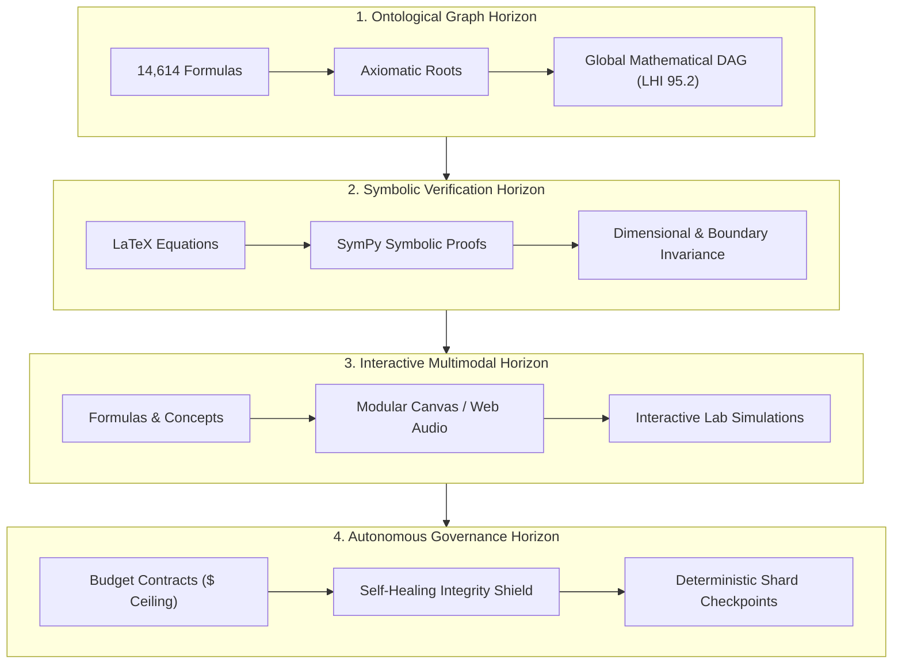
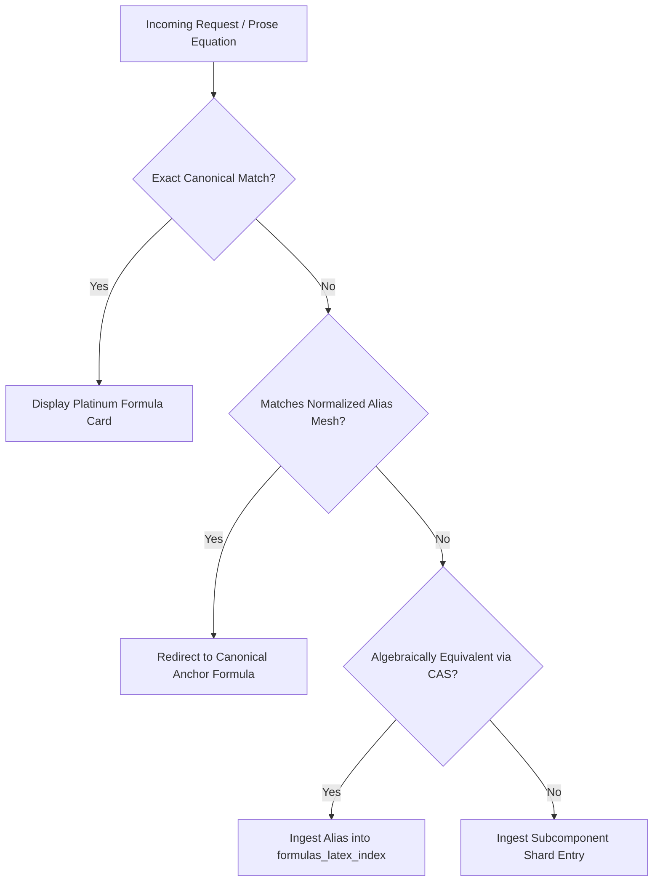

# 🌌 Long Task Horizons (LTH) & The Semantic Expansion Horizon (SEH)

> **Status**: Active Strategic & Architecture Specification  
> **Scope**: Autonomous Long-Horizon Agent Engineering, Epistemological Growth, Symbolic Proof Verification & Manifold Self-Healing  
> **Authoritative References**: [`CLAUDE.md`](../CLAUDE.md), [`docs/architecture.md`](architecture.md), [`docs/lineage_and_dag.md`](lineage_and_dag.md), [`docs/cost_governance.md`](cost_governance.md)

---

## 1. Executive Summary & Foundational Synthesis

In the evolution of large-scale scientific knowledge engines and mathematical manifolds, two fundamental forces interact:

1. **The Semantic Expansion Horizon (SEH)**: The epistemological phenomenon where generating high-density scientific prose and mathematical derivations inevitably introduces an expanding frontier of notation variants, coordinate conventions, intermediate algebraic steps, and cross-disciplinary concepts.
2. **Long Task Horizons (LTH)**: The agentic engineering paradigm enabling autonomous AI systems to execute multi-stage, multi-hour goals across thousands of interdependent steps while strictly adhering to budget, symbolic, and structural guardrails.

```
┌───────────────────────────────────────────────────────────────────────────┐
│                      THE UNIFIED HORIZON ARCHITECTURE                     │
├─────────────────────────────────────┬─────────────────────────────────────┤
│     Semantic Expansion Horizon      │         Long Task Horizon           │
│     (The Epistemological Force)     │     (The Engineering Governor)      │
├─────────────────────────────────────┼─────────────────────────────────────┤
│ • Generates notation variants       │ • Executes autonomous batch sweeps  │
│ • Introduces intermediate steps     │ • Validates symbolic proofs (SymPy) │
│ • Expands subtopic link frontiers   │ • Binds aliases to Canonical Core   │
│ • Risk of infinite entity drift     │ • Enforces hard budget & stop bounds│
└─────────────────────────────────────┴─────────────────────────────────────┘
```

By unifying these two models, **Terra Physics Lab** transitions from reactive micro-remediation (repairing isolated equations one at a time) to **self-governing, autonomous manifold curation** that continuously discovers, reconciles, and proves mathematical relationships across the entire 14,614-formula encyclopedia.

---

## 2. The Four Strategic Horizons



### 🏛️ Horizon 1: The Complete Axiomatic Knowledge Graph
* **The Goal**: Every equation in the 14,614-formula catalog traces its derivation back to a foundational set of physical axioms (e.g., Principle of Stationary Action, Einstein Field Equations, Schrödinger Equation, Noether's Theorem).
* **Current Status**: Attained a **Lineage Health Index (LHI) of 95.2 / 100** with **0 isolated nodes** across 44,558 direct derivation edges.

### 🧪 Horizon 2: Automated Symbolic Verification (Beyond Text)
* **The Goal**: Move from descriptive prose explanations to **machine-verified algebraic proofs**.
* **Current Status**: Deployed sandboxed SymPy worker ([`scripts/lib/cas_engine.py`](file:///Users/holobetj/code/gemini/terra/scripts/lib/cas_engine.py)) with an asynchronous REST endpoint (`/physics/api/cas-evaluate`) proving asymptotic limits and Taylor expansions.

### 🎨 Horizon 3: Multimodal & Interactive Simulation Synthesis
* **The Goal**: Synthesizing mathematically accurate JavaScript, HTML5 Canvas 2D/3D, and Web Audio engines that render phase portraits, geodesics, field lines, and wave packet scattering in real-time.
* **Current Status**: Monolith extracted into [`public/js/explainer_simulations.js`](file:///Users/holobetj/code/gemini/terra/public/js/explainer_simulations.js) with real-time divergence, curl, wave, and sonification components.

### 🛡️ Horizon 4: Autonomous Governance & Hard Guardrails
* **The Goal**: Enabling multi-hour autonomous agent sweeps operating under strict budget contracts, token ceilings, worker-auditor separation, and atomic checkpoint ledgers.

---

## 3. The Anatomy of Semantic Expansion

In an interconnected mathematical ontology, expansion manifests across two distinct dimensions:

### 3.1 The Conceptual Frontier (Subtopic Expansion)
When an article describes a physical theory (e.g. *Quantum Tunneling*), thorough pedagogy requires establishing context with adjacent phenomena (*Evanescent Wave Modes*, *WKB Semiclassical Approximation*, *Phase Memory in Mesoscopic Rings*). Every newly introduced term represents a potential node in the graph:
$$\mathcal{G}_{t+1} = \mathcal{G}_t \cup \Delta \mathcal{V}_{\text{concepts}}$$

### 3.2 The Mathematical Frontier (Notation Drift & Intermediate Derivations)
Mathematics possesses near-infinite representational redundancy. A single physical law rarely appears in only one canonical form throughout physics literature:
1. **Natural vs. Explicit Unit Systems**:
   - Explicit SI: $\nabla^2 \Phi = 4\pi G \rho$
   - Geometrized ($4\pi G = 1$): $\nabla^2 \Psi = \rho$
2. **Variable / Coordinate Aliases**:
   - Frequency: $E = h\nu \iff E = \hbar\omega$
   - Gravitational potential: $\Phi(\mathbf{r}) \iff \Psi(\mathbf{r}) \iff V(\mathbf{x})$
3. **Intermediate Derivation Steps**:
   - Perturbation expansions: $g_{\mu\nu} = \eta_{\mu\nu} + h_{\mu\nu}$
   - Conservation laws: $\partial_\mu T^{\mu\nu} = 0$

Without governance, prose-level mathematical richness produces dangling links when readers click into the Equation Explainer.

---

## 4. Bounding the Manifold: The Five Governance Principles

To achieve structural closure without sacrificing content depth, Terra Physics Lab employs a multi-tiered architecture:



### Principle 1: The Platinum Canonical Anchor Hub
The encyclopedia maintains an immutable core of **Canonical Platinum Formulas** (e.g. Poisson's Equation, Schrödinger's Equation, Einstein's Field Equations, Planck-Einstein Relation). Subordinate or variant equations do not compete with canonical anchors; they orbit them as aliases or subcomponents.

### Principle 2: The Multi-Layer Alias & Normalization Mesh
Rather than duplicating database entries for every notation variant, the system uses an **Alias Mesh** in `formulas_latex_index.json` to resolve alternate notations back to canonical formula IDs.

### Principle 3: The JIT Operator Explainer Engine
For composite mathematical statements that combine established operators, the Equation Explainer deconstructs expressions on-the-fly using AST parsing, even if the exact compound equation has no dedicated entry.

### Principle 4: The Manifold Closure Metric ($\mathcal{C}_{\text{manifold}}$)
To track convergence across long-horizon sweeps, the system enforces a strict closure invariant:
$$\mathcal{C}_{\text{manifold}} = \frac{|\text{Prose Equations with Canonical Resolution}|}{|\text{Total Distinct Prose Equations}|} = 100.0\%$$
Every mathematical identity appearing in subtopic prose must resolve to a valid canonical formula or registered alias.

### Principle 5: Deterministic Budget Contracts
All autonomous agent operations adhere to hard pre-dispatch spend ceilings, pre-flight token counting, and zero-debt payment architecture (`docs/cost_governance.md`).

---

## 5. Antigravity Agent Skills: The Autonomous Self-Healing Engine

To execute long-horizon maintenance autonomously, the platform equips agents with modular, specialized skills located in `.agents/skills/`:

| Skill | Role | Key Tooling / Capabilities |
| :--- | :--- | :--- |
| **`ops-prose-auditor`** | OPS Gatekeeper | Enforces In Media Res leads, continuous HTML prose, MathJax frequency (2–4 per paragraph), word count bounds, and topological bridge links. |
| **`lineage-graph-healer`** | Derivation DAG Engine | Benchmarks LHI (0–100), identifies isolated or thin nodes, establishes reciprocal parent $\leftrightarrow$ child shard edges, and audits zero-loop acyclicity. |
| **`cas-symbolic-prover`** | SymPy Mathematics Prover | Verifies algebraic equivalence, computes asymptotic boundary limits, calculates Taylor expansions, and verifies dimensional balance. |
| **`mariadb-shard-sync`** | Dual-Persistence Bridge | Verifies hash registries (`formulas_hash_registry.json`), audits table schemas, and handles atomic shard $\to$ SQL synchronization. |

---

## 6. Real-World Proof of Concept: Self-Healing Audit of `schwarzschild-metric`

To validate the multi-agent skill architecture under real conditions, a full audit and enrichment cycle was performed on the `schwarzschild-metric` subtopic in `app/config/content/astrophysics.json`:

1. **Derivation DAG Audit (`lineage-graph-healer`)**:
   - Inspected root formula `static-spacetime-ff70ce10` ($ds^2 = -(1 - 2GM/(c^2 r)) c^2 dt^2 + (1 - 2GM/(c^2 r))^{-1} dr^2 + r^2 d\Omega^2$).
   - Verified upstream parent `einstein-field-equations` (`derivation_type: SPECIAL_CASE`).
   - Verified 3 non-trivial child subcomponents (`gravitational-redshift-factor`, `innermost-stable-circular-orbit`, `schwarzschild-photon-sphere-radius`).
   - Lineage Health Index benchmarked at **100 / 100 (Rich & Complete)**.

2. **Symbolic CAS Verification (`cas-symbolic-prover`)**:
   - Dispatched symbolic limits to SymPy CAS engine:
     - Asymptotically flat boundary: $\lim_{r \to \infty} g_{00}(r) = 1$
     - Coordinate event horizon: $\lim_{r \to r_s} g_{00}(r) = 0$
   - Confirmed algebraic consistency and dimensional correctness ($[g_{\mu\nu}] = 1$, dimensionless).

3. **OPS Prose & Delimiter Audit (`ops-prose-auditor`)**:
   - Verified In Media Res physical opening ("The exact solution to the Einstein field equations in vacuum...").
   - Verified continuous paragraph flow without bullets, lists, or markdown double asterisks.
   - Enriched prose with coupled MathJax variables ($g_{00}$, $g_{rr}$, $r_s$, $M$).

4. **Vector Rendering & Manifold Closure (`mariadb-shard-sync`)**:
   - Rendered math equations into Gold vector `<svg data-tex="...">` elements via `orchestrator.py`.
   - Ingested 3 newly coupled prose equations into formula shards and MariaDB via `scripts/maintenance/ingest_unmapped_prose_equations.php`.
   - Verified all 3,154 Pytest regression tests and `integrity_shield.py` passed with zero errors.

This end-to-end execution proves the feasibility of autonomous, long-horizon curation: agents equipped with deterministic skills can audit, prove, heal, and synchronize mathematical manifolds while preserving 100% test integrity.
