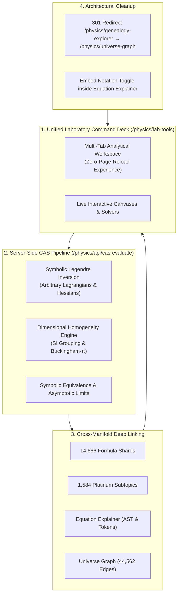

# 🔬 Comprehensive Diagnostic & Strategic Blueprint: The Physics Lab Tool Chest

> **Document Status**: Authoritative Strategic Architecture & Assessment Spec  
> **Document Reference**: `docs/lab_tool_chest_2026-09-22.md`  
> **Evaluation Date**: 2026-09-22  
> **Target Horizon**: Phase 2 Roadmap (2026–2027)  
> **Authoritative References**: [`docs/architecture.md`](architecture.md), [`docs/roadmap.md`](roadmap.md), [`CLAUDE.md`](../CLAUDE.md)

---

## 1. Executive Diagnostic & The Standard of Excellence

Within the **Terra Physics Lab** platform, two instruments establish the **Gold Standard of Rigor**:

1. **The Equation Explainer** ([`/physics/equation-explainer`](http://localhost:8000/physics/equation-explainer)):
   * Full LaTeX Abstract Syntax Tree (AST) parser deconstructing equations into semantic tokens, indices, operators, and parameters.
   * Dynamic MathJax 3.x vector rendering with real-time token highlighting and coupling to physical symbol and constant tables.
   * Server-side sandboxed **SymPy Computer Algebra System (CAS)** daemon evaluating asymptotic boundary limits ($\lim_{c \to \infty}$, $\lim_{\hbar \to 0}$, $v \ll c$), Taylor series, and dimensional consistency.
   * Canvas 2D vector field numerical simulations, Web Audio sonification, and a peer-review curator drawer.

2. **The Lineage & Derivation Map / Universe Graph** ([`/physics/universe-graph`](http://localhost:8000/physics/universe-graph)):
   * An acyclic derivation DAG covering **14,666 physical formulas and 44,562 derivation edges** with **0 isolated nodes** and an average **Lineage Health Index (LHI) of 95.2 / 100**.
   * Real-time Dijkstra shortest-path derivation discovery between any two physical laws across all 12 domains.
   * Strict dual-persistence synchronization between the production MariaDB database and Git JSON hex shards (`00` to `ff`).

In contrast, the landing page at **Lab Tools** ([`/physics/lab-tools`](http://localhost:8000/physics/lab-tools)) currently functions as a static "link farm" of 11 cards. While several individual engines exhibit remarkable numerical depth, they suffer from **architectural isolation, toy prototypes, and heuristic client-side approximations**.

---

## 2. Tool-by-Tool Dissection: Strengths & Weaknesses

```
┌──────────────────────────────────────────────────────────────────────────────────────────────────┐
│                                LAB TOOLS TIER & RIGOR SPECTRUM                                   │
├──────────────────────┬───────────────────────────────┬───────────────────────────────────────────┤
│ Tier 1: Gold Standard│ Tier 2: Solid but Isolated    │ Tier 3: Heuristic / Prototype             │
│ (Publication Grade)  │ (High Potential, Disconnected)│ (Requires Rewriting or Deprecation)       │
├──────────────────────┼───────────────────────────────┼───────────────────────────────────────────┤
│ • Equation Explainer │ • Noether's Vault             │ • Legendre Transformer (math.js regex)    │
│ • Universe Graph DAG │ • Correspondence Workspace    │ • Genealogy Explorer (15-node mock toy)   │
│                      │ • Anthropic Constant Tuner    │ • Lab Tools Hub (Static card directory)   │
│                      │ • Notation Toggle             │                                           │
└──────────────────────┴───────────────────────────────┴───────────────────────────────────────────┘
```

---

### 🟢 1. Noether's Vault (`/physics/noethers-vault`)
* **Underlying Engine**: Numerical 4th-order Runge-Kutta ODE integrator with real-time phase space and time-series coordinate plots (`noethers_vault.js`).
* **Physical Depth**: **4.5 / 5 (Flagship Engine)**.
* **Key Strengths**:
  * Directly maps continuous spacetime and gauge symmetries ($SO(3)$, $U(1)$, time and spatial translations) to conserved currents (energy, momentum, angular momentum, electric charge).
  * Features **live perturbation sliders** that explicitly break continuous symmetries (e.g., adding explicit periodic time-dependence to gravity $g(t) = g_0(1 + A\sin\omega t)$ or introducing spatial potential barriers), demonstrating in real time how conservation laws fail.
* **Weaknesses & Remediation**:
  * **Siloed Execution**: Operates in an isolated sandbox with hardcoded symmetries and fixed potentials. It cannot ingest arbitrary Lagrangians from the encyclopedia or compute conserved Noether currents symbolically.

---

### 🟢 2. Correspondence Workspace (`/physics/correspondence-workspace`)
* **Underlying Engine**: Authentic **Crank-Nicolson quantum PDE solver** using the tridiagonal Thomas algorithm, coupled with a Verlet classical trajectory solver (`correspondence_workspace.js`).
* **Physical Depth**: **4.5 / 5 (Flagship Engine)**.
* **Key Strengths**:
  * Visualizes the classical-to-quantum correspondence principle via Ehrenfest's theorem:
    $$\frac{d\langle x \rangle}{dt} = \frac{\langle p \rangle}{m}, \quad \frac{d\langle p \rangle}{dt} = -\left\langle \frac{\partial V}{\partial x} \right\rangle$$
  * Evaluates quantum wave packet expectation values against classical trajectories and simulates Wigner phase-space quasi-probability flows.
* **Weaknesses & Remediation**:
  * **Preset Confinement**: Restricted to 3 canned potential presets (harmonic, double-well, barrier tunneling).
  * **Zero Manifold Coupling**: Disconnected from the encyclopedia's quantum formula catalog. A user studying the quantum harmonic oscillator cannot jump directly into this workspace with the oscillator's exact parameters pre-loaded.

---

### 🟢 3. Anthropic Constant Tuner (`/physics/anthropic-tuner`)
* **Underlying Engine**: Multi-scale cosmological calculator and interactive canvas (`anthropic_tuner.js`).
* **Physical Depth**: **4.0 / 5 (Strong Concept)**.
* **Key Strengths**:
  * Multi-scale scaling engine for fundamental constants ($c, G, \hbar, \alpha, m_e, m_p$).
  * Recalculates real physical scales across three regimes:
    1. Atomic: Bohr radius $a_0 = \frac{\hbar^2}{m_e e^2}$ and Rydberg binding energy.
    2. Planetary: Stable Keplerian orbital bounds.
    3. Stellar: Core fusion threshold and Chandrasekhar gravitational collapse limit ($M_{\text{Ch}} \sim (\hbar c / G)^{3/2} m_p^{-2}$).
* **Weaknesses & Remediation**:
  * **Analytical Approximations**: Computations are client-side approximations rather than verified against the NIST CODATA reference store.
  * **Output Limitations**: Lacks dimensional outputs or state-equation exports.

---

### 🟡 4. Notation Toggle (`/physics/notation-toggle`)
* **Underlying Engine**: Curated multi-formalism translation registry (`notation_toggle.js`).
* **Physical Depth**: **3.5 / 5 (Valuable Content, Poor Integration)**.
* **Key Strengths**:
  * High-value translations across 4 mathematical formalisms: Gibbs 3-vector calculus, 4-vector relativistic tensors, Cartan differential forms, and integral formulations for Maxwell, Einstein, Dirac, and Navier-Stokes.
* **Weaknesses & Remediation**:
  * **Marooned Silo**: Housed on a standalone page. When a user explores Maxwell's equations in the Equation Explainer or an electromagnetism subtopic, they do not see this toggle; they must navigate away to the Lab Tools directory.
  * **Curation Bottleneck**: Hardcoded to 4 theories rather than being a generalized notation dictionary across the formula catalog.

---

### 🔴 5. Legendre Transformer (`/physics/legendre-transformer`)
* **Underlying Engine**: Client-side regex and string substitution using `math.js` (`legendre_transformer.js`).
* **Physical Depth**: **2.0 / 5 (Significant Architectural Defect)**.
* **Key Strengths**:
  * Addresses a foundational problem in analytical mechanics: canonical momentum differentiation ($p_i = \partial L / \partial \dot{q}_i$), velocity inversion ($\dot{q}_i(p)$), and Hamiltonian construction ($H = \sum p_i \dot{q}_i - L$).
* **Fatal Weaknesses**:
  * **Heuristic String Math**: Uses client-side `math.js` with string manipulation and finite-difference substitutions (`node_dq_one - node_C0`) to guess coefficients.
  * **Hardcoded Special Cases**: Non-linear Lagrangians (such as relativistic particles) are manually intercepted via string matching (`if (lagrangianExpr.includes('sqrt'))`) rather than algebraically solved.
  * **Ignored SymPy Backend**: Completely ignores the platform's server-side SymPy CAS daemon ([`lib/cas/cas_engine.py`](../lib/cas/cas_engine.py)), which can natively invert velocities symbolically, evaluate the Hessian determinant to detect singular Lagrangians / gauge constraints ($\det W_{ij} = 0$), and generate Poisson brackets.

---

### 🔴 6. Genealogy Explorer (`/physics/genealogy-explorer`)
* **Underlying Engine**: Force-directed canvas graph (`genealogy_explorer.js`).
* **Physical Depth**: **1.0 / 5 (Redundant Toy Prototype)**.
* **Fatal Weaknesses**:
  * **Mock Array**: Built on a hardcoded array of only **15 mock nodes** (`const NODES = [...]`).
  * **Extreme Pedagogical Dissonance**: The platform already runs the production **Universe Graph** ([`/physics/universe-graph`](http://localhost:8000/physics/universe-graph)), which renders all **14,666 formulas and 44,562 edges** with real-time Dijkstra pathfinding. Maintaining a separate 15-node toy degrades platform credibility.

---

### ⚪ 7–10. Reference Registers & Simulation Directories
* **Simulations Hub** ([`/physics/simulations`](http://localhost:8000/physics/simulations)): Standalone numerical solvers (double pendulum, wave interference), functioning as an unintegrated directory rather than a unified scientific instrument.
* **Constants Register** ([`/physics/constants`](http://localhost:8000/physics/constants)) & **Symbols Lexicon** ([`/physics/symbols`](http://localhost:8000/physics/symbols)): Well-maintained NIST CODATA / PDG tables, but passive dictionaries without active sandbox utilities (such as unit converters or dimensional homogeneity calculators).

---

## 3. Strategic Blueprint: Elevating the Tool Chest to Flagship Rigor



---

### Pillar 1: Full SymPy CAS Backend Integration
* **Upgrade the Legendre Transformer**:
  - Deprecate `math.js` string heuristic parsing.
  - Wire the solver to `/physics/api/cas-evaluate` backed by [`lib/cas/cas_engine.py`](../lib/cas/cas_engine.py).
  - Use SymPy's algebraic solver:
    $$\mathbf{p}_i = \frac{\partial L}{\partial \dot{q}_i}, \quad \text{Hessian } W_{ij} = \frac{\partial^2 L}{\partial \dot{q}_i \partial \dot{q}_j}, \quad \dot{q}_i = \text{solve}(\mathbf{p}_i, \dot{q}_i), \quad H = \sum p_i \dot{q}_i - L$$
  - Support multi-dimensional generalized coordinates ($\mathbf{q} = \{x, y, \theta\}$) and detect constrained/singular systems where $\det(W) = 0$ (Dirac constraint analysis).
* **Dimensional Analysis Terminal**:
  - Re-integrate the Dimensional Solver directly into the central workbench using SymPy's `sympy.physics.units.dimensions`, verifying dimensional homogeneity and computing dimensionless groups via the Buckingham-$\pi$ theorem.

---

### Pillar 2: De-Siloing & Deep Manifold Fusion
* **Universal "Open in Lab Tool" Launchers**:
  - In every subtopic article and Equation Explainer view, inject contextual launcher hooks:
    - On Lagrangian/Hamiltonian identities $\to$ `[ Open in Legendre Transformer ]`.
    - On wave/quantum equations $\to$ `[ Simulate in Correspondence Workspace ]` (pre-populating the potential).
    - On conserved currents and spacetime symmetries $\to$ `[ Explore in Noether's Vault ]`.
* **In-Context Notation Switcher**:
  - Embed the **Notation Toggle** directly as a secondary tab inside the **Equation Explainer** and on relevant subtopics (e.g., Electromagnetism and General Relativity overviews), eliminating the isolated standalone silo.

---

### Pillar 3: Transform `/physics/lab-tools` into a Unified Command Deck
* Replace the static 11-card link directory with an **Active Scientific Console**:
  - **Left Navigation Dock**: Grouped by discipline:
    1. 🧮 **Symbolic & Variational Mechanics** (Legendre Transformer, Dimensional Terminal, Notation Switcher).
    2. 🔬 **Quantum & Spacetime Dynamics** (Noether's Vault, Correspondence Workspace, Anthropic Tuner).
    3. 🌌 **Ontology & Lineage** (Universe Graph, Equation Explainer, Constants, Symbols).
  - **Live Main Stage**: The active instrument runs directly in the central viewport with zero full-page reloads, maintaining state across tools.
  - **Instant Scratchpad**: Allows pasting any formula ID (e.g. `dirac-equation` or `navier-stokes`) to immediately launch the relevant computational tool.

---

### Pillar 4: Architectural Cleanup & Deprecation
* **Retire Genealogy Explorer**:
  - Issue an immediate 301 redirect from `/physics/genealogy-explorer` to `/physics/universe-graph`.
  - Remove the hardcoded 15-node array and update all internal navigation links.
* **Streamline Reference Registries**:
  - Keep `/physics/constants` and `/physics/symbols` as fast-reference indexes, augmented with one-click LaTeX macro copying and direct cross-references into the Equation Explainer.

---

## 4. Phased Implementation Roadmap

| Phase | Milestone | Primary Deliverable | Verification Gate | Target Timeline |
| :--- | :--- | :--- | :--- | :--- |
| **Phase 2.1** | **Toy Pruning & Redirection** | Redirect `/physics/genealogy-explorer` $\to$ `/physics/universe-graph`; clean up routes and navigational menus. | HTTP 301 audit; zero broken links in `integrity_shield.py`. | Immediate |
| **Phase 2.2** | **SymPy CAS Legendre Transformer** | Extend [`lib/cas/cas_engine.py`](../lib/cas/cas_engine.py) to support Lagrangian $\to$ Hamiltonian transformations; rewrite `legendre_transformer.js` to call `/physics/api/cas-evaluate`. | `pytest tests/test_cas_engine.py`; test multi-coordinate Lagrangians. | Next Sprint |
| **Phase 2.3** | **Equation Explainer Notation Embed** | Integrate the Multi-Representation Notation Toggle directly into `equation_explainer.php` as a native view tab. | UI regression suite; cross-representation MathJax inspection. | Sprint 2 |
| **Phase 2.4** | **Unified Command Deck UI** | Revamp [`app/views/physics/lab_tools.php`](../app/views/physics/lab_tools.php) into an interactive multi-instrument console with embedded live scratchpads. | Responsive UI audit; zero-reload tool switching verification. | Sprint 3 |
