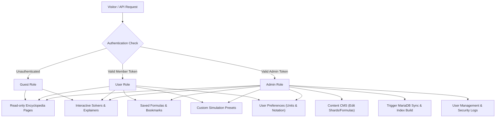

# Architecture Proposal: Multi-Tier User System (`guest`, `user`, `admin`)

---

## 1. Overview & Goal

Adding a multi-tier authentication and role-based access control (RBAC) system to Terra will allow the platform to transition from a reference site into a personalized, interactive physics workspace, while providing administrative tools for content curation and dataset management.

The system defines three distinct user tiers:



---

## 2. Role Permissions Matrix

| Feature / Action | `guest` | `user` | `admin` |
| :--- | :---: | :---: | :---: |
| **Browse Encyclopedia (Topics, Subtopics, Formulas)** | ✅ | ✅ | ✅ |
| **Interactive Equation Explainer & Dimensional Solver** | ✅ | ✅ | ✅ |
| **Simulations & Sandbox Tools** | ✅ (Default presets) | ✅ (Save custom presets) | ✅ |
| **Personal Workspace (Bookmark Formulas & Subtopics)** | ❌ | ✅ | ✅ |
| **Custom Preferences (SI vs Gaussian, Index vs Vector)** | ❌ | ✅ | ✅ |
| **Issue Reporting & Subtopic Comments** | ❌ | ✅ | ✅ |
| **Formula Content CMS (Edit Shards & Descriptions)** | ❌ | ❌ | ✅ |
| **Database Sync Trigger (`sync_formulas_to_mariadb.php`)** | ❌ | ❌ | ✅ |
| **User & Role Management (Promote, Demote, Ban)** | ❌ | ❌ | ✅ |
| **Security Audit Logs & Diagnostics** | ❌ | ❌ | ✅ |

---

## 3. Proposed Database Schema (MariaDB)

To support authentication, user preferences, and audit logging, four core tables would be added:

### `users`
Stores user credentials, profile information, and role assignments.
```sql
CREATE TABLE users (
    id BIGINT UNSIGNED AUTO_INCREMENT PRIMARY KEY,
    uuid CHAR(36) NOT NULL UNIQUE,
    email VARCHAR(255) NOT NULL UNIQUE,
    password_hash VARCHAR(255) NOT NULL,
    display_name VARCHAR(100) NOT NULL,
    role ENUM('guest', 'user', 'admin') NOT NULL DEFAULT 'user',
    avatar_url VARCHAR(512) NULL,
    preferences_json JSON NULL,
    created_at TIMESTAMP DEFAULT CURRENT_TIMESTAMP,
    updated_at TIMESTAMP DEFAULT CURRENT_TIMESTAMP ON UPDATE CURRENT_TIMESTAMP,
    last_login_at TIMESTAMP NULL,
    INDEX idx_users_role (role)
) ENGINE=InnoDB DEFAULT CHARSET=utf8mb4 COLLATE=utf8mb4_unicode_ci;
```

### `user_sessions`
Handles session persistence, support for multiple devices, and revocation.
```sql
CREATE TABLE user_sessions (
    id BIGINT UNSIGNED AUTO_INCREMENT PRIMARY KEY,
    user_id BIGINT UNSIGNED NOT NULL,
    session_token_hash CHAR(64) NOT NULL UNIQUE,
    ip_address VARCHAR(45) NULL,
    user_agent TEXT NULL,
    expires_at TIMESTAMP NOT NULL,
    created_at TIMESTAMP DEFAULT CURRENT_TIMESTAMP,
    FOREIGN KEY (user_id) REFERENCES users(id) ON DELETE CASCADE,
    INDEX idx_sessions_token (session_token_hash),
    INDEX idx_sessions_user (user_id)
) ENGINE=InnoDB DEFAULT CHARSET=utf8mb4 COLLATE=utf8mb4_unicode_ci;
```

### `user_bookmarks`
Allows authenticated members to save formulas and subtopics to their personal workspace.
```sql
CREATE TABLE user_bookmarks (
    id BIGINT UNSIGNED AUTO_INCREMENT PRIMARY KEY,
    user_id BIGINT UNSIGNED NOT NULL,
    item_type ENUM('formula', 'subtopic', 'topic') NOT NULL,
    item_id VARCHAR(255) NOT NULL,
    notes TEXT NULL,
    created_at TIMESTAMP DEFAULT CURRENT_TIMESTAMP,
    UNIQUE KEY uq_user_item (user_id, item_type, item_id),
    FOREIGN KEY (user_id) REFERENCES users(id) ON DELETE CASCADE
) ENGINE=InnoDB DEFAULT CHARSET=utf8mb4 COLLATE=utf8mb4_unicode_ci;
```

### `admin_audit_logs`
Tracks administrative changes for security and dataset integrity.
```sql
CREATE TABLE admin_audit_logs (
    id BIGINT UNSIGNED AUTO_INCREMENT PRIMARY KEY,
    admin_user_id BIGINT UNSIGNED NOT NULL,
    action_type VARCHAR(100) NOT NULL, -- e.g. 'FORMULA_EDIT', 'MARIADB_SYNC', 'USER_PROMOTION'
    target_type VARCHAR(50) NOT NULL,
    target_id VARCHAR(255) NOT NULL,
    changes_json JSON NULL,
    ip_address VARCHAR(45) NULL,
    created_at TIMESTAMP DEFAULT CURRENT_TIMESTAMP,
    FOREIGN KEY (admin_user_id) REFERENCES users(id) ON DELETE CASCADE
) ENGINE=InnoDB DEFAULT CHARSET=utf8mb4 COLLATE=utf8mb4_unicode_ci;
```

---

## 4. Backend Authentication & Authorization Pipeline (PHP / Flight)

### A. Authentication Middleware (`AuthMiddleware.php`)
Runs on every incoming HTTP request:
1. Inspects the HTTP request for a `terra_session` HttpOnly cookie or an `Authorization: Bearer <token>` header.
2. Validates the session against `user_sessions` (or a high-performance Redis cache layer).
3. If valid, attaches the `User` object to the Flight engine container (`$app->set('user', $user)`).
4. If missing/invalid, attaches a synthetic `GuestUser` object (`$user->role = 'guest'`).

### B. Declarative Role Middleware (`RoleMiddleware.php`)
Guards administrative and user routes:
```php
// Example route definition syntax
$app->route('GET /admin/dashboard', [RoleMiddleware::require('admin'), 'AdminController->dashboard']);
$app->route('POST /api/user/bookmarks', [RoleMiddleware::require('user'), 'UserController->addBookmark']);
```

---

## 5. Frontend Architecture & UI Component Integration

To support the multi-tier backend (`guest`, `user`, `admin`), Terra's frontend evolves from static page rendering into a **state-aware, responsive web interface**. The goal is to maintain Terra’s signature **glassmorphic, dark-mode design system** while seamlessly adapting UI components based on the active user’s role—without slowing down page load times or requiring full-page reloads.

### A. Top Navigation Header & Authentication Modals

```
+-----------------------------------------------------------------------------------+
|  [TERRA LOGO]   Topics   Subtopics   Solvers   Lab Tools   |  [SIGN IN] [JOIN LAB] |  <-- Guest View
+-----------------------------------------------------------------------------------+
|  [TERRA LOGO]   Topics   Subtopics   Solvers   Lab Tools   |  [⭐ 12] [(Avatar) User ▾] <-- User View
+-----------------------------------------------------------------------------------+
|  [TERRA LOGO]   Topics   Subtopics   Solvers   Lab Tools   |  [🛡️ ADMIN] [(Avatar) ▾]  <-- Admin View
+-----------------------------------------------------------------------------------+
```

1. **`guest` Tier Navigation**:
   - Displays **"Sign In"** and **"Join Lab"** action buttons in the top-right header.
   - Clicking opens a **Unified Auth Modal**:
     - Built with glassmorphic backdrop blur and smooth tab transitions (*Sign In* $\leftrightarrow$ *Create Account*).
     - Handles login/registration via asynchronous `fetch()` API calls with zero full-page reloads.
     - Inline form validation and security error handling (*"Invalid credentials"*, *"Password must be at least 8 characters"*).

2. **`user` Tier Navigation**:
   - Displays user avatar, display name, and a **Saved Formulas Badge** (`⭐ 12`).
   - Avatar dropdown menu includes:
     - 📌 **My Saved Formulas & Workspaces**
     - ⚙️ **Notation & Unit Preferences** *(SI vs. Gaussian CGS units, Matrix vs. Index notation)*
     - 🧪 **Saved Sandbox Presets**
     - 🚪 **Sign Out**

3. **`admin` Tier Navigation**:
   - Adds a glowing **"Admin Panel"** badge in the top navigation.
   - Admin dropdown includes quick links to:
     - 📝 **Live Shard & Formula Editor**
     - ⚡ **1-Click Database Sync & Index Build**
     - 👥 **User Directory & Role Management**
     - 🛡️ **Audit Logs & Issue Flags Queue**

---

### B. Interactive Formula Cards & Subtopics

1. **Universal Interactive Bookmark Star ($\star$)**:
   - Floating interactive star icon on every formula card and subtopic hero section.
   - `guest`: Clicking triggers a non-intrusive toast popover: *"Sign in to save formulas to your workspace."*
   - `user` / `admin`: Toggles bookmark state instantly with a gold micro-animation and updates the backend workspace via `/api/user/bookmarks`.

2. **Community Issue & Typo Reporting**:
   - For authenticated `user`s, formula cards gain a small **"Flag Typo / Bug"** option in the inspector menu.
   - Opens a popover allowing members to submit TeX syntax corrections or prose typo reports directly into the `admin` audit queue.

---

### C. Consolidated Variable Hover-Card Component (`variable_hover_card.js`)

Refactoring variable hover-card logic into a single standalone module (`public/js/components/variable_hover_card.js`):
- **Unified Design**: Standardizes glassmorphic popover styling, arrow positioning, and MathJax rendering across `subtopic.php`, `topic.php`, and `equation_explainer.php`.
- **Context Awareness**: Shows domain-scoped variable definitions (e.g., $F \to$ **Force Vector** on Mechanics pages vs. $F \to$ **Helmholtz Free Energy** on Thermodynamics pages).
- **User Preference Integration**: Logged-in `user`s see an inline **"Switch Unit System"** toggle inside the hover card (e.g., toggle units between $N$ and $dyn$).

---

### D. Personal Workspace Dashboard (`/physics/workspace`)

A dedicated dashboard view for logged-in `user`s:
1. **Saved Formula Deck**: Grid or carousel of bookmarked equations with real-time text/symbol filtering and PDF/LaTeX export.
2. **Custom Equation Lists**: Organize formulas into named study collections (e.g., *"Quantum Field Theory Midterm Prep"*).
3. **Simulation Preset Library**: Save custom parameter states for interactive simulation sandboxes (e.g., custom projectile velocities, drag coefficients, orbital masses).

---

### E. Admin Curation Panel (`/physics/admin`)

A dark-mode administrative suite featuring 4 main tabs:
1. 📝 **Live Formula Editor**: Split-screen editor with raw TeX/JSON shard input on the left and live MathJax preview on the right.
2. ⚡ **System Operations Center**: 1-click execution for `sync_formulas_to_mariadb.php` and search index regeneration.
3. 🛡️ **User-Flagged Audit Queue**: Review community typo submissions and broken TeX reports with one-click **"Approve & Fix"** or **"Dismiss"** actions.
4. 👥 **User Management Matrix**: Filter and search registered accounts, inspect active session tokens, and promote/demote roles (`user` $\leftrightarrow$ `admin`).

---

## 6. Architectural Benefits

- **Decoupled Architecture**: Keeps content rendering (physics equations and explanations) separate from user data, preserving the speed of Terra's cached static page generation.
- **Zero Friction for Public Readers**: Unauthenticated guests continue to experience instant, unrestricted access to the entire encyclopedia.
- **Zero-Reload State Transitions**: UI switches seamlessly between Guest, User, and Admin modes using lightweight JavaScript and asynchronous REST APIs.
- **Content Security**: Administrative actions (like triggering MariaDB dataset re-syncs or editing formulas) are fully protected behind password-authenticated, audited admin accounts.
