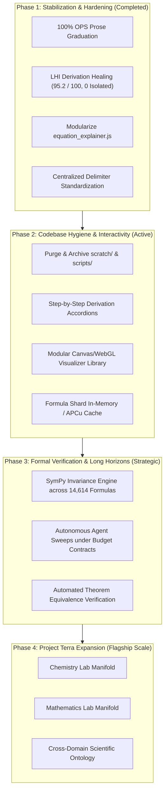

# 🔭 Terra Physics Lab — Strategic Remediation & Development Roadmap

> **Status**: Active Master Roadmap  
> **Target Horizon**: 2026–2027  
> **Authoritative References**: [`CLAUDE.md`](../CLAUDE.md), [`README.md`](../README.md), [`docs/architecture.md`](architecture.md), [`docs/horizons_and_expansion.md`](horizons_and_expansion.md)

---

## 1. Executive Baseline & Platform Health

Over successive engineering sprints, the **Terra Physics Lab** platform has attained a mature, publication-grade foundation:

| Metric / Dimension | Benchmark Status | Verification Gate |
| :--- | :--- | :--- |
| **Subtopic Coverage** | **1,584 / 1,584 Subtopics (100.0%)** graduated to Organic Platinum Standard (OPS) | `integrity_shield.py` (OPS Lead & Density Audit) |
| **Formula Catalog** | **14,614 Physical Formulas** partitioned across 256 hex shards (`00` to `ff`) | `integrity_shield.py` (Shard Hex Partition Audit) |
| **Derivation Lineage DAG** | **Lineage Health Index (LHI) of 95.2 / 100** with **0 isolated nodes** (44,558 edges) | `scripts/fixlineage --summary` |
| **Manifold Closure** | **100.0% equation closure** (0 unmapped prose identities across 8,649 expressions) | `php scripts/audit_prose_equations.php` |
| **Symbolic CAS Engine** | Sandboxed SymPy worker ([`cas_engine.py`](file:///Users/holobetj/code/gemini/terra/scripts/lib/cas_engine.py)) with async `/physics/api/cas-evaluate` | `pytest tests/test_cas_engine.py` |
| **Modular ES6 Client** | `equation_explainer.js` decoupled into `simulations`, `curator`, `dictionary` modules | Browser verification & regression suite |
| **Regression Net** | **100% passing automated test suite** (3,150+ Pytest tests in ~13s) | `.venv/bin/python3 -m pytest tests/` |

---

## 2. Phased Architectural Roadmap



---

## 3. Phase 1: Stabilization & Hardening (Completed Achievements)

### 1.1 Modularization of the Client Monolith
* **Accomplished**: Successfully deconstructed the 5,376-line `equation_explainer.js` into focused ES6 modules:
  - `explainer_simulations.js`: HTML5 Canvas 2D vector field visualizations (divergence, curl, wave propagation) and Web Audio sonification.
  - `explainer_curator.js`: Curator Drawer UI, peer-review suggestions, and parameter edit staging.
  - `explainer_dictionary.js`: Symbol, variable, and unit mappings.
  - Retained core AST parsing and MathJax rendering in `equation_explainer.js` without regressions.

### 1.2 Mathematical Derivation Lineage DAG (LHI 95.2)
* **Accomplished**: Healed isolated formula nodes from early baselines down to **0 isolated nodes**, achieving an LHI score of **95.2 / 100** across all 14,614 formulas. Compiled acyclic DAG structures (`formula_derivation_graph.json` and `.gz`).

### 1.3 100% Organic Platinum Standard (OPS) Completion
* **Accomplished**: All 1,584 subtopic articles graduated to the Organic Platinum Standard, satisfying strict In Media Res physical openings, zero-artifact continuous HTML prose, and rich inline MathJax density.

### 1.4 Centralized Delimiter & Math Sanitization Standard
* **Accomplished**: Unified delimiter handling in `PhysicsService.php`, `scripts.lib.delimiters`, and `math_prose_formatter.js`.

---

## 4. Phase 2: Active & Near-Term Action Plan

### 2.1 Codebase Hygiene & Repository Streamlining
* **Goal**: Eliminate stale historical artifacts and obsolete scratch files to reduce repository noise.
* **Actions**:
  1. Archive one-off historical migrations from `scratch/` into `docs/archive/historical_scratch/`.
  2. Deprecate superseded maintenance scripts in `scripts/maintenance/` into `scripts/archive/`, retaining canonical tools (`fixlatex`, `fixlineage`, `gqs.py`, `integrity_shield.py`).
  3. Ensure clean `.gitignore` tracking for temporary debug files.

### 2.2 Step-by-Step Derivation Accordions
* **Goal**: Transform single-link parent-child relationships ($A \to B$) into readable, collapsible multi-step mathematical derivations.
* **Actions**:
  1. Expand the formula schema to support optional intermediate derivation steps:
     ```json
     "derivation_steps": [
       { "step": 1, "latex": "...", "rationale": "Apply Euler-Lagrange variation" },
       { "step": 2, "latex": "...", "rationale": "Eliminate boundary terms" }
     ]
     ```
  2. Render collapsible derivation accordions in the Equation Explainer and Formula Inspector modal.

### 2.3 Modular Canvas / WebGL Visualizer Library
* **Goal**: Enrich theoretical physics topics with interactive, parameter-tunable visual models.
* **Target Areas**:
  - Relativistic geodesics (Schwarzschild and Kerr black hole raytracing).
  - Quantum wave packet scattering across 1D potential barriers.
  - Phase portraits for non-linear Hamiltonian and chaotic systems.

### 2.4 Formula Shard APCu / In-Memory Caching
* **Goal**: Maximize read throughput on high-traffic instances by caching deserialized JSON shard contents in APCu / memory buffers, reducing filesystem disk I/O.

---

## 5. Phase 3: Medium to Long-Term Strategic Horizons

### 3.1 Sitewide SymPy CAS Invariance Verification (Horizon 2)
* **Goal**: Upgrade derivation links from pedagogical references to **algebraically proven identities**.
* **Actions**:
  1. Execute batch verification via `cas-symbolic-prover` across candidate parent-child pairs.
  2. Prove algebraic equivalence: $\text{Simplify}(\text{Expr}_{\text{child}} - \text{Expr}_{\text{parent\_reduction}}) \equiv 0$.
  3. Automatically audit dimensional consistency across mass $[M]$, length $[L]$, time $[T]$, and charge $[I]$.

### 3.2 Long-Horizon Autonomous Governance (Horizon 4)
* **Goal**: Conduct multi-hour autonomous manifold sweeps under strict budget and token contracts.
* **Actions**:
  1. Run self-governed sweeps using the Antigravity agent skills framework.
  2. Enforce pre-dispatch spend ceilings and mandatory canary calibration (`docs/cost_governance.md`).
  3. Automate continuous manifold closure ($\mathcal{C}_{\text{manifold}} = 100.0\%$).

---

## 6. Phase 4: Project Terra Multi-Science Expansion

Physics Lab serves as the flagship domain module for **Project Terra**. With the core architecture (FlightPHP microframework, 256-shard partitioning, dual-engine math rendering, and automated integrity shields) proven at scale:

* **Chemistry Lab**: Molecular manifolds, reaction kinetics, orbital hybridization, and thermochemical cycles.
* **Mathematics Lab**: Abstract algebra, differential geometry, topology, and number theory derivations.
* **Biology & Earth Sciences**: Cellular biophysics, population dynamics, geophysics, and atmospheric fluid dynamics.

---

## 7. Master Priority & Implementation Ledger

| Horizon | ID | Initiative | Key Components / Files | Priority | Status |
| :--- | :--- | :--- | :--- | :---: | :---: |
| **Phase 1** | 1.1 | Modularize `equation_explainer.js` | `public/js/explainer_simulations.js`<br/>`public/js/explainer_curator.js` | 🔴 **P1** | 🟢 Completed |
| **Phase 1** | 1.2 | Derivation Lineage DAG Healing (LHI 95.2) | `scripts/fixlineage`<br/>`formula_derivation_graph.json` | 🔴 **P1** | 🟢 Completed |
| **Phase 1** | 1.3 | 100% OPS Subtopic Graduation | `app/config/content/*.json`<br/>`integrity_shield.py` | 🔴 **P1** | 🟢 Completed |
| **Phase 2** | 2.1 | Scratch & Maintenance Script Archival | `scratch/`<br/>`scripts/maintenance/` | 🟡 **P2** | 📋 In Progress |
| **Phase 2** | 2.2 | Step-by-Step Derivation Accordions | `equation_explainer.php`<br/>`shard_[00-ff].json` | 🟡 **P2** | 📋 Active |
| **Phase 2** | 2.3 | Modular Canvas/WebGL Visualizers | `public/js/explainer_simulations.js` | 🟡 **P2** | 📋 Active |
| **Phase 2** | 2.4 | In-Memory Shard APCu Caching | `app/logic/PhysicsService.php` | 🟢 **P3** | 📋 Backlog |
| **Phase 3** | 3.1 | Sitewide SymPy CAS Invariance | `cas_engine.py`<br/>`.agents/skills/cas-symbolic-prover` | 🟡 **P2** | 📋 Active |
| **Phase 3** | 3.2 | Autonomous Long-Horizon Sweeps | `docs/cost_governance.md`<br/>`.agents/skills/` | 🟢 **P3** | 📋 Backlog |
| **Phase 4** | 4.1 | Project Terra Multi-Science Expansion | Chemistry, Mathematics, Earth Sciences | 🟢 **P3** | 🔭 Strategic |
