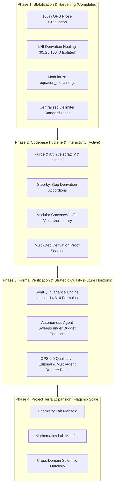

# 🔭 Terra Physics Lab — Strategic Remediation & Development Roadmap

> **Status**: Active Master Roadmap  
> **Target Horizon**: 2026–2027  
> **Authoritative References**: [`CLAUDE.md`](../CLAUDE.md), [`README.md`](../README.md), [`docs/architecture.md`](architecture.md), [`archive/horizons_and_expansion.md`](../archive/horizons_and_expansion.md)

---

## 1. Executive Baseline & Platform Health

Over successive engineering sprints, the **Terra Physics Lab** platform has attained a mature, publication-grade foundation:

| Metric / Dimension | Benchmark Status | Verification Gate |
| :--- | :--- | :--- |
| **Subtopic Coverage** | **1,584 / 1,584 Subtopics (100.0%)** graduated to Organic Platinum Standard (OPS) | `integrity_shield.py` (OPS Lead & Density Audit) |
| **Formula Catalog** | **14,614 Physical Formulas** partitioned across 256 hex shards (`00` to `ff`) | `integrity_shield.py` (Shard Hex Partition Audit) |
| **Derivation Lineage DAG** | **Lineage Health Index (LHI) of 95.2 / 100** with **0 isolated nodes** (44,558 edges) | `scripts/fixlineage --summary` |
| **Manifold Closure** | **100.0% equation closure** (0 unmapped prose identities across 8,649 expressions) | `php scripts/audit_prose_equations.php` |
| **Symbolic CAS Engine** | Sandboxed SymPy worker ([`cas_engine.py`](file:///Users/holobetj/code/gemini/terra/lib/cas/cas_engine.py)) with async `/physics/api/cas-evaluate` | `pytest tests/test_cas_engine.py` |
| **Modular ES6 Client** | `equation_explainer.js` decoupled into `simulations`, `curator`, `dictionary` modules | Browser verification & regression suite |
| **Regression Net** | **100% passing automated test suite** (3,150+ Pytest tests in ~13s) | `.venv/bin/python3 -m pytest tests/` |

---

## 2. Phased Architectural Roadmap

```mermaid
flowchart TD
    subgraph Phase1["Phase 1: Stabilization & Hardening (Completed)"]
        P1A["100% OPS Prose Graduation"]
        P1B["LHI Derivation Healing (95.2 / 100, 0 Isolated)"]
        P1C["Modularize equation_explainer.js"]
        P1D["Centralized Delimiter Standardization"]
    end

    subgraph Phase2["Phase 2: Codebase Hygiene & Interactivity (Active)"]
        P2A["Purge & Archive scratch/ & scripts/"]
        P2B["Step-by-Step Derivation Accordions"]
        P2C["Modular Canvas/WebGL Visualizer Library"]
        P2D["Multi-Step Derivation Proof Seeding"]
    end

    subgraph Phase3["Phase 3: Formal Verification & Strategic Quality (Future Horizons)"]
        P3A["SymPy Invariance Engine across 14,614 Formulas"]
        P3B["Autonomous Agent Sweeps under Budget Contracts"]
        P3C["OPS 2.0 Qualitative Editorial & Multi-Agent Referee Panel"]
    end

    subgraph Phase4["Phase 4: Project Terra Expansion (Flagship Scale)"]
        P4A["Chemistry Lab Manifold"]
        P4B["Mathematics Lab Manifold"]
        P4C["Cross-Domain Scientific Ontology"]
    end

    Phase1 --> Phase2
    Phase2 --> Phase3
    Phase3 --> Phase4
```

---

## 3. Phase 1: Stabilization & Hardening (Completed Achievements)

### 1.1 Modularization of the Client Monolith
* **Accomplished**: Successfully deconstructed the 5,376-line `equation_explainer.js` into focused ES6 modules:
  - `explainer_simulations.js`: HTML5 Canvas 2D vector field visualizations (divergence, curl, wave propagation) and Web Audio sonification.
  - `explainer_curator.js`: Curator Drawer UI, peer-review suggestions, and parameter edit staging.
  - `explainer_dictionary.js`: Symbol, variable, and unit mappings.
  - Retained core AST parsing and MathJax rendering in `equation_explainer.js` without regressions.

### 1.2 Mathematical Derivation Lineage DAG (LHI 95.2)
* **Accomplished**: Healed isolated formula nodes from early baselines down to **0 isolated nodes**, achieving an LHI score of **95.2 / 100** across all 14,614 formulas. Compiled acyclic DAG structures (`formula_derivation_graph.json` and `.gz`).

### 1.3 100% Organic Platinum Standard (OPS) Completion
* **Accomplished**: All 1,584 subtopic articles graduated to the Organic Platinum Standard, satisfying strict In Media Res physical openings, zero-artifact continuous HTML prose, and rich inline MathJax density.

### 1.4 Centralized Delimiter & Math Sanitization Standard
* **Accomplished**: Unified delimiter handling in `PhysicsService.php`, `scripts.lib.delimiters`, and `math_prose_formatter.js`.

---

## 4. Phase 2: Active & Near-Term Action Plan

### 2.1 Codebase Hygiene & Repository Streamlining
* **Goal**: Eliminate stale historical artifacts and obsolete scratch files to reduce repository noise.
* **Actions**:
  1. Archive one-off historical migrations and superseded documentation into the root `archive/` directory.
  2. Deprecate superseded maintenance scripts in `scripts/maintenance/` into `scripts/archive/` (or `archive/`), retaining canonical tools (`fixlatex`, `fixlineage`, `gqs.py`, `integrity_shield.py`).
  3. Ensure clean `.gitignore` tracking for temporary debug files.

### 2.2 Step-by-Step Derivation Accordions
* **Goal**: Transform single-link parent-child relationships ($A \to B$) into readable, collapsible multi-step mathematical derivations.
* **Accomplished**:
  1. Expanded `app/config/formula.schema.json` with `derivation_steps` schema (step, latex, rationale) and `derivation_type`.
  2. Implemented persistence, JSON decoding, and MariaDB synchronization in `PhysicsService.php` and `FormulaReviewService.php`.
  3. Integrated collapsible derivation accordions with MathJax typesetting into the Equation Explainer (`equation_explainer.php` / `public/js/equation_explainer.js`), the in-page Formula Inspector modal (`public/js/formula_inspector.js`), and the Curator slide-over drawer (`public/js/explainer_curator.js`).
  4. Seeded canonical foundation formulas (Euler-Lagrange equations, Time-Dependent & Time-Independent Schrödinger equations, Klein-Gordon massive field, Poisson observable dynamics, Lorentz force law, Quantum probability continuity, Relativistic energy-momentum invariant, Schwarzschild metric) across Git shards with rigorous step-by-step mathematical proofs (expanded to 53 canonical formulas).
  5. Added comprehensive test coverage in `tests/test_derivation_steps.py` (verifying all 53 proofs, schema compliance, and TeX brace/delimiter integrity).

### 2.3 Modular Canvas / WebGL Visualizer Library & Simulation Elevations
* **Goal**: Enrich theoretical physics topics with interactive, parameter-tunable visual models.
* **Accomplished**:
  1. Built the zero-dependency `WebGLPhysicsHarness` (`public/js/lib/webgl_physics_harness.js`) supporting WebGL2/GLSL 300 es, shader compilation with formatted error logs, automatic uniform binding, HiDPI scaling, smooth spherical orbit camera with inertia, and ping-pong FBOs.
  2. Implemented Flagship Option A: **Relativistic Kerr Black Hole Raytracer** (`public/js/simulations/relativistic-black-hole.js`):
     - Real-time GPU null geodesic raymarching in Boyer-Lindquist coordinates for static Schwarzschild ($a=0$) and spinning Kerr ($a \le 0.998$) black holes.
     - Physically accurate event horizon shadows ($r_+$), Cauchy inner horizons ($r_-$), ergosphere frame-dragging ($r_{\text{ergo}}$), and ISCO ($r_{\text{isco}}$).
     - Relativistic Keplerian accretion disk with Shakura-Sunyaev / Novikov-Thorne temperature profiles, gravitational redshift, and Doppler beaming ($I_{\text{obs}} = g^4 I_{\text{emit}}$).
     - Procedural celestial starfield gravitational lensing and Einstein rings.
     - Presets: Interstellar (Gargantua), M87* (EHT), Static Schwarzschild, Extreme Kerr, Polar Jet Axis, Pure Star Lensing.
     - Real-time mathematical telemetry HUD and 4K PNG snapshot export.
  3. **Elevated Academic Simulations** (`commit bf08034a`):
     - *Damped-Driven Chaotic Pendulum & Poincaré Sections* (`public/js/simulations/pendulum.js`): 4th-order Runge-Kutta (RK4) integration of $d^2\theta/dt^2 + \gamma d\theta/dt + \omega_0^2 \sin(\theta) = F_0 \cos(\omega_d t)$, real-time phase portrait $(\theta, \dot{\theta})$, Feigenbaum period-doubling cascade, and stroboscopic Poincaré recurrence attractor.
     - *Newton's Orbital Cannon & Escape Trajectories* (`public/js/simulations/projectile-motion.js`): Simulates Newton's 1728 spherical planet thought experiment with continuous transitions from sub-orbital arcs to circular orbital insertion ($7.91\text{ km/s}$), bound Keplerian ellipses ($9.6\text{ km/s}$), and hyperbolic cosmic escape ($11.19\text{ km/s}$).
  4. Registered simulations in MariaDB, `app/config/content/simulations.json`, `_topic_icons.php`, and embedded direct GPU launcher inside Equation Explainer.
  5. Automated regression test net verified in `tests/test_webgl_simulations.py`.

### 2.4 Hero Stage Cosmic Arena & Unified Cockpit
* **Status**: Completed (`commit 8ee1a836`).
* **Accomplished**:
  1. Built the 60fps high-DPI canvas engine (`public/js/cosmic_arena.js`) on the `/physics/lab-tools` landing page across 4 physical regimes:
     - *The Butterfly of Chaos*: Double pendulum RK4 integration and phase space trajectory.
     - *The Quantum Ghost*: 1D Schrödinger Gaussian wave packet tunneling and barrier penetration.
     - *Tuning the Universe to Death*: Relativistic ISCO orbital collapse in Schwarzschild spacetime.
     - *The Breaking of Energy*: Noether time-symmetry perturbation with dynamic $\partial \mathcal{L} / \partial t \neq 0$ breaking energy conservation.
  2. Integrated Web Audio API harmonic sound synthesis (`playTone`) modulated by system frequencies.
  3. Deployed color-coupled mathematical telemetry HUD ($q$ cyan, $p$ emerald, $V$ amber, $E$ purple) and interactive "What-If?" micro-challenges.
  4. Embedded the 6-system Crucible and 5-mode Transformation Prism (Variational, Noether, Quantum, Rosetta, Dimensions) into `app/views/physics/lab_tools.php`.

### 2.5 Cross-Encyclopedia Lab Tools Ingestion & URL State Hydration
* **Status**: Completed.
* **Accomplished**:
  1. Built `app/logic/LabToolsLauncher.php` with curated mapping rules covering all 1,584 subtopic articles to their optimal interactive lab instrument, duality workbench, or numerical simulation with pre-hydrated URL parameters.
  2. Implemented deep-linking URL state hydration across all 5 flagship lab tools (`legendre_transformer.js`, `noethers_vault.js`, `correspondence_workspace.js`, `anthropic_tuner.js`, `notation_toggle.js`) and the Unified Cockpit (`lab_cockpit.js`).
  3. Embedded interactive header action launchers (`.lab-launcher-badge`) and ambient in-prose cockpit bridge cards (`.subtopic-cockpit-bridge`) directly into `subtopic.php`.
  4. Verified cache-invalidation architecture in `PhysicsController.php` with 9/9 automated tests in `tests/test_lab_tools_hydration.py`.

### 2.6 Analytical Mechanics Workbench Deepening (Legendre Transformer)
* **Status**: Completed.
* **Accomplished**:
  1. Expanded the physical preset library from 6 to **10 publication-grade classical & relativistic configurations**:
     - *Harmonic Oscillator* (1D quadratic potential)
     - *Simple Pendulum* (transcendental gravitational potential)
     - *Anharmonic Duffing Oscillator* (quartic restoring force $\beta q^4 / 4$)
     - *Relativistic Free Particle* (square root kinetic metric $-mc^2\sqrt{1-v^2/c^2}$)
     - *Charged Particle in EM Field* (magnetic vector potential gauge shift $q\mathbf{A}\cdot\mathbf{v}$)
     - *Rotating Reference Frame* (non-diagonal Coriolis cross-coupling $m\omega(x\dot{y}-y\dot{x})$ and centrifugal potential)
     - *2D Central Force* (polar coordinates $(r, \phi)$ with cyclic conservation)
     - *Kepler Two-Body Gravitational Problem* (reduced mass $\mu$, cyclic $\phi$, conserved $p_\phi$)
     - *3D Spherical Central Force* (metric tensor $W_{ij}$, $\det(W) = m^3 r^4 \sin^2\theta$, cyclic $\phi$)
     - *Singular Constrained System* (degenerate $\det(W) = 0$ triggering Dirac primary constraint analysis)
  2. Enhanced SymPy CAS engine ([`lib/cas/cas_engine.py`](file:///Users/holobetj/code/gemini/terra/lib/cas/cas_engine.py)) to cleanly format coupled multi-variable inverted velocity fields ($\dot{q}_i = \dots$) across arbitrary configuration dimensions.
  3. Added responsive 2-column preset selectors to [`app/views/physics/legendre_transformer.php`](file:///Users/holobetj/code/gemini/terra/app/views/physics/legendre_transformer.php) and state pre-loading in [`public/js/legendre_transformer.js`](file:///Users/holobetj/code/gemini/terra/public/js/legendre_transformer.js).
  4. Mapped celestial mechanics and rotational dynamics subtopics (`keplers-second-law`, `rotational-dynamics`, `coupled-oscillations`, `central-force`) directly into dedicated presets in [`LabToolsLauncher.php`](file:///Users/holobetj/code/gemini/terra/app/logic/LabToolsLauncher.php).
### 2.8 Thin Shard Curriculum Enrichment (`fluids-nonlinear.json`)
* **Status**: ⏸️ **Deferred (Post-OPS 2.0 Strategic Decision)**.
* **Architectural Rationale**:
  - The encyclopedia currently maintains **100.0% manifold closure** across all 1,584 subtopics with 0 broken links and 0 orphaned nodes.
  - Expanding `fluids-nonlinear.json` under current **OPS 1.0** mechanical constraints would produce content that would inevitably require full qualitative re-authoring once **OPS 2.0** (multi-agent referee panels, discourse analysis, and authentic academic voice) is deployed.
  - To prevent pedagogical rework and technical debt, subtopic expansion is intentionally suspended until the OPS 2.0 qualitative rubric and critique tooling are operational, ensuring all new subtopics graduate under OPS 2.0 from inception.

---

## 5. Phase 3: Medium to Long-Term Strategic Horizons

### 3.1 Sitewide SymPy CAS Invariance Verification (Horizon 2)
* **Goal**: Upgrade derivation links from pedagogical references to **algebraically proven identities**.
* **Actions**:
  1. Execute batch verification via `cas-symbolic-prover` across candidate parent-child pairs.
  2. Prove algebraic equivalence: $\text{Simplify}(\text{Expr}_{\text{child}} - \text{Expr}_{\text{parent\_reduction}}) \equiv 0$.
  3. Automatically audit dimensional consistency across mass $[M]$, length $[L]$, time $[T]$, and charge $[I]$.

### 3.2 Long-Horizon Autonomous Governance (Horizon 4)
* **Goal**: Conduct multi-hour autonomous manifold sweeps under strict budget and token contracts.
### 3.3 OPS 2.0 Qualitative Editorial Architecture (Horizon 3)
* **Goal**: Next-level future upgrade transitioning from syntactic compliance (OPS 1.0) to multi-agent qualitative peer review and discourse assessment.
* **Pre-conditions & Prerequisites**: Execution deferred until foundational Phase 2 milestones (derivation proofs, thin shard curriculum, in-memory caching) and symbolic CAS verification are hardened.
* **Key Components**:
  1. Authoritative 5-dimension qualitative rubric ([`docs/OPS 2.0 (The Qualitative Rubric).md`](OPS%202.0%20(The%20Qualitative%20Rubric).md)).
  2. Multi-agent referee panel (Pedagogue, Experimentalist, Formalist, Inquisitor).
  3. CLI evaluation command (`gqs.py critique [slug]`).

---

## 6. Phase 4: Project Terra Multi-Science Expansion

Physics Lab serves as the flagship domain module for **Project Terra**. With the core architecture (FlightPHP microframework, 256-shard partitioning, dual-engine math rendering, and automated integrity shields) proven at scale:

* **Chemistry Lab**: Molecular manifolds, reaction kinetics, orbital hybridization, and thermochemical cycles.
* **Mathematics Lab**: Abstract algebra, differential geometry, topology, and number theory derivations.
* **Biology & Earth Sciences**: Cellular biophysics, population dynamics, geophysics, and atmospheric fluid dynamics.

---

## 7. Master Priority & Implementation Ledger

| Horizon | ID | Initiative | Key Components / Files | Priority | Status |
| :--- | :--- | :--- | :--- | :---: | :---: |
| **Phase 1** | 1.1 | Modularize `equation_explainer.js` | `public/js/explainer_simulations.js` `public/js/explainer_curator.js` | 🔴 **P1** | 🟢 Completed |
| **Phase 1** | 1.2 | Derivation Lineage DAG Healing (LHI 95.2) | `scripts/fixlineage` `formula_derivation_graph.json` | 🔴 **P1** | 🟢 Completed |
| **Phase 1** | 1.3 | 100% OPS Subtopic Graduation | `app/config/content/*.json` `integrity_shield.py` | 🔴 **P1** | 🟢 Completed |
| **Phase 2** | 2.1 | Scratch & Maintenance Script Archival | `scratch/` `archive/README.md` | 🟡 **P2** | 🟢 Completed |
| **Phase 2** | 2.2 | Step-by-Step Derivation Infrastructure | `equation_explainer.php` `shard_[00-ff].json` | 🟡 **P2** | 🟢 Completed |
| **Phase 2** | 2.3 | WebGL Raytracer & Simulation Elevations | `relativistic-black-hole.js` `pendulum.js` `projectile-motion.js` | 🟡 **P2** | 🟢 Completed |
| **Phase 2** | 2.4 | Hero Stage Cosmic Arena & Cockpit | `cosmic_arena.js` `lab_cockpit.js` `lab_tools.php` | 🟡 **P2** | 🟢 Completed |
| **Phase 2** | 2.5 | Cross-Encyclopedia Lab Tools Ingestion | `LabToolsLauncher.php` `subtopic.php` `test_lab_tools_hydration.py` | 🟡 **P2** | 🟢 Completed |
| **Phase 2** | 2.6 | Analytical Mechanics Workbench Deepening | `legendre_transformer.js` `legendre_transformer.php` `cas_engine.py` | 🟡 **P2** | 🟢 Completed |
| **Phase 2** | 2.7 | Derivation Steps Proof Seeding | `shard_[00-ff].json` `tests/test_derivation_steps.py` | 🟡 **P2** | 📋 Active |
| **Phase 2** | 2.8 | Thin Shard Curriculum Enrichment | `fluids-nonlinear.json` `gqs.py` | 🟢 **P3** | ⏸️ Deferred (Post-OPS 2.0) |
| **Phase 3** | 3.1 | Sitewide SymPy CAS Invariance | `cas_engine.py` `.agents/skills/cas-symbolic-prover` | 🟡 **P2** | 📋 Active |
| **Phase 3** | 3.2 | Autonomous Long-Horizon Sweeps | `docs/cost_governance.md` `.agents/skills/` | 🟢 **P3** | 📋 Backlog |
| **Phase 3** | 3.3 | OPS 2.0 Qualitative Multi-Agent Architecture | `docs/OPS 2.0 (The Qualitative Rubric).md` `gqs.py critique` | 🟢 **P3** | 🔭 Future Upgrade |
| **Phase 4** | 4.1 | Project Terra Multi-Science Expansion | Chemistry, Mathematics, Earth Sciences | 🟢 **P3** | 🔭 Strategic |
