# GQS Formula Seeding Post-Mortem (Full Lifecycle Report)

**Date:** July 3, 2026  
**Project:** Physics Lab Formula Registry Database Seeding Lifecycle  
**Status:** Completed (100.00% Enriched)  
**Total Formulas:** 5,278 / 5,278 formulas enriched  

---

## 1. Executive Summary

This post-mortem documents the complete end-to-end lifecycle of the formula database seeding project for the GQS Physics Formula Registry, starting from the initial Git rollback.

The campaign was initiated by executing a **`git reset --hard` (Git Rollback)** to discard a previous botched batch-enrichment run. This rollback returned the repository to a clean baseline, setting the database state to **exactly 576 enriched formulas** out of **5,278 total formulas**, leaving **4,702 pending placeholders** as the target for regeneration.

The seeding operation was successfully completed on July 3, 2026, achieving **100.00% database enrichment**. However, multiple coding flaws—including a lack of incremental checkpointing, a substring matching bug that re-processed completed records, and duplicate code declarations—prolonged the timeline, caused the seeder to "spin its wheels," and led to significant redundant API token consumption.

---

## 2. Chronological Timeline of the Lifecycle

```mermaid
gantt
    title GQS Seeding Timeline (Inception to Completion)
    dateFormat  HH:mm
    axisFormat %H:%M
    section Phases
    Git Rollback to Baseline (Day 0)        :active, 18:30, 19:00
    Initial Analysis & Rate-Limit Bottleneck :active, 19:00, 19:30
    Transition to Vertex AI & Parallel Run   :19:30, 20:56
    Server Restart & Task Interruption       :20:56, 21:00
    Seeder Resumption & Vertex Seeding       :21:00, 22:56
    Bug Discovery (depending/duplicate)     :22:56, 23:45
    Final Fallback Sweep & Completion        :23:45, 00:00
```



### Phase 0: The Git Rollback (Day 0)
* **The Action**: Performed a Git rollback to discard a previous flawed batch-enrichment run.
* **The Result**: Reverted the database to a clean baseline of **576 enriched formulas**. The remaining 4,702 formulas were returned to empty placeholders, establishing the scope for our new seeding campaign.

### Phase 1: Inception & Free-Tier Throttling
* **The Setup**: The seeder was initially run sequentially using the standard free-tier Gemini API.
* **The Bottleneck**: The free-tier API was heavily throttled by a 15 Requests Per Minute (RPM) ceiling. The estimated run time was **~4.3 hours**, which was frequently interrupted by transient `429 Resource Exhausted` and `503` service errors.
* **Quota Exhaustion**: The script's repeated runs and rate limits quickly depleted daily token quotas on the standard Gemini API key, causing the process to halt repeatedly.

### Phase 2: Switch to Vertex AI & Unrealistic Estimates
* **The Shift**: To bypass the free-tier RPM ceilings and speed up completion, the seeder was transitioned to the paid **Vertex AI API** platform to run with **10 parallel workers**.
* **The Estimate**: The initial estimation for the parallel run was **~25 minutes** to full completion.
* **The Reality ("Spinning Wheels")**: Despite the parallel workers, the seeder was failing to make substantial net progress. It remained active for far longer than the 25-minute estimate, generating heavy token traffic and GCP fees while leaving the enriched count stagnant. 

### Phase 3: Investigation of Seeder Overusage & Flaws
* **Cost Alert**: The user noticed unexpected Vertex AI token consumption and endpoint VM overhead. An investigation into the seeder's performance revealed two fundamental architectural flaws:
  1. **Delayed Shard Writing**: The seeder buffered all updates in memory and only wrote to disk when a shard (up to 50+ formulas) was 100% complete. Any crash or timeout mid-shard discarded all progress, requiring those formulas to be requested again on the next run.
  2. **The `"depending"` Substring Bug**: The script matched the substring `"pending"` to identify placeholder formulas. This matched the common English word `"depending"` in already-enriched fields, causing the script to repeatedly re-request completed formulas.
* **Immediate Fixes**: Refactored the shard writing to save incrementally after *every single formula* using atomic temporary file swaps, and wrapped the seeder run in `caffeinate` to prevent the host machine from sleeping.

### Phase 4: Server Interruptions & Resiliency
* **Server Recycle**: During the main run, the workspace orchestration daemon underwent a routine server restart, immediately terminating the active seeding process.
* **Checkpoint Success**: Due to the incremental saving fix, **zero bytes of progress were lost**. The script was restarted under a new background task, picking up exactly where it was cut off.
* **Main Sweep Completion**: The seeder successfully completed the main run, reaching **5,185 formulas**.

### Phase 5: Cleaning the Final Sweep & 100% Ingestion
* **The Word Boundary Fix**: Refactored `is_formula_pending()` to use regex word boundaries (`\bpending\b`), preventing the `"depending"` substring match and bringing the true pending count down to 8.
* **Duplicate Scoping Resolution**: Discovered a duplicate inner function declaration of `extract_latex_from_svg` nested inside `seed()` that was overriding our global parsing updates. Removed the duplicate.
* **SVG Fallback Mapping**: Decoded MathJax glyphs for the remaining 6 placeholder formulas that lacked raw LaTeX metadata in their SVGs, implementing fallback parsers in `extract_latex_from_svg`.
* **Database Completion**: Ran the final sweep, successfully enriching all remaining formulas to reach exactly **5,278 / 5,278 (100.00%)**.

---

## 3. Analysis of Critical Coding Flaws

### Flaw A: Delayed Shard Saving (Non-Atomic Seeding)
* **The Design**: The seeder accumulated all enriched formula records in memory and only wrote the entire shard back to the filesystem when all formulas in that specific shard were completed.
* **The Flaw**: Any crash, rate limit block, or terminal timeout mid-run discarded all progress made on the active shard.
* **The Cost**: Every process failure wiped out recent generations, forcing the script to re-request the same formulas, directly multiplying token usage and billing.

### Flaw B: The `"depending"` Substring Search Bug
* **The Design**: Checked if the string `"pending"` was present anywhere in the formula's description fields:
  ```python
  if any(p in val for p in placeholders): # where placeholders contained "pending"
  ```
* **The Flaw**: It matched the word `"depending"` in already-enriched fields, marking completed records as pending.
* **The Cost**: On every sweep, the seeder re-requested dozens of already-finished formulas, driving up Vertex AI token counts and GCP expenses.

### Flaw C: Nested Duplicate Functions
* **The Design**: A duplicate inner version of `extract_latex_from_svg` was declared inside the `seed()` function scope.
* **The Flaw**: Modifying the global parser utility to resolve LaTeX extraction issues had no effect because the nested function overrode the changes during runtime.

### Flaw D: Incomplete SVG Metadata Handling
* **The Design**: The seeder assumed all equation SVGs contained a `data-tex` attribute containing the raw LaTeX equation.
* **The Flaw**: 6 formulas (such as `Crystal math` and `Cyclic Conservation Law`) had no `data-tex` attributes or were stored as raw LaTeX text blocks, causing the seeder to skip them indefinitely.

---

## 4. Financial & Operational Impact ("Spinning Wheels")

### Token Consumption Quota Drain (Pre-Vertex AI)
Before switching to paid Vertex AI, the combination of Flaw A (delayed saving) and Flaw B (the `"depending"` bug) rapidly exhausted the user's **Gemini API token quotas**. The script repeatedly requested identical data, hit rate limits, crashed mid-shard, and lost its progress. This vicious cycle depleted the daily free-tier token ceilings almost instantly, forcing the switch to paid Vertex AI endpoints to keep the project moving.

### Vertex AI Cost Accumulation
After the switch to Vertex AI, the same inefficiencies shifted to the GCP billing ledger. The "spinning wheels" phenomenon occurred: the script remained active for hours—consuming active VM endpoint runtime and paid input/output tokens—while making minimal net progress towards completion due to discarded mid-shard runs.

| Factor | Phase | Operational Impact | Financial Impact |
| :--- | :--- | :--- | :--- |
| **Standard API Quota Depletion** | Pre-Vertex | Halted script execution; blocked progress. | Depleted daily free limits; forced transition to paid Vertex. |
| **Discarded Mid-Shard Progress** | Post-Vertex | Repeatedly regenerated same formulas upon process crashes. | **High token waste** (duplicate input/output prompts). |
| **"Depending" Redundant Sweeps** | Post-Vertex | Re-processed completed formulas during sweeps. | **Major token waste** (unnecessary paid calls). |
| **Endpoint VM Overhead** | Post-Vertex | Kept paid endpoint VM active over several hours. | **High runtime overhead** (VM instance hours). |

---

## 5. Key Recommendations & Lessons Learned

1. **Implement Atomic Checkpointing Immediately**: In any bulk data pipeline or migration script, write results to persistent storage immediately after processing each record rather than buffering in memory.
2. **Avoid Loose Substring containment Checks**: When checking for status flags (like `"pending"`), use regex word boundaries (`\b`) or strict equality checks to avoid matching common substrings (like `"depending"`).
3. **Eliminate Duplicated Code Scopes**: Refrain from defining helper functions inside other functions when a global utility exists. This prevents scoping issues and makes troubleshooting straightforward.
4. **Log Exceptions and Skips Clearly**: Provide clear log statements when records are skipped so that broken metadata (like missing SVG `data-tex` attributes) can be caught early in the pipeline.
5. **Estimate with Friction in Mind**: Always build in buffer margins for API throttling, backoffs, and process interruptions when estimating bulk database processing operations.

---

## 6. AI Agent Reflections & Takeaways

As an AI developer collaborating on this codebase, the diagnostic and seeding lifecycle has yielded five core guidelines to improve agent code generation, refactoring, and execution behaviors:

### Takeaway A: Atomic Checkpointing is Non-Negotiable
In-memory buffering is a liability for long-running scripts. The original design of writing to the filesystem only at the end of a shard run meant any network timeout, OS sleep cycle, or backend recycle discarded hours of work.
* **The Standard**: Always default to designing bulk data pipelines to write incrementally (atomic checkpointing) after *every single record*. This ensures resilience against task interruptions and prevents wasted API costs.

### Takeaway B: Loose Substring Checks are Dangerous for State Management
Using simple substring checks (like `"pending" in description`) for control flow is dangerous when standard vocabulary overlaps. The word `"depending"` was present in many valid physics explanations, causing the script to falsely flag them as incomplete.
* **The Standard**: Never use loose substring matches to manage process states. Always use exact equality matches, dedicated state flags, or regex word boundaries (`\b`) to prevent infinite loop executions and billing inflation.

### Takeaway C: Keep Function Scopes Clear and Unique
The duplicate nested declaration of `extract_latex_from_svg` inside the `seed()` function meant that modifications to the global utility were silently overridden.
* **The Standard**: Avoid declaring helper functions in nested scopes when a global utility exists. Keep utilities modular, global, and verify scoping to maintain a single source of truth.

### Takeaway D: Bounded Estimates Must Factor in "Friction"
Our initial estimate of **25 minutes** was calculated under ideal, linear conditions. We failed to account for the time lost "spinning wheels" due to rate-limiting cooldowns, mid-shard crashes, and backoff retries.
* **The Standard**: Future estimations for API-reliant pipelines must factor in friction (cooldowns, average failure rates, process recycles) rather than assuming a best-case scenario.

### Takeaway E: Always Design Fallbacks for Incomplete Data
Assuming all SVGs would consistently contain the same metadata (`data-tex` attribute) led to silent skips and incomplete records.
* **The Standard**: Build robust catch blocks and fallback parsing pathways (like looking for raw LaTeX strings or maintaining a mapping of known broken entries) to handle anomalies gracefully rather than skipping them indefinitely.
