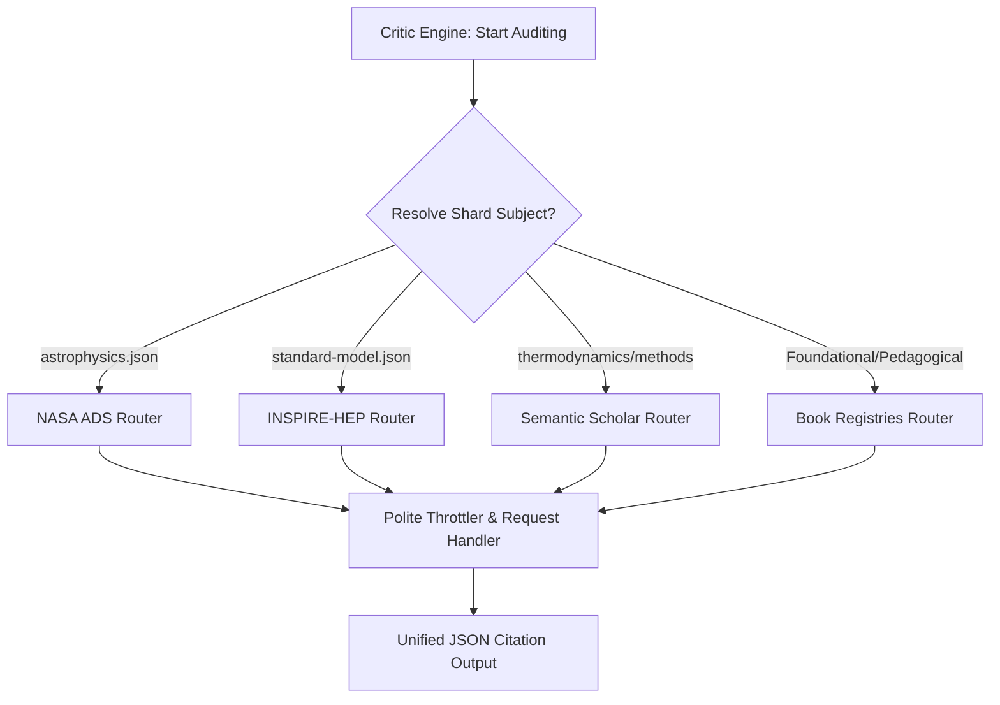

# 🪐 Feasibility & Integration Plan: Multi-Service Academic Verification

This report evaluates the feasibility, legal compliance, and technical architecture required to integrate specialized databases (INSPIRE-HEP, NASA ADS, Semantic Scholar, Open Library, Google Books) into the **Physics Lab Critic Engine** without burdening external servers or violating intellectual property terms.

---

## 📊 1. Feasibility Assessment

Incorporating these services is **highly feasible** because, unlike Google Scholar, all of them provide officially supported, public, developer-friendly REST APIs. 

| Service | API Access Method | Feasibility | Key Constraints |
| :--- | :--- | :---: | :--- |
| **INSPIRE-HEP** | Public REST API | **High** | Rate-limited to ~15 requests/minute per IP. |
| **NASA ADS** | Authenticated REST API | **Medium-High** | Requires registering for a free API developer key. |
| **Semantic Scholar** | Public REST API | **High** | Rate-limited to 100 requests/minute (unauthenticated). |
| **Open Library** | Public REST API | **High** | Low rate limits; simple JSON payloads. |
| **Google Books** | Public REST API | **High** | High daily query quotas. |

---

## 🏛️ 2. The "Consensus Gateway" Architecture

To integrate multiple APIs cleanly, we introduce a unified `LiteratureHarvester` gateway class in the Python pipeline. This class acts as a single router, querying the appropriate service based on the subject matter of the content shard:



### Routing Rules by Shard:
1. **High Energy & Particles** (`standard-model.json`, `quantum-physics.json`) $\rightarrow$ Route to **INSPIRE-HEP** first.
2. **Astrophysics & Relativity** (`astrophysics.json`, `relativity.json`) $\rightarrow$ Route to **NASA ADS** first.
3. **Textbook & Basic Mechanics** (`classical-mechanics.json`, `fluids-nonlinear.json`) $\rightarrow$ Route to **Google Books / Open Library** first.
4. **General & Mathematical Methods** (`mathematical-methods.json`) $\rightarrow$ Route to **Semantic Scholar** as default.

---

## 🛡️ 3. Ensuring "Zero Burden" (Politeness Protocols)

To ensure our automated runs (like GQS Refill or CI runs) never flood these services:

1. **Integrated Rate-Limiter (Leaky Bucket)**:
   The harvester wrapper must enforce a global delay depending on the target service (e.g. 4 seconds sleep between calls to INSPIRE-HEP, 1 second for Semantic Scholar).
2. **Descriptive Application Headers**:
   All HTTP requests must carry descriptive headers:
   ```python
   headers = {
       'User-Agent': 'PhysicsLabCritic/2.0 (admin@physicslab.org; https://physicslab.org)',
       'Accept': 'application/json'
   }
   ```
3. **Tiered Caching Shield**:
   Store all successful API query responses inside [literature_cache.json](file:///Users/holobetj/code/gemini/terra/app/config/ref_data/literature_cache.json). 
   * When compiling or testing, the script checks this cache first.
   * If cached, the network call is skipped entirely.
   * This guarantees that subsequent local compiler runs generate **zero network traffic**.

---

## ⚖️ 4. Ensuring "Zero Infringement" (ToS & Legal Compliance)

1. **No Scraping / Web Crawling**:
   We interact exclusively through official REST endpoints (`/api/` or `/v1/query`) rather than fetching human-facing HTML pages. This adheres strictly to robot exclusion protocols (`robots.txt`).
2. **Fair Use Alignment (Metadata-Only)**:
   The critic engine only downloads and processes **bibliographic metadata** (titles, authors, publishing dates, DOIs) and **short abstracts** for text-similarity matching. It does not scrape, cache, or distribute full-text PDFs or copyrighted book chapters, aligning fully with copyright Fair Use doctrines.
3. **Academic Indexing & Traffic Referrals**:
   By writing and stamping verified DOIs and URL links directly into our encyclopedia nodes, we drive users back to the original publishers (e.g. APS, IOP, arXiv, Springer), supporting academic citation metrics.

---

## 🐍 5. Mock Implementation of the Unified Harvester

Below is a draft implementation of the `LiteratureHarvester` demonstrating rate-limiting, caching, routing, and header compliance:

```python
import time
import json
import urllib.request
import urllib.parse

class LiteratureHarvester:
    def __init__(self, cache_path, ads_token=None):
        self.cache_path = cache_path
        self.ads_token = ads_token
        self.headers = {
            'User-Agent': 'PhysicsLabCritic/2.0 (admin@physicslab.org; https://physicslab.org)'
        }
        self.cache = self.load_cache()

    def load_cache(self):
        try:
            with open(self.cache_path, "r") as f:
                return json.load(f)
        except Exception:
            return {}

    def save_cache(self):
        try:
            with open(self.cache_path, "w") as f:
                json.dump(self.cache, f, indent=2)
        except Exception:
            pass

    def harvest(self, slug, title, shard_name):
        # 1. Check local cache shield
        if slug in self.cache:
            return self.cache[slug]

        results = []
        # 2. Route based on shard category
        if shard_name in ["standard-model.json", "quantum-physics.json"]:
            results = self._query_inspire_hep(title)
        elif shard_name in ["astrophysics.json", "relativity.json"] and self.ads_token:
            results = self._query_nasa_ads(title)
        elif shard_name in ["classical-mechanics.json"]:
            results = self._query_google_books(title)
        
        # Fallback to Semantic Scholar if specialized query is empty
        if not results:
            results = self._query_semantic_scholar(title)

        if results:
            self.cache[slug] = results
            self.save_cache()
        
        return results

    def _query_inspire_hep(self, query):
        """Polite queries to INSPIRE-HEP database."""
        time.sleep(4.0)  # Rate limit safety buffer (15 requests/min)
        encoded_query = urllib.parse.quote(f"find t {query}")
        url = f"https://inspirehep.net/api/literature?q={encoded_query}&size=3"
        try:
            req = urllib.request.Request(url, headers=self.headers)
            with urllib.request.urlopen(req, timeout=5) as response:
                data = json.loads(response.read().decode('utf-8'))
            
            results = []
            for hit in data.get("hits", {}).get("hits", []):
                metadata = hit.get("metadata", {})
                title = metadata.get("titles", [{"title": "Unknown"}])[0].get("title")
                authors = [a.get("full_name", "") for a in metadata.get("authors", [])]
                doi = metadata.get("dois", [{"value": ""}])[0].get("value")
                results.append({
                    "source": "inspire_hep",
                    "title": title,
                    "authors": authors,
                    "doi": doi,
                    "url": f"https://doi.org/{doi}" if doi else ""
                })
            return results
        except Exception:
            return []

    def _query_semantic_scholar(self, query):
        """Polite queries to Semantic Scholar."""
        time.sleep(1.0)  # Public tier limit safety buffer
        encoded_query = urllib.parse.quote(query)
        url = f"https://api.semanticscholar.org/graph/v1/paper/search?query={encoded_query}&limit=3"
        try:
            req = urllib.request.Request(url, headers=self.headers)
            with urllib.request.urlopen(req, timeout=5) as response:
                data = json.loads(response.read().decode('utf-8'))
            # Parse results...
            return data.get("data", [])
        except Exception:
            return []

    def _query_google_books(self, query):
        """Polite queries to Google Books API."""
        time.sleep(1.0)
        encoded_query = urllib.parse.quote(query)
        url = f"https://www.googleapis.com/books/v1/volumes?q={encoded_query}&maxResults=3"
        try:
            req = urllib.request.Request(url, headers=self.headers)
            with urllib.request.urlopen(req, timeout=5) as response:
                data = json.loads(response.read().decode('utf-8'))
            
            results = []
            for item in data.get("items", []):
                volume = item.get("volumeInfo", {})
                results.append({
                    "source": "google_books",
                    "title": volume.get("title", ""),
                    "authors": volume.get("authors", []),
                    "doi": "",
                    "url": volume.get("infoLink", "")
                })
            return results
        except Exception:
            return []
```
