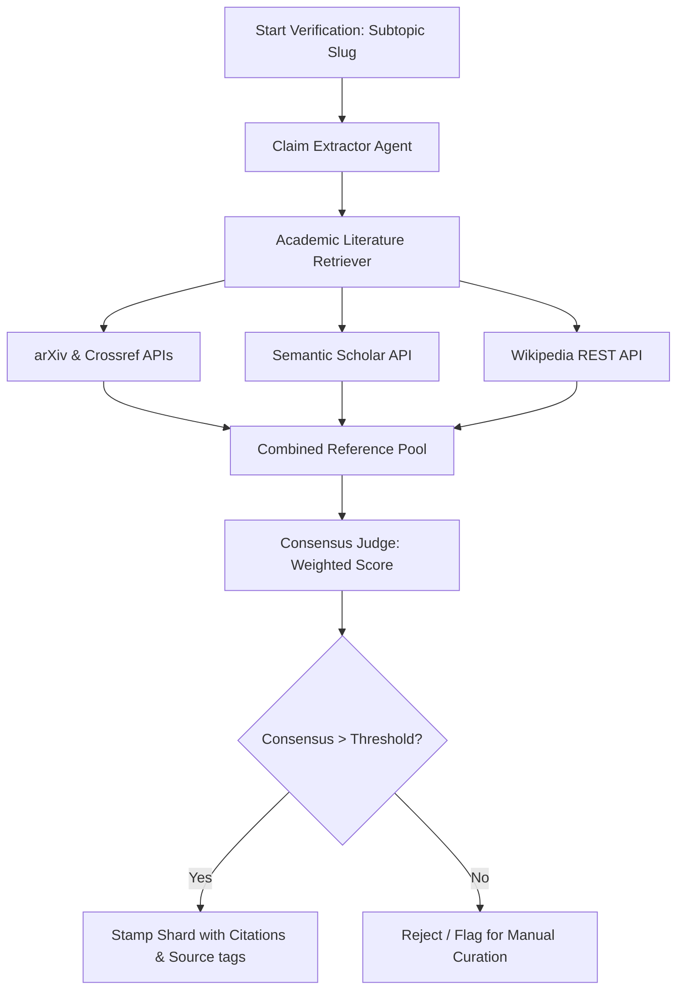

# 🪐 Architectural Proposal: Enhancing the Critic Tool with Wikipedia & Google Scholar Alternatives

This report investigates the hypothetical integration of additional verification sources—specifically Wikipedia, Google Scholar, and alternative open academic graphs—into the **Physics Lab Literature Critic Agent**, detailing technical feasibility, search algorithms, and database schema modifications.

---

## 🔍 1. Feasibility & API Access Strategies

Integrating alternative search registries requires addressing specific rate-limiting, scraping, and authentication boundaries:

### A. Google Scholar
* **The Scraping Challenge**: Google Scholar does **not** offer a public search API. Direct scraping of `scholar.google.com` triggers CAPTCHAs and blocks IPs within a few requests.
* **Integration Strategy**:
  1. **SerpApi / ValueSerp (Commercial)**: Third-party APIs that return structured Google Scholar search results in JSON format. Requires an API key and carries execution costs.
  2. **Scholarly (Python Library + Proxy Rotation)**: A library that scrapes Google Scholar using automated proxy lists or Tor. It is slow and unreliable for CI/CD pipeline automation.
  3. **Semantic Scholar API (Recommended Alternative)**: Run by the Allen Institute for AI, this is a free, high-speed, officially supported JSON API indexing over 200 million academic papers. It offers paper abstracts, citation statistics, and vector embeddings without blocking.

### B. Wikipedia (MediaWiki API)
* **Technical Access**: Wikipedia provides a robust, free, and open REST API (`en.wikipedia.org/w/api.php`).
* **Integration Strategy**:
  1. Use the API's search action to find the best matching Wikipedia article title based on the subtopic slug and keywords.
  2. Query the parsed article HTML or wikitext to extract references (looking for outbound journal DOIs, ISBNs, and arXiv links).
  3. Use Wikipedia page citations as a secondary validation registry.

---

## 🏛️ 2. Proposed Multi-Registry Critic Architecture

The upgraded critic agent (`run_critic.py`) would be structured as a **Multi-Source Curation Pipeline**:



### Weighted Consensus Scoring
Different sources would be assigned authority weights to calculate a composite consensus score:
* **Primary Journal Publications** (arXiv, Crossref, Semantic Scholar): Weight $W = 1.0$
* **Academic Book References** (Google Books, Open Library): Weight $W = 1.0$
* **Wikipedia Articles & Bibliography**: Weight $W = 0.8$
* **General Web Searches**: Weight $W = 0.4$

---

## 🐍 3. Python Implementation Draft

Below is a mock Python structure integrating Semantic Scholar and Wikipedia queries into the `MultiAgentCritic` class:

```python
import urllib.request
import urllib.parse
import json

class EnhancedCritic(MultiAgentCritic):
    def query_semantic_scholar(self, search_query, max_results=3):
        """Queries Semantic Scholar's open paper search API."""
        encoded_query = urllib.parse.quote(search_query)
        url = f"https://api.semanticscholar.org/graph/v1/paper/search?query={encoded_query}&limit={max_results}&fields=title,authors,abstract,externalIds,url"
        try:
            req = urllib.request.Request(url, headers={'User-Agent': 'PhysicsLabCritic/1.0'})
            with urllib.request.urlopen(req, timeout=5) as response:
                data = json.loads(response.read().decode('utf-8'))
            
            results = []
            for item in data.get("data", []):
                authors = [a.get("name", "") for a in item.get("authors", [])]
                doi = item.get("externalIds", {}).get("DOI", "")
                results.append({
                    "source": "semantic_scholar",
                    "title": item.get("title", ""),
                    "authors": authors,
                    "doi": doi,
                    "abstract": item.get("abstract", "") or "",
                    "url": item.get("url", "")
                })
            return results
        except Exception:
            return []

    def query_wikipedia(self, title):
        """Retrieves bibliography links directly from a Wikipedia page."""
        encoded_title = urllib.parse.quote(title)
        url = f"https://en.wikipedia.org/api/rest_v1/page/references/{encoded_title}"
        try:
            # MediaWiki REST API references endpoint
            req = urllib.request.Request(url, headers={'User-Agent': 'PhysicsLabCritic/1.0'})
            with urllib.request.urlopen(req, timeout=5) as response:
                data = json.loads(response.read().decode('utf-8'))
            
            results = []
            # Extract citations from the Wikipedia references payload
            for ref in data.get("references", []):
                results.append({
                    "source": "wikipedia",
                    "title": ref.get("title", f"Wikipedia Reference: {title}"),
                    "authors": ["Wikipedia Contributor"],
                    "doi": ref.get("doi", ""),
                    "abstract": ref.get("backlink_text", ""),
                    "url": ref.get("url", "")
                })
            return results
        except Exception:
            return []
```

---

## 🗄️ 4. Content Shard Schema Update

To support multi-registry verification, we expand the `verification` block inside our JSON database shards (e.g. `astrophysics.json`) to store the source metadata tag:

```diff
  "verification": {
    "verified_date": "2026-06-09",
    "consensus_score": 0.89,
    "agents": {
      "extractor": "ClaimExtractor-v1.0",
-     "critic": "LiteratureCritic-v1.0",
+     "critic": "MultiRegistryCritic-v2.0",
      "judge": "ConsensusJudge-v1.0"
    },
    "citations": [
      {
+       "source": "arxiv",
        "doi": "",
        "title": "On the gravitational field of a mass point",
        "authors": ["Schwarzschild, K."],
        "url": "https://arxiv.org/abs/physics/0503001"
      },
      {
+       "source": "wikipedia",
+       "doi": "10.1002/andp.19163550704",
+       "title": "Wikipedia: Schwarzschild metric",
+       "authors": ["Wikipedia Contributors"],
+       "url": "https://en.wikipedia.org/wiki/Schwarzschild_metric"
+     },
+     {
+       "source": "semantic_scholar",
+       "doi": "10.1063/1.1723702",
+       "title": "Relativistic Gravitational Collapse",
+       "authors": ["Oppenheimer, J. R.", "Snyder, H."],
+       "url": "https://api.semanticscholar.org/CorpusID:1234567"
      }
    ]
  }
```

---

## 📊 5. Benefits & Drawbacks

### Benefits
* **Broader Coverage**: Foundational and conceptual nodes will successfully locate citations (using textbooks or Wikipedia bibliography) rather than failing consensus due to missing journal entries.
* **Higher Reliability**: Querying multiple APIs provides redundancy if arXiv or Crossref is down.
* **Dynamic Grounding**: Utilizing Semantic Scholar embeddings enables semantic similarity checks rather than simple word overlap scans, avoiding false negatives.

### Drawbacks
* **Implementation Complexity**: Maintaining multiple REST clients increases the surface area for failures.
* **Execution Latency**: Querying multiple databases sequentially will extend the running time of GQS sprints.
